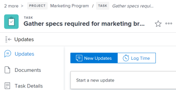

# 21.2 release activity:&nbsp;Week of February 22, 2021

This page describes all `[Product Area]` enhancements made with the `21.2` release to the Preview environment. These enhancements were made available in the Production environment the week of July 21, 2021.

For a list of all changes available with the `21.2` release, see [21.3 Release overview](../../../product-announcements/product-releases/21.3-release-activity/21-3-release-overview.md).

## The Primary Contact of an Issue is now visible from the Project Details area

>[!NOTE]
>
>This feature released to the Production environment on March 10, 2020.

When converting an issue to a project, the issue’s requester is transferred to the project and visible in the Converted Issue Originator field. You can view this field in the Project Details area, as well as in project reports and lists. This information is also visible for tasks, only in reports and lists.

You must enable this field in your Layout Template to be able to view it in the new `Adobe Workfront` experience for projects.

For information about converting issues, see [Overview of converting issues in Adobe Workfront](../../../manage-work/issues/convert-issues/convert-issues.md).

`<iframe class="vimeo-player_0" src="assets/516275975?" frameborder="0" allowfullscreen="1" width="560px" height="315px"></iframe>`

[View this video in full-screen mode.](https://vimeo.com/516275975/f775e74810)

## New look and feel for object headers

>[!NOTE]
>
>This feature released to the Production environment on March 10, 2020.
>
>This feature is available only in `the new Adobe Workfront experience`.

To further reinforce the hierarchy of information and help users more clearly understand what page they are on, each object header now has:

* Colorful, more modern icons for each object type
* The object type listed above the object’s name
* An updated font style and text size
* Other minor style changes

Previously, there was no icon and a badge with the object name appeared to the right of the object title.

The page headers of areas in the new Workfront experience—such as Enhanced analytics, Resource Management, and others—also have this updated look and feel.

To learn more about the new object headers in the new Workfront experience, see New object headers.

## Change in the way the Job Role filter works in the Unassigned area of the Workload Balancer

To improve the way the Job Role filter works in the Workload Balancer and to match users’ expectations, we have modified the functionality of the filter in the Unassigned area. You can now view only the hours allocated to the job roles you specify in the filter.

Prior to this enhancement, when applying the Job Role filter to the Unassigned area the Workload Balancer displayed all hours associated with the work items assigned to the job roles .

For information about filtering information in the Workload Balancer, see [Manage filters in the Workload Balancer](../../../resource-mgmt/workload-balancer/filter-information-workload-balancer.md).

## Bring back removed New Issue Fields on a New Request form

>[!NOTE]
>
>This feature is available only in `the new Adobe Workfront experience`.

With the redesign of the New Request form that launched with the previous release, we had prevented several fields from the New Issue Fields area of the project Queue Details section to display when submitting a new request. After incorporating your feedback, we have decided to bring the fields back so they can all display on the New Request form.

For information, see Create a Request Queue.

## New fields on the Proof Approval report

To help surface useful proofing information, we've added the following fields to the Proof Approval report:

* `Decision Date:`&nbsp;Displays the date an approver makes a decision on a proof. You can also find this date on the Print Summary of the proof.
* `Approver Stage:`&nbsp;Displays the current stage information.
* `Workflow Template:`&nbsp;Displays any workflow templates attached to the proof. If there is no template attached, the column is blank.

These fields are not part of the default report. You need to add them if you want to see them.

## View information about a group that you want to assign to a portfolio, portfolio, or team

>[!NOTE]
>
>This feature is available only in `the new Adobe Workfront experience`.

When you are assigning a group to a portfolio, program, or team, we’ve made it easier to ensure that you have the right group—you can click the info icon next to the name of the group to display a tooltip containing the hierarchy of groups above it, along with the group’s administrators. Depending on the details configured for the group, you might also see the group’s Business Leader and description.

This is the same functionality that was released recently to help you identify a group that you need to assign to a project, as explained in [Edit projects](../../../manage-work/projects/manage-projects/edit-projects.md).

For more information, see the following articles:

* Create a portfolio 
* Create a program 
* Create a team

## Text formatting in custom fields now displays in all Workfront Classic lists and reports

>[!NOTE]
>
>This feature is available only in `Adobe Workfront Classic`.

Users can now see text formatting such as bold, bullet lists, and hyperlinks in custom fields when viewing lists and reports.

Previously in Workfront Classic, text formatting was visible only in Project, Task, and Hour lists.

For information about formatting text in a custom field, see Create a custom form.

For information about displaying information in lists, see Get started with lists.

`<iframe class="vimeo-player_0" src="assets/516458707?" frameborder="0" allowfullscreen="1" width="560px" height="315px"></iframe>`

[View this video in full-screen mode.](https://vimeo.com/516458707/519f4f9295)

## Additional objects supported with typeahead — only for iOS users

The mobile app now supports the following objects in custom form typeahead fields:

* Company
* Group
* Job Role
* Portfolio
* Program
* Project
* Team
* Template

For more information, see [Create or edit a custom form](../../../administration-and-setup/customize-workfront/create-manage-custom-forms/create-or-edit-a-custom-form.md).

## Save requests as drafts in the Workfront mobile app

You can now save partially filled requests as drafts in the mobile app. We’ve added a new Drafts section in the Request area for you to easily find any of your drafts.

For more info, see [Adobe Workfront for Android](../../../workfront-basics/mobile-apps/using-the-workfront-mobile-app/workfront-for-android.md) or [Adobe Workfront for iOS](../../../workfront-basics/mobile-apps/using-the-workfront-mobile-app/workfront-for-ios.md).
