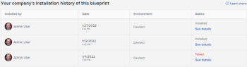

# 22.2 release activity:&nbsp;Week of February 7, 2022

This page describes all enhancements made with the *22.2* release to the Preview environment the week of *February 7, 2022*. These enhancements will be made available in the Production environment later this year

<!--
<MadCap:conditionalText data-mc-conditions="QuicksilverOrClassic.Draft mode">
the week of October 4, 2021
</MadCap:conditionalText>
-->

`<MadCap:conditionalText data-mc-conditions="QuicksilverOrClassic.Draft mode">  the week of October 4, 2021 </MadCap:conditionalText>`.For a list of all changes available at this point in the *22.2* release cycle, see [22.2 Release overview](../../../product-announcements/product-releases/22.2-release-activity/22-2-release-overview.md).

## Blueprints installation history enhancements

When you install a blueprint, a message now displays the specific objects (such as roles, teams, or groups) that were successfully installed with the blueprint and any objects that failed to install. You can also view the list of installed objects on the Blueprint Details page by clicking View Details next to a specific installation in the installation history table.

For more information, see [Install a blueprint](../../../administration-and-setup/blueprints/blueprints-install.md).

## A warning now displays when installing a Preview-only blueprint in Production

Certain blueprints are only available to install in the Preview environment for testing purposes.

If you access Preview-only content in your Production environment, Sandbox 1, or Sandbox 2, the install button is not active, and you might see a warning message.

For more information, see [Install a blueprint](../../../administration-and-setup/blueprints/blueprints-install.md).

## Share folders only in the top five levels of a folder hierarchy

To ensure the best performance for users sharing folders, we are currently limiting sharing to the top five levels in a folder hierarchy on an object.

Each folder at the sixth level or below inherits its sharing configurations from the folder directly above it.

For more information about sharing folders, see [Share a document folder](../../../workfront-basics/grant-and-request-access-to-objects/share-a-document-folder.md).

`<iframe class="vimeo-player_0" src="assets/675978565?" frameborder="0" allowfullscreen="1" width="560px" height="315px"></iframe>`

[View this video in full-screen mode.](https://vimeo.com/675978565/1901e4a8a1)

## Keep users on the dashboard, list, or report after converting issue to project

To increase efficiency and eliminate the number of clicks, we have released an improvement when converting issues to projects from a list, report, or a dashboard.

Users remain on the list, report or a dashboard after converting an issue to a project instead of being redirected to the project’s page. A success notification with the link to the project displays after the conversion is complete, to allow you to easily navigate to the project, if needed.

For more information, see [Convert an issue to a project in Adobe Workfront](../../../manage-work/issues/convert-issues/convert-issue-to-project.md).

`<iframe class="vimeo-player_0" src="assets/675972622?" frameborder="0" allowfullscreen="1" width="560px" height="315px"></iframe>`

[View this video in full-screen mode.](https://vimeo.com/675972622/f1fa3093f5)

## Allocation hours will no longer be removed when making changes to assignments

To ensure the accuracy of your data, we have made a change to preserve allocation hours and to keep task Planned Hours unchanged when making changes to assignments on the task.

The following changes have been made to tasks with a Simple Duration Type:

* Planned Hours are preserved when removing all assignees.
* Individual assignment allocations are preserved when replacing users and roles.
* Individual assignment allocations are preserved on the role when removing the user.

For more information about Planned Hours, see [Planned Hours overview](../../../manage-work/tasks/task-information/planned-hours.md).

`<iframe class="vimeo-player_0" src="assets/675975468?" frameborder="0" allowfullscreen="1" width="560px" height="315px"></iframe>`

[View this video in full-screen mode.](https://vimeo.com/675975468/35c97d326a)

## Set expiration for refresh tokens in your custom OAuth2 integrations

>[!NOTE]
>
>This feature is temporarily unavailable in the Preview environment. This page will be updated when the feature is available.

To better control access and security for your custom OAuth2 integrations, you can now customize the lifespan of refresh tokens. After a user's refresh token expires, they will need to log in to the integration again.

For more information, see [Create OAuth2 applications for Workfront integrations](../../../administration-and-setup/configure-integrations/create-oauth-application.md).

## Use public and private keys in your custom OAuth2 integrations for server-to-server apps

You can now set up server-to-server OAuth2 applications in your custom integrations. By setting up public and private keys, you can allow Workfront to communicate with another application without using login credentials.

Previously, all authentication in your custom OAuth2 applications used the user's login credentials.

For more information, see [Create OAuth2 applications for Workfront integrations](../../../administration-and-setup/configure-integrations/create-oauth-application.md).

`<iframe class="vimeo-player_0" src="assets/677737747?" frameborder="0" allowfullscreen="1" width="560px" height="315px"></iframe>`

[View this video in full-screen mode.](https://vimeo.com/677737747/8fe195bc17)

## Enhancements to proof functionality in mobile app

>[!NOTE]
>
>This feature will be generally available in the Apple App Store and Google Play Store in early February. These enhancements were originally communicated with the 22.1 release.

In the Adobe Workfront mobile app, you can now:

* Share proofs with internal and external recipients 
* View proof comments
* Download proofs

The following article will be updated when the app is released to the app stores:

[Review and make decisions on proofs in the Adobe Workfront mobile app](../../../workfront-basics/mobile-apps/using-the-workfront-mobile-app/work-with-proofs-in-mobile-app.md) 
