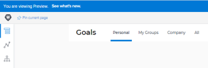

# *`Adobe Workfront Goals`* 21.1 release activity:&nbsp;Week of November 16, 2020 {#adobe-workfront-goals-release-activity-week-of-november}

This page describes all enhancements made with the *`21.1`* release for *`Adobe Workfront Goals`* to the Preview environment the week of *`November 30, 2020`*. These enhancements will be made available in the Production environment in the first quarter of *`21.1`*.

For a list of all changes available for *`Workfront Goals`* at this point in the *`21.1`* release cycle, see [Adobe Workfront Goals with the 21.1 release](goals-release-21-1.md).

For a list of all changes available for all areas of *`Workfront`* at this point in the *`21.1`* release cycle, see [21.1 release overview](21-1-release-overview.md).

## Visualize *`Workfront Goals`* license count in the Setup area {#visualize-workfront-goals-license-count-in-the-setup-area}

As a Workfront administrator, you can now view the number of *`Workfront Goals`* licenses in the System area of Setup. You can view the following information:

The total number of *`Workfront Goals`* licenses that your company has purchased

The number of *`Workfront Goals`* licenses associated with users. This is the number of users to whom to have granted at least View access to Goals in their access level.

For information about managing your license count, see [Manage available licenses in your system](manage-available-licenses-in-your-system.md).

`<iframe class="vimeo-player_0" src="assets/481769970?" frameborder="0" allowfullscreen="1" width="560px" height="315px"></iframe>` 

[View this video in full-screen mode.](https://vimeo.com/481769970/14a32ce74d) 

## Eliminate the “My Teams” tab for users without teams {#eliminate-the-my-teams-tab-for-users-without-teams}

To eliminate the confusion of displaying an empty tab, we have removed the "My Teams" tab from users who are not assigned to any teams. Prior to this change, if a user didn’t belong to any teams, the My Teams tab was empty.

For information about what information displays in *`Workfront Goals`*, see [Filter information in Adobe Workfront Goals](filter-information-wf-goals.md).

