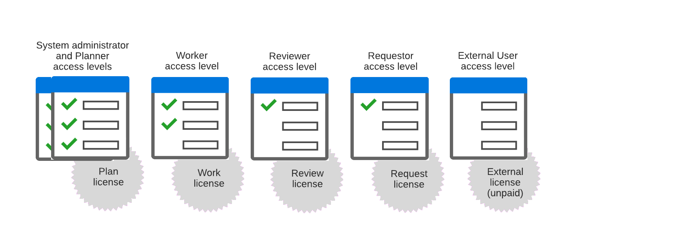

# Access levels overview

As an Adobe Workfront administrator, you assign an access level to a user for two purposes:

* Each user must have an access level in order to log in and work in Workfront. 
* Access levels control what a user can see and do with certain Workfront objects and areas.

Each of the six built-in access levels is attached to one of the five Workfront licenses: Plan, Work, Review, Request, and External. (External is an unpaid license designed primarily for sharing documents with collaborators who don't use Workfront.)

For information on topics related to access levels, see the following articles:

<table style="table-layout:auto"> 
 <col> 
 <col> 
 <thead> 
  <tr> 
   <th>Topic</th> 
   <th>Articles</th> 
  </tr> 
 </thead> 
 <tbody> 
  <tr> 
   <td>Licenses</td> 
   <td> 
The license attached to an access level determines how the access level can be configured.
 
For more information, see <a href="../../../administration-and-setup/add-users/access-levels-and-object-permissions/wf-licenses.md" class="MCXref xref">Licenses overview</a>.
 
<strong>Tip</strong>: You can see which access level and license is assigned to each user by viewing a user list or report. For instructions, see <a href="../../../administration-and-setup/add-users/access-levels-and-object-permissions/list-access-levels-and-licenses-for-your-users.md" class="MCXref xref">List your users' access levels and licenses</a>.
 </td> 
  </tr> 
  <tr> 
   <td>Built-in access levels</td> 
   <td> 
For more information about the 6 built-in access levels shown in the image above, see <a href="../../../administration-and-setup/add-users/access-levels-and-object-permissions/default-access-levels-in-workfront.md" class="MCXref xref">Built-in access levels in Adobe Workfront</a>.
 </td> 
  </tr> 
  <tr> 
   <td>Assigning access levels</td> 
   <td> 
For instructions on how to assign an access level to a user, see <a href="../../../administration-and-setup/add-users/create-and-manage-users/edit-a-users-profile.md" class="MCXref xref">Edit a user's profile</a>.
 </td> 
  </tr> 
  <tr> 
   <td>Access levels Standard, Light, Contributor</td> 
   <td> 
If you see these access levels in your environment instead of Plan, Work, Review, or Request, your organization uses the new access level model. For information on the new model, see <a href="../../../administration-and-setup/add-users/how-access-levels-work/access-level-overview.md" class="MCXref xref">New access levels overview</a>.
 </td> 
  </tr> 
  <!--
  <tr> 
   <td>Access levels and proofing</td> 
   <td> 
Your users' access levels can affect proofing for each permission profile. For more information, see the section in the article .
 </td> 
  </tr> 
  -->
 </tbody> 
</table>
