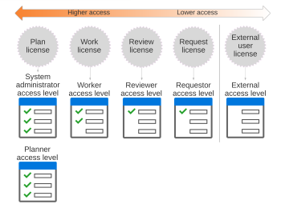

# Adobe Workfront licenses overview

Your organization purchased a certain number of licenses when it acquired Adobe Workfront. As a Workfront administrator, you give one of 4 types of paid Workfront licenses to each user when you assign the user an access level.

## How Workfront licenses and access levels are tied together

The 4 types of paid Workfront licenses allow different levels of access to Workfront. Each access level is attached to one of these licenses.

As a Workfront administrator, instead of assigning a license to a user, you assign them the access level attached to that license.

This table and diagram show the main levels of access to Workfront:

<table> 
 <col> 
 <col> 
 <thead> 
  <tr> 
   <th>License</th> 
   <th>Associated access level</th> 
  </tr> 
 </thead> 
 <tbody> 
  <tr> 
   <td>Plan </td> 
   <td> 
 System Administrator
 
Planner
 </td> 
  </tr> 
  <tr> 
   <td>Work </td> 
   <td>Worker</td> 
  </tr> 
  <tr> 
   <td>Review </td> 
   <td>Reviewer</td> 
  </tr> 
  <tr> 
   <td> 
External
 
Note: This is not a paid license. It is designed primarily for sharing documents with collaborators who don't use Workfront. For more information, see <a href="../../../administration-and-setup/add-users/access-levels-and-object-permissions/default-access-levels-in-workfront.md" class="MCXref xref">Built-in access levels in Adobe Workfront</a>.
 </td> 
   <td> 
External User
 
&nbsp;
 </td> 
  </tr> 
 </tbody> 
</table>

## How a license defines an access level

The license attached to an access level determines the overall scope of functionality available in the access level.

You can copy a default access level and customize the copy as needed for your users. Within the scope of functionality allowed by the license for the copied access level, you can adjust access settings to meet the needs of the user.

For more information, see [Access levels overview](../../../administration-and-setup/add-users/access-levels-and-object-permissions/access-levels-overview.md) and [Create or modify custom access levels](../../../administration-and-setup/add-users/configure-and-grant-access/create-modify-access-levels.md).

## License count

When you assign an access level to a user, your available license count is reduced by 1.

For example, if you assign the Planner access level to a user, your number of available Plan licenses is reduced by 1.

You can view the licenses and access levels assigned to your users. For more information, see [List your users’ access levels and licenses](../../../administration-and-setup/add-users/access-levels-and-object-permissions/list-access-levels-and-licenses-for-your-users.md).

For information about managing your licenses, see [Manage available licenses in your system](../../../administration-and-setup/get-started-wf-administration/manage-available-licenses-in-your-system.md).  

