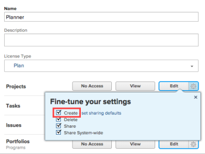
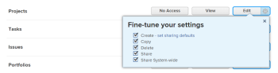

# Deleting soon-need temporarily for access level revamp

## Access level information and settings for each object type

The process above can vary a bit from one object type to another. This section explains the variations for each object type and other object-specific access level information:

* [Projects](#projects) 
* [Tasks](#tasks) 
* [Issues](#issues) 
* [Portfolios](#portfoli) 
* [Reports, dashboards, and calendars](#reports,) 
* [Filters, Views, and Groupings](#filters,) 
* [Documents](#document) 
* [Users](#users) 
* [Templates](#template) 
* [Financial Data](#financia) 
* [Resource Management](#resource) 
* [Scenario Planner area](#scenario) 
* [Goals area](#align)

### Projects

As you configure access settings for the projects object type in an access level, be aware of the following:

* When you are configuring the gear option settings in step 5 above, after you grant **Create** access to projects you can **Fine-tune your settings**.

  <!--
  <MadCap:conditionalText data-mc-conditions="QuicksilverOrClassic.Draft mode">
  In the Production environment,.
  </MadCap:conditionalText>
  -->

  Users with this access level can copy projects as well as create projects.

  

  <!--
  <p class="preview" data-mc-conditions="QuicksilverOrClassic.Draft mode">Alternately, in the Preview environment, you must enable both the <strong>Create</strong> and <strong>Copy</strong> access for users to be able to perform either action. Granting Create access alone does not allow users to also copy projects. And you cannot enable <strong>Copy</strong> alone because Workfront automatically enables <strong>Create</strong> along with it.<br><!--
  
  --></p>
  -->

* For an access level associated with the Plan license (the System Administrator access level and the Planner access level), if you click **Edit** in step 5 above, you can add rules to configure sharing permissions for projects that users create:

   1. Click the gear icon  on the **Edit** button, click **set sharing defaults** next to **Create**, then click **Add Rule**.
   1. Select an entity in the drop-down menu on the left, then select a sharing permission for it in the drop-down menu on the right.

      When a user with this access level creates a project, the project is shared with the entities specified here. This eliminates the need for project managers to configure these permissions for every new project.
   
   1. Add other rules as needed, then click X in the upper-right corner of the **Fine-tune your settings** box when you are finished.

      >[!NOTE]
      >
      >If the user has saved a project access template, the template overrides the settings in the access level. For more information about project access templates, see [Share a project in Adobe Workfront](../../../workfront-basics/grant-and-request-access-to-objects/share-a-project.md).

* Not all access levels can be granted access to projects. For example:

   * A user with a Worker access level can contribute to a project, but not manage one.
   * A user with a Reviewer access level have View rights on projects from converted issues, but their View rights are limited.
   * A user whose access level does not include access to financial data cannot manage risks and finances for projects, even if the user has Edit access to projects.

To learn the default configuration of the 3 main access settings for projects (Edit access, View access, and No access) in each of the 6 default access levels, see the section [Access levels overview](../../../administration-and-setup/add-users/access-levels-and-object-permissions/access-levels-overview.md#projects2) in the article [Access levels overview](../../../administration-and-setup/add-users/access-levels-and-object-permissions/access-levels-overview.md).

For information about what a Workfront administrator can allow users to do with projects in each of the 6 default access levels, see the section [Configurable access to functionality for each object type](../../../administration-and-setup/add-users/access-levels-and-object-permissions/configurable-functionality-in-each-access-level-by-object-type.md#projects) in the article [Configurable access to functionality for each object type](../../../administration-and-setup/add-users/access-levels-and-object-permissions/configurable-functionality-in-each-access-level-by-object-type.md).

<!--
<p style="color: #ff1493;" data-mc-conditions="QuicksilverOrClassic.Draft mode">Thinking about including the 2 tables for each object type in one article instead of 2 articles</p>
-->

<!--
<p style="color: #ff1493;" data-mc-conditions="QuicksilverOrClassic.Draft mode">Also, go through each section below and consolidate any information that is saying basically the same thing</p>
-->

### Tasks

As you configure access settings for the tasks object type in an access level, be aware of the following:

* When you are configuring the gear option settings in step 5 above, you can restrict inherited sharing permissions for tasks from higher ranking objects. Click **Set additional restrictions**, then select **Never inherit document access from projects, tasks, issues, etc**.
* If a user has permissions to a specific project, they inherit permissions to the tasks in that project.

  This doesn’t apply to users with the External User access level, which doesn’t have access to tasks, and the Requestor access level, which has limited task access.

To learn the default configuration of the 3 main access settings for tasks (Edit access, View access, and No access) in each of the 6 default access levels, see the section [Access levels overview](../../../administration-and-setup/add-users/access-levels-and-object-permissions/access-levels-overview.md#tasks2) in the article [Access levels overview](../../../administration-and-setup/add-users/access-levels-and-object-permissions/access-levels-overview.md).

For information about what a Workfront administrator can allow users to do with tasks in each of the 6 default access levels, see the section [Configurable access to functionality for each object type](../../../administration-and-setup/add-users/access-levels-and-object-permissions/configurable-functionality-in-each-access-level-by-object-type.md#tasks) in the article [Configurable access to functionality for each object type](../../../administration-and-setup/add-users/access-levels-and-object-permissions/configurable-functionality-in-each-access-level-by-object-type.md).

### Issues

As you configure access settings for the issues object type in an access level, be aware of the following:

* When you are configuring the gear option settings in step 5 above, you can restrict inherited permissions for issues from higher ranking objects. Click **Set additional restrictions**, then select **Never inherit document access from projects, tasks, issues, etc**.
* When someone shares a project, the recipient’s ability to access issues in the project can be further restricted, but they cannot be expanded beyond what the administrator&nbsp;sets on the access level. For example:

   * If Tony's access level doesn't allow him to create issues, he can't create issues on any projects, even if the user sharing a project with him has given him permission to create issues on the project. 
   * If Olivia's access level allows her to create issues, but she doesn't have permissions to add issues on a particular project, she cannot add issues on that project. But, if her access level allows her to create issues, she can create issues on other another projects where she has been given permissions to do so.

* Users can gain access to an issue in a parent object that is shared with them. For example, if a user already has permission on a project or a task, those permissions are also available for the issue.

To learn the default configuration of the 3 main access settings for issues (Edit access, View access, and No access) in each of the 6 default access levels, see the section [Access levels overview](../../../administration-and-setup/add-users/access-levels-and-object-permissions/access-levels-overview.md#issues2) in the article [Access levels overview](../../../administration-and-setup/add-users/access-levels-and-object-permissions/access-levels-overview.md).

For information about what a Workfront administrator can allow users to do with issues in each of the 6 default access levels, see the section [Issues](../../../administration-and-setup/add-users/access-levels-and-object-permissions/configurable-functionality-in-each-access-level-by-object-type.md#issues) in the article [Configurable access to functionality for each object type](../../../administration-and-setup/add-users/access-levels-and-object-permissions/configurable-functionality-in-each-access-level-by-object-type.md).

### Portfolios

Not all access levels can be granted access to portfolios. Users with a Planner access level can have full access to portfolios.

To learn the default configuration of the 3 main access settings for portfolios (Edit access, View access, and No access) in each of the 6 default access levels, see [Access levels overview](../../../administration-and-setup/add-users/access-levels-and-object-permissions/access-levels-overview.md).

For information about what a Workfront administrator can allow users to do with portfolios and programs in each of the 6 default access levels, see the section [Configurable access to functionality for each object type](../../../administration-and-setup/add-users/access-levels-and-object-permissions/configurable-functionality-in-each-access-level-by-object-type.md#portfoli) in the article [Configurable access to functionality for each object type](../../../administration-and-setup/add-users/access-levels-and-object-permissions/configurable-functionality-in-each-access-level-by-object-type.md).

### Programs

Not all access levels can be granted access to programs. Users with a Planner access level can have full access to programs.

To learn the default configuration of the 3 main access settings for portfolios (Edit access, View access, and No access) in each of the 6 default access levels, see [Access levels overview](../../../administration-and-setup/add-users/access-levels-and-object-permissions/access-levels-overview.md).

For information about what a Workfront administrator can allow users to do with programs in each of the 6 default access levels, see the section [Configurable access to functionality for each object type](../../../administration-and-setup/add-users/access-levels-and-object-permissions/configurable-functionality-in-each-access-level-by-object-type.md#programs) in the article [Configurable access to functionality for each object type](../../../administration-and-setup/add-users/access-levels-and-object-permissions/configurable-functionality-in-each-access-level-by-object-type.md).

### Reports, dashboards, and calendars

>[!IMPORTANT]
>
>```In an access level, if you want grant users access to reports, dashboards, and calendars, you must also give those users access to filters, views, and groupings.```

As you configure access settings for the reports object type in an access level, be aware of the following:

* When you are configuring the gear option settings in step 5 above, the following options are enabled by default:

   * **Create** 
   * **Delete** 
   * **View Built-In Reports**: This needs to be selected to see reports built by Workfront.
   * **Share** 
   * **Share Reports Publicly**: Reports can be shared publicly, by sharing a public link to the report with anyone that does not have a Workfront account. This option must be selected to allow for this level of sharing.
   * **Share System-wide**: Reports can be shared with everyone in the system who has a Workfront license. This option must be selected to allow for this level of sharing.

     For information about sharing reports, dashboards, and calendars, see [Share reports, dashboards, and calendars in Adobe Workfront](../../../workfront-basics/grant-and-request-access-to-objects/permissions-reports-dashboards-calendars.md).

* Access to reports, dashboards, and calendars also includes access to External Pages.
* Not all access levels can be granted full access to reports. Users with a Planner access level can have full access to reports. All other access levels have View access to reports.

To learn the default configuration of the 3 main access settings for reports, dashboards, and calendars (Edit access, View access, and No access) in each of the 6 default access levels, see the section [Access levels overview](../../../administration-and-setup/add-users/access-levels-and-object-permissions/access-levels-overview.md#reports) in the article [Access levels overview](../../../administration-and-setup/add-users/access-levels-and-object-permissions/access-levels-overview.md).

For information about what a Workfront administrator can allow users to do with portfolios and programs in each of the 6 default access levels, see the section [Configurable access to functionality for each object type](../../../administration-and-setup/add-users/access-levels-and-object-permissions/configurable-functionality-in-each-access-level-by-object-type.md#reports) in the article [Configurable access to functionality for each object type](../../../administration-and-setup/add-users/access-levels-and-object-permissions/configurable-functionality-in-each-access-level-by-object-type.md).

### Filters, Views, and Groupings

By default, users with any of the default access level except for External have full View and Edit abilities.

### Documents

As you configure access settings for the documents object type in an access level, be aware of the following:

* When you are configuring the gear option settings in step 5 above, you can restrict inherited permissions for documents from higher ranking objects. Click **Set additional restrictions**, then select **Never inherit document access from projects, tasks, issues, etc**.
* The access granted to documents in the access level works together with permissions granted on a shared document to give users their rights on the document. You cannot inherit access to documents from higher-ranking objects. For example, you can restrict a user from deleting projects in their access level, but this does not restrict them from deleting documents attached to projects, which are a lower-ranking object.

  For information about permissions on documents, see [Share a document in Adobe Workfront](../../../workfront-basics/grant-and-request-access-to-objects/document-permissions.md). For more information about the hierarchy of objects, see the [Interdependency and hierarchy of objects](../../../workfront-basics/navigate-workfront/workfront-navigation/understand-objects.md#understanding-interdependency-and-hierarchy-of-objects) section in [Understand objects in Adobe Workfront](../../../workfront-basics/navigate-workfront/workfront-navigation/understand-objects.md).

To learn the default configuration of the 3 main access settings for reports, dashboards, and calendars (Edit access, View access, and No access) in each of the 6 default access levels, see the section [Access levels overview](../../../administration-and-setup/add-users/access-levels-and-object-permissions/access-levels-overview.md#document) in the article [Access levels overview](../../../administration-and-setup/add-users/access-levels-and-object-permissions/access-levels-overview.md).

For information about what a Workfront administrator can allow users to do with portfolios and programs in each of the 6 default access levels, see the section [Configurable access to functionality for each object type](../../../administration-and-setup/add-users/access-levels-and-object-permissions/configurable-functionality-in-each-access-level-by-object-type.md#document) in the article [Configurable access to functionality for each object type](../../../administration-and-setup/add-users/access-levels-and-object-permissions/configurable-functionality-in-each-access-level-by-object-type.md).

### Users

As you configure access settings for the users object type in an access level, be aware of the following:

* By default, users with a Planner or Worker access level can view the contact information of other users. If you choose **View** when you are configuring the gear option settings in step 5 above, you can deselect **View Contact Info** to remove this access.
* Any of the following users can create and edit other users:

   * A Workfront administrator.
   * A user with a Planner access level that includes administrative access to users. Only the Plan license allows for this access.

     Users that are restricted to see only users from their company (as in step 6 above) or the primary company have access to edit only users they can see.
   
   * A user with a Planner access level who is also specified as the manager of another user.

     Users who are granted Edit access to users in their access level can manage users who report to them.

     For more information about who the manager of a user is see [View the organizational chart](../../../people-teams-and-groups/work-directly-with-others/view-the-org-chart.md).
   
   * A user with a Planner access level who created a user can deactivate, delete, or edit the user they created.

  If you choose **Edit** when you are configuring the gear option settings in step 5 above, you can select any or all of the following options to control how users can edit other users:

  <table cellspacing="0"> 
   <col> 
   <col> 
   <tbody> 
    <tr> 
     <td role="rowheader"><strong>Create</strong> </td> 
     <td>Allows users to create users.<br>This option is enabled, by default.</td> 
    </tr> 
    <tr> 
     <td role="rowheader"><strong>Delete</strong> </td> 
     <td> Allows users to delete the users they have created themselves.<br>This option is enabled, by default.</td> 
    </tr> 
    <tr> 
     <td role="rowheader"><strong>User Admin (All Users)</strong> </td> 
     <td> <p>Allows users to edit, delete, or deactivate all users in Workfront.<br>This option is disabled, by default.</p> </td> 
    </tr> 
    <tr> 
     <td role="rowheader"><strong>User Admin (Group Users)</strong> </td> 
     <td> <p>Allows users who are group administrators to perform the following actions for users in the groups they administer: 
       <ul>
        <li>Log in as them</li>
        <li>Reset their password<br><p>Note:  A group administrator cannot log in as or reset the password of a Workfront administrator.<br></p>When this option is selected and the <strong>User Admin (All Users)</strong> is deselected, group administrators can only edit, delete, or deactivate users in the groups they manage.<br>This option is disabled, by default.</li>
       </ul></p> </td> 
    </tr> 
   </tbody> 
  </table>

* External users can search for users by name. They can’t access the Users  in the Main Menu, so they can’t see a list of users in Workfront.

To learn the default configuration of the 3 main access settings for portfolios and programs (Edit access, View access, and No access) in each of the 6 default access levels, see the section [Access levels overview](../../../administration-and-setup/add-users/access-levels-and-object-permissions/access-levels-overview.md#users) in the article [Access levels overview](../../../administration-and-setup/add-users/access-levels-and-object-permissions/access-levels-overview.md).

For information about what a Workfront administrator can allow users to do with portfolios and programs in each of the 6 default access levels, see the section [Configurable access to functionality for each object type](../../../administration-and-setup/add-users/access-levels-and-object-permissions/configurable-functionality-in-each-access-level-by-object-type.md#users) in the article [Configurable access to functionality for each object type](../../../administration-and-setup/add-users/access-levels-and-object-permissions/configurable-functionality-in-each-access-level-by-object-type.md).

### Templates

As you configure access settings for the templates object type in an access level, be aware of the following:

* If someone else created a template, they must share it with a user before that user can view it or use it to create a project, even when the user has full access to templates in their access level. For more information about permissions on templates, see [Sharing a template](../../../workfront-basics/grant-and-request-access-to-objects/share-a-template.md).
* Not all access levels can be granted full access to templates. Only users with a Planner access level can have full access to templates.

To learn the default configuration of the 3 main access settings for portfolios and programs (Edit access, View access, and No access) in each of the 6 default access levels, see [Access levels overview](../../../administration-and-setup/add-users/access-levels-and-object-permissions/access-levels-overview.md).

For information about what a Workfront administrator can allow users to do with portfolios and programs in each of the 6 default access levels, see the section [Configurable access to functionality for each object type](../../../administration-and-setup/add-users/access-levels-and-object-permissions/configurable-functionality-in-each-access-level-by-object-type.md#template) in the article [Configurable access to functionality for each object type](../../../administration-and-setup/add-users/access-levels-and-object-permissions/configurable-functionality-in-each-access-level-by-object-type.md).

### Financial Data

As you configure access settings for the financial data object type in an access level, be aware of the following:

* When you are configuring the **Allow administrative access for** area in step 6 above, you can select the following options: 

  <table cellspacing="0"> 
   <col> 
   <col> 
   <tbody> 
    <tr> 
     <td role="rowheader">Exchange rates</td> 
     <td>Allows users to modify the exchange rate of the system. Users with a Planner access level can modify the currency of their projects.</td> 
    </tr> 
    <tr> 
     <td role="rowheader">Expenses</td> 
     <td> <p>Allows users to see only:</p> 
      <ul> 
       <li>Their own expenses</li> 
       <li>The expenses for projects and tasks they manage</li> 
       <li>The expenses of users who report to them</li> 
      </ul> </td> 
    </tr> 
   </tbody> 
  </table>

* A user with no access to financial data does not have access to the following:

   * Finance section under Project and Task objects
   * Business case
   * Billing rates and Billing records
   * Cost per hour and billing per hour on User preferences You can configure this using the gear icon  on the View button in step 5 above.
   * Cost per hour and billing per hour on Job Roles. You can configure this using the gear icon  on the View button in step 5 above.

* A user with View access to financial data can view (not edit) the following:

   * Finance section under Project and Task objects
   * Business case
   * Billing rates and Billing records
   * Cost per hour and billing per hour on User preferences You can configure this using the gear icon  on the View button in step 5 above.
   * Cost per hour and billing per hour on Job Roles. You can configure this using the gear icon  on the View button in step 5 above.

* A user with Edit access to financial data can view and edit the following:

   * Finance section under Project and Task objects
   * Business case
   * Billing rates and Billing records
   * Cost per hour and billing per hour on User preferences. You can configure this using the gear icon  on the Edit button in step 5 above.
   * Cost per hour and billing per hour on Job Roles. You can configure this using the gear icon  on the Edit button in step 5 above.

* As a Workfront administrator, you control the financial information a user can see on projects through the user's access level.

  You also control the resource budgeting and allocation information that the user can see in the Resource Management tools through the user's access level.

  For more information, see [Resource Management](#resource) in this article.

* Not all access levels include full access to financial data in Workfront. A user with a Planner access level has full access to financial data.
* A user whose access level doesn't allow access to financial data cannot create a risk for a project. For more information, see [Create and edit risks on projects](../../../manage-work/projects/define-a-business-case/create-edit-risks-on-projects.md).

To learn the default configuration of the 3 main access settings for portfolios and programs (Edit access, View access, and No access) in each of the 6 default access levels, see [Access levels overview](../../../administration-and-setup/add-users/access-levels-and-object-permissions/access-levels-overview.md).

For information about what a Workfront administrator can allow users to do with portfolios and programs in each of the 6 default access levels, see the section [Configurable access to functionality for each object type](../../../administration-and-setup/add-users/access-levels-and-object-permissions/configurable-functionality-in-each-access-level-by-object-type.md#financia) in the article [Configurable access to functionality for each object type](../../../administration-and-setup/add-users/access-levels-and-object-permissions/configurable-functionality-in-each-access-level-by-object-type.md).

### Resource Management

As you configure access settings for the Resource Management object type in an access level, be aware of the following:

* If you choose **Edit** in step 5 above and configure the gear option  settings , you can select any or all of the following options to control the editing access that users have to the Resource Management tools:

  <table cellspacing="0"> 
   <col> 
   <col> 
   <tbody> 
    <tr> 
     <td role="rowheader">Edit priorities and budget hours in the Planner</td> 
     <td> <p>Allows users to do the following:</p> 
      <ul> 
       <li> <p>Prioritize projects in the Resource Planner.</p> </li> 
       <li> <p>Budget allocation for resources in the Resource Planning tools (the Resource Planner and the Resource Budgeting section in the Business Case of a project.)</p> </li> 
      </ul> <p>This option is enabled by default.</p> </td> 
    </tr> 
    <tr> 
     <td role="rowheader">Manage Resource Pools</td> 
     <td> <p>Allows users to create, edit, and delete Resource Pools. This option is disabled by default.</p> </td> 
    </tr> 
    <tr data-mc-conditions=""> 
     <td role="rowheader"><span>Update Planned Hours in the Workload Balancer</span> </td> 
     <td> <p>Allows users to update the Planned Hours of work items when they update the user allocations in the Workload Balancer. The total number of allocated hours becomes the Planned Hours of the work items.</p> <p>This option is disabled by default.</p> <p> For more information, see <a href="../../../resource-mgmt/workload-balancer/manage-user-allocations-workload-balancer.md" class="MCXref xref">Manage user allocations in the Workload Balancer</a>.</p> </td> 
    </tr> 
   </tbody> 
  </table>

* Only a user with a Planner access level or System Administrator access level can be granted full access to Resource Management. Other access levels provide limited or no access to Resource Management.
* Along with the permissions granted to a user on a particular object (which allow the user to budget and view resource allocation on projects), access to the Resource Management tools for the object is determined by the user’s access level settings for both Resource Management and for Financial Data.

To learn the default configuration of the 3 main access settings for portfolios and programs (Edit access, View access, and No access) in each of the 6 default access levels, see [Access levels overview](../../../administration-and-setup/add-users/access-levels-and-object-permissions/access-levels-overview.md).

For information about what a Workfront administrator can allow users to do with portfolios and programs in each of the 6 default access levels, see the section [Configurable access to functionality for each object type](../../../administration-and-setup/add-users/access-levels-and-object-permissions/configurable-functionality-in-each-access-level-by-object-type.md#portfoli) in the article [Configurable access to functionality for each object type](../../../administration-and-setup/add-users/access-levels-and-object-permissions/configurable-functionality-in-each-access-level-by-object-type.md).

### Scenario Planner area

As you configure access settings for the Scenario Planner object type in an access level, be aware of the following:

* In addition to access to Scenario Planner, a user with a non-System Administrator access level must also have access to financial data in order to see any financial information contained in a plan. Some examples of financial information are budgets, costs, and job role rates.
* The following information can help you understand how to use the Access level settings to control users' access to information in the Workfront Scenario Planner.

   * A user with no access to Scenario Planner can neither see the Scenarios icon in the Main Menu when it is added to their layout template, nor view plans and initiatives that are shared with them. If the link to a plan is shared with a user who has no access to Scenario Planner, the user cannot view or edit the plan.
   * Users with view access to Scenario Planner can do the following:

      * See the Scenarios icon in the Main Menu , though the Plans area is empty unless the user clicks a plan link shared by another user. 
      * View a plan when another user shares the link to it. This includes any job role information in the plan. It also includes job role rates and cost information on the plan if the recipient’s access level also grants access to financial data.

   * Users with Edit access to Scenario Planner can do the following:

      * See the Scenarios icon in the Main Menu  and use it to access plan data.
      * Create plans.
      * View, edit, and delete plans that they create.
      * View, edit, and delete other users' plans that they access using a shared link. This includes any job role information in a plan. It also includes job role rates and cost information on the plan if the recipient’s access level also grants access to financial data.

  To learn the default configuration of the 3 main access settings for portfolios and programs (Edit access, View access, and No access) in each of the 6 default access levels, see [Access levels overview](../../../administration-and-setup/add-users/access-levels-and-object-permissions/access-levels-overview.md).

  For information about what a Workfront administrator can allow users to do with portfolios and programs in each of the 6 default access levels, see the section [Configurable access to functionality for each object type](../../../administration-and-setup/add-users/access-levels-and-object-permissions/configurable-functionality-in-each-access-level-by-object-type.md#scenario) in the article [Configurable access to functionality for each object type](../../../administration-and-setup/add-users/access-levels-and-object-permissions/configurable-functionality-in-each-access-level-by-object-type.md).

### Goals area

All 6 of the default access levels (and all 4 of the license types) have the same access to Workfront Goals. For information about specific View and Edit actions that a Workfront administrator can allow when giving users access to Goals in a custom access level, see the table for Workfront Goals in the article [Configurable access to functionality for each object type](../../../administration-and-setup/add-users/access-levels-and-object-permissions/configurable-functionality-in-each-access-level-by-object-type.md).

To learn the default configuration of the 3 main access settings for portfolios and programs (Edit access, View access, and No access) in each of the 6 default access levels, see [Access levels overview](../../../administration-and-setup/add-users/access-levels-and-object-permissions/access-levels-overview.md).

>[!NOTE]
>
>When granting access to Workfront Goals, you must also enroll the users with this access to the new Adobe Workfront experience. Workfront Goals is not available in Adobe Workfront Classic. For information about enrolling users in the new Adobe Workfront experience, see [Enroll users in the new Adobe Workfront experience](../../../administration-and-setup/add-users/create-and-manage-users/enroll-users-new-workfront-experience.md).

For general information about access to Workfront Goals, see Requirements to use Adobe Workfront Goals.
