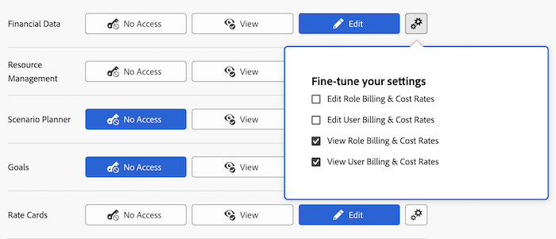

# Grant access to financial data

{{highlighted-preview}}

As an Adobe Workfront administrator, you can define a user's access to the following through the user's access level, as explained in [Access levels overview](../../../administration-and-setup/add-users/access-levels-and-object-permissions/access-levels-overview.md):

* Financial information on projects in Workfront
* Resource budgeting information in the Resource Planning tools

## Access requirements

You must have the following access to perform the steps in this article: 

<table style="table-layout:auto"> 
 <col> 
 <col> 
 <tbody> 
  <tr> 
   <td role="rowheader">Adobe Workfront plan</td> 
   <td>Any</td> 
  </tr> 
  <tr> 
   <td role="rowheader">Adobe Workfront license</td> 
   <td>Plan</td> 
  </tr> 
  <tr> 
   <td role="rowheader">Access level configurations</td> 
   <td> 
You must be a Workfront administrator.
 
<b>NOTE</b>: If you still don't have access, ask your Workfront administrator if they set additional restrictions in your access level. For information on how a Workfront administrator can modify your access level, see <a href="../../../administration-and-setup/add-users/configure-and-grant-access/create-modify-access-levels.md" class="MCXref xref" data-mc-variable-override="">Create or modify custom access levels</a>.
 </td> 
  </tr> 
 </tbody> 
</table>

## Considerations for granting access to financial data

Consider the following when granting users access to financial data in Workfront:

* A user whose access level doesn't allow access to financial data cannot create a risk for a project. For more information, see [Create and edit risks on projects](../../../manage-work/projects/define-a-business-case/create-edit-risks-on-projects.md).
* You can also use an access level to determine which Resource Management activities a user can employ to budget or view resource allocation. For information, see [Grant access to Resource Management](../../../administration-and-setup/add-users/configure-and-grant-access/grant-access-resource-management.md).

## Configure user access to financial data using a custom access level

1. Begin creating or editing the access level, as explained in [Create or modify custom access levels](../../../administration-and-setup/add-users/configure-and-grant-access/create-modify-access-levels.md).
1. Click the gear icon  on the **View** or **Edit** button to the right of Financial Data, then select the abilities you want to grant under **Fine-tune your settings**.

   

1. (Optional) In the **Allow administrative access for** area, select the following options:

   <table style="table-layout:auto"> 
    <col> 
    <col> 
    <tbody> 
     <tr> 
      <td role="rowheader">Exchange rates</td> 
      <td> 
Add new currency in Workfront.
 
Without this access, the user can only add an existing currency to a project they create.
 </td> 
     </tr> 
     <tr> 
      <td role="rowheader">Expenses</td> 
      <td> 
View all expenses on objects in Workfront.
 
This does not allow the user to create new Expense Types.
 
Without this access, the user can only view the following:
 
       <ul> 
        <li>Expenses on projects, tasks or issues they manage</li> 
        <li>Their own expenses</li> 
        <li>The expenses of their subordinates</li> 
       </ul> </td> 
     </tr> 
    </tbody> 
   </table>

1. (Optional) To configure access settings for other objects and areas in the access level you are working on, continue with one of the articles listed in [Configure access to Adobe Workfront](../../../administration-and-setup/add-users/configure-and-grant-access/configure-access.md) such as [Grant access to tasks](../../../administration-and-setup/add-users/configure-and-grant-access/grant-access-tasks.md).
1. When you are finished, click **Save**.

   After the access level is created, you can assign it to a user. For more information, see [Edit a user's profile](../../../administration-and-setup/add-users/create-and-manage-users/edit-a-users-profile.md).

## Access to shared financial information

You can share financial information on a project, task, or issue with other users by granting them permissions to it, as explained in [Share financial permissions on an object](../../../workfront-basics/grant-and-request-access-to-objects/share-financial-permissions-object.md).

<!--
If you make changes here, make them also in the "Grant access to" articles where this snippet had to be converted to text:
* reports, dashboards, and calendars
* financial data
* issue
-->

When you share any object with another user, the recipient's rights on it are determined by a combination of two things:

* The permissions that you grant to your recipient for the object
* The recipient's access level settings for the object's type

## Access to financial information by license type

For information about what users in each access level can do with financial information, see the section [Financial data](../../../administration-and-setup/add-users/access-levels-and-object-permissions/functionality-available-for-each-object-type.md#financia) in the article [Functionality available for each object type](../../../administration-and-setup/add-users/access-levels-and-object-permissions/functionality-available-for-each-object-type.md).

## Access to financial information by setting

The following information can help you understand how to use the Access level settings to control users' access to financial data.

### No access

A user with no access to financial data does not have access to the following:

* Finance section under Project and Task objects
* Business case
* Billing rates and Billing records
* Rate cards
* Cost per hour and billing per hour on User preferences

  You can configure this using the gear icon  on the View button in step 4 above.

* Cost per hour and billing per hour on Job Roles

  You can configure this using the gear icon  on the View button in step 4 above.

### View access

A user with View access to financial data can view (not edit) the following:

* Finance section under Project and Task objects
* Business case
* Billing rates and Billing records
* Cost per hour and billing per hour on User preferences

  You can configure this using the gear icon  on the View button in step 4 above.

* Cost per hour and billing per hour on Job Roles

  You can configure this using the gear icon  on the View button in step 4 above.

### Edit access

A user with Edit access to financial data can view and edit the following:

* Finance section under Project and Task objects
* Business case
* Billing rates and Billing records
* Rate cards
* Cost per hour and billing per hour on User preferences

  You can configure this using the gear icon  on the Edit button in step 4 above.

* Cost per hour and billing per hour on Job Roles

  You can configure this using the gear icon  on the Edit button in step 4 above.
