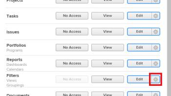

# Grant access to filters, views, and groupings

As an Adobe Workfront administrator, you can use an access level to define a user's access to the filter, view, and grouping controls for lists and reports, as explained in [Access levels overview](../../../administration-and-setup/add-users/access-levels-and-object-permissions/access-levels-overview.md).

For information about the filter, view, and grouping controls, see [Reporting elements: filters, views, and groupings](../../../reports-and-dashboards/reports/reporting-elements/reporting-elements-filters-views-groupings.md).

<!--
Maybe we need an article explaining how there are List Controls as a whole admin set of settings, list controls in Layout Templates, and list elements that users can work with?
-->

## Access requirements

You must have the following access to perform the steps in this article: 

<table style="table-layout:auto"> 
 <col> 
 <col> 
 <tbody> 
  <tr> 
   <td role="rowheader">Adobe Workfront plan</td> 
   <td>Any</td> 
  </tr> 
  <tr> 
   <td role="rowheader">Adobe Workfront license</td> 
   <td>Plan</td> 
  </tr> 
  <tr> 
   <td role="rowheader">Access level configurations</td> 
   <td> 
You must be a Workfront administrator.
 
<b>NOTE</b>: If you still don't have access, ask your Workfront administrator if they set additional restrictions in your access level. For information on how a Workfront administrator can modify your access level, see <a href="../../../administration-and-setup/add-users/configure-and-grant-access/create-modify-access-levels.md" class="MCXref xref" data-mc-variable-override="">Create or modify custom access levels</a>.
 </td> 
  </tr> 
 </tbody> 
</table>

## Configure user access to filters, views, and groupings using a custom access level

1. Begin creating or editing the access level, as explained in [Create or modify custom access levels](../../../administration-and-setup/add-users/configure-and-grant-access/create-modify-access-levels.md).
1. Click the gear icon  on the **View** or **Edit** button to the right of Filters, then select the abilities you want to grant under **Fine-tune your settings**.

   

   By default, users with a Plan, Work, Reviewer, or Request license have full View and Edit abilities. Users with an External User license do not access to filters, views, and groupings.

   <!--
   <MadCap:conditionalText style="color: #ff1493;" data-mc-conditions="QuicksilverOrClassic.Draft mode">
   If this changes, undraft section with table below
   </MadCap:conditionalText>
   -->

1. (Optional) To configure access settings for other objects and areas in the access level you are working on, continue with one of the articles listed in [Configure access to Adobe Workfront](../../../administration-and-setup/add-users/configure-and-grant-access/configure-access.md), such as [Grant access to tasks](../../../administration-and-setup/add-users/configure-and-grant-access/grant-access-tasks.md) and [Grant access to financial data](../../../administration-and-setup/add-users/configure-and-grant-access/grant-access-financial.md).
1. When you are finished, click **Save**.

   After the access level is created, you can assign it to a user. For more information, see [Edit a user's profile](../../../administration-and-setup/add-users/create-and-manage-users/edit-a-users-profile.md).

<!--

<h2>Access to filters, views, and groupings by license type</h2>

Drafting out this section for now because the table is redundant since all four license types can do everything.
-->

This table lists what a Workfront administrator can allow users with each license type to do with filter, views, and groupings. For information about the Workfront license types, see [Adobe Workfront licenses overview](../../../administration-and-setup/add-users/access-levels-and-object-permissions/wf-licenses.md)

<table style="table-layout:auto">
<col>
<col>
<col>
<col>
<col>
<thead>
<tr>
<th> Action </th>
<th> Planner </th>
<th> Worker </th>
<th> Reviewer </th>
<th> Requester </th>
</tr>
</thead>
<tbody>
<tr>
<td>Edit filters, views, and groupings</td>
<td>✓</td>
<td>✓</td>
<td>✓</td>
<td>✓</td>
</tr>
<tr>
<td>Create filters, views, and groupings</td>
<td>✓</td>
<td>✓</td>
<td>✓</td>
<td>✓</td>
</tr>
<tr>
<td>View filters, views, and groupings</td>
<td>✓</td>
<td>✓</td>
<td>✓</td>
<td>✓</td>
</tr>
<tr>
<td>Delete filters, views, and groupings</td>
<td>✓</td>
<td>✓</td>
<td>✓</td>
<td>✓</td>
</tr>
<tr>
<td>Share filters, views, and groupings</td>
<td>✓</td>
<td>✓</td>
<td>✓</td>
<td>✓</td>
</tr>
<tr>
<td>Share filters, views, and groupings system-wide</td>
<td>✓</td>
<td>✓</td>
<td>✓</td>
<td>✓</td>
</tr>
</tbody>
</table> 
