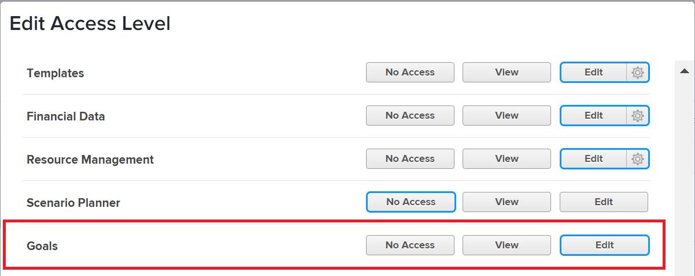

# Grant access to Adobe Workfront Goals

As an Adobe Workfront administrator, you can use an access level to define a user's access to Adobe Workfront Goals, as explained in [Access levels overview](../../../administration-and-setup/add-users/access-levels-and-object-permissions/access-levels-overview.md).

## Access requirements

+++ Expand to view access requirements for the functionality in this article.

You must have the following to grant users access to Workfront Goals:

<table style="table-layout:auto"> 
 <col> 
 <col> 
 <tbody> 
  <tr> 
   <td role="rowheader">Workfront plan</td> 
   <td> 
Pro or higher
 </td> 
  </tr> 
  <tr> 
   <td role="rowheader">Adobe Workfront license*</td> 
   <td>Plan</td> 
  </tr> 
  <tr> 
   <td role="rowheader">Product</td> 
   <td>Workfront Goals 
Contact your Workfront account manager to learn about a Workfront Goals license. 
 
Workfront Goals is available only in the new Adobe Workfront experience.
 </td> 
  </tr> 
  <tr> 
   <td role="rowheader">Access level configuration*</td> 
   <td> 
You must have the System Administrator access level.
 
<b>NOTE</b>: If you still don't have access, ask your Workfront administrator if they set additional restrictions in your access level. For information on how a Workfront administrator can modify your access level, see <a href="../../../administration-and-setup/add-users/configure-and-grant-access/create-modify-access-levels.md" class="MCXref xref" data-mc-variable-override="">Create or modify custom access levels</a>.
 </td> 
  </tr> 
 </tbody> 
</table>

&#42;To find out what plan, license type, or access level you have, contact your Workfront administrator.

For additional information about access to Workfront Goals, see [Requirements to use Workfront Goals](../../../workfront-goals/goal-management/access-needed-for-wf-goals.md).

+++

## Grant user access to Workfront Goals using a custom access level

1. Begin creating or editing the access level, as explained in [Create or modify custom access levels](../../../administration-and-setup/add-users/configure-and-grant-access/create-modify-access-levels.md).
1. Click the option to the right of **Goals** that you want to use for this access level.

   

   >[!NOTE]
   >
   >The External license type does not allow View or Edit access to Workfront Goals.

1. (Optional) To configure access settings for other objects and areas in the access level you are working on, continue with one of the articles listed in [Configure access to Adobe Workfront](../../../administration-and-setup/add-users/configure-and-grant-access/configure-access.md), such as [Grant access to tasks](../../../administration-and-setup/add-users/configure-and-grant-access/grant-access-tasks.md) and [Grant access to financial data](../../../administration-and-setup/add-users/configure-and-grant-access/grant-access-financial.md).
1. When you are finished, click **Save**.

## Access to Workfront Goals by license type

A Workfront administrator can use an access level to grant access to Workfront Goals to users with a Plan, Work, Request, or Review license.
