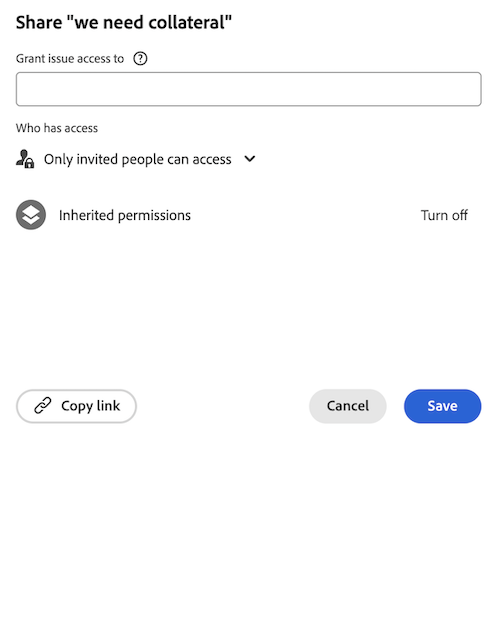

# Grant access to issues

As an Adobe Workfront administrator, you can use an access level to define a user's access to issues, as explained in [Access levels overview](../../../administration-and-setup/add-users/access-levels-and-object-permissions/access-levels-overview.md). 

For information about using custom access levels to manage users' access to other object types in Workfront, see [Create or modify custom access levels](../../../administration-and-setup/add-users/configure-and-grant-access/create-modify-access-levels.md).

## Access requirements

+++ Expand to view access requirements for the functionality in this article.

You must have the following access to perform the steps in this article: 

<table style="table-layout:auto"> 
 <col> 
 <col> 
 <tbody> 
  <tr> 
   <td role="rowheader">Adobe Workfront plan</td> 
   <td>Any</td> 
  </tr> 
  <tr> 
   <td role="rowheader">Adobe Workfront license</td> 
   <td>Plan</td> 
  </tr> 
  <tr> 
   <td role="rowheader">Access level configurations</td> 
   <td> 
You must be a Workfront administrator.
 
<b>NOTE</b>: If you still don't have access, ask your Workfront administrator if they set additional restrictions in your access level. For information on how a Workfront administrator can modify your access level, see <a href="../../../administration-and-setup/add-users/configure-and-grant-access/create-modify-access-levels.md" class="MCXref xref" data-mc-variable-override="">Create or modify custom access levels</a>.
 </td> 
  </tr> 
 </tbody> 
</table>

+++

## Grant user access to issues using a custom access level

1. Begin creating or editing the access level, as explained in [Create or modify custom access levels](../../../administration-and-setup/add-users/configure-and-grant-access/create-modify-access-levels.md).
1. Click the gear icon  on the **View** or **Edit** button to the right of Issues, then select the abilities you want to grant under **Fine-tune your settings**.

1. (Optional) To restrict inherited permissions for issues from higher ranking objects, click **Set additional restrictions**, then select **Never inherit document access from projects, tasks, issues, etc**.

1. (Optional) To configure access settings for other objects and areas in the access level you are working on, continue with one of the articles listed in [Configure access to Adobe Workfront](../../../administration-and-setup/add-users/configure-and-grant-access/configure-access.md), such as [Grant access to tasks](../../../administration-and-setup/add-users/configure-and-grant-access/grant-access-tasks.md) and [Grant access to financial data](../../../administration-and-setup/add-users/configure-and-grant-access/grant-access-financial.md).
1. When you are finished, click **Save**.

   After the access level is created, you can assign it to a user. For more information, see [Edit a user's profile](../../../administration-and-setup/add-users/create-and-manage-users/edit-a-users-profile.md).

## Access to issues by license type

For information about what users in each access level can do with issues, see the section [Issues](../../../administration-and-setup/add-users/access-levels-and-object-permissions/functionality-available-for-each-object-type.md#issues) in the article [Functionality available for each object type](../../../administration-and-setup/add-users/access-levels-and-object-permissions/functionality-available-for-each-object-type.md).

## Access to shared issues

As the owner or creator of an issue, you can share with other users by granting them permissions to it, as explained in [Share an issue](../../../workfront-basics/grant-and-request-access-to-objects/share-an-issue.md).

<!--

If you make changes here, make them also in the "Grant access to" articles where this snippet had to be converted to text:

* reports, dashboards, and calendars

* financial data

* issue

-->

When you share any object with another user, the recipient's rights on it are determined by a combination of two things:

* The permissions that you grant to your recipient for the object
* The recipient's access level settings for the object's type

Also, if allowed by their access level, users can gain access to an issue through object hierarchy: if a user already has permission on an issue's parent project or task, they also have permission on the issue (see Step 3 above). When you are sharing an issue, you can see a list of the users who have inherited permission to it.

