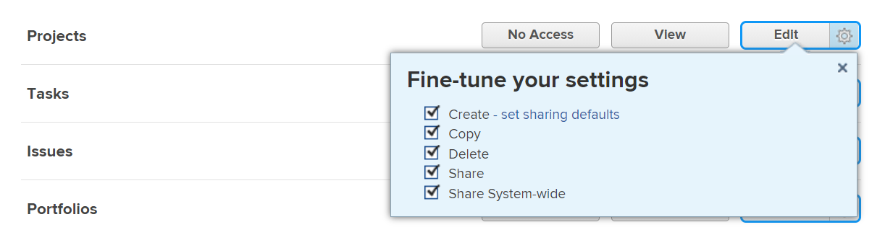
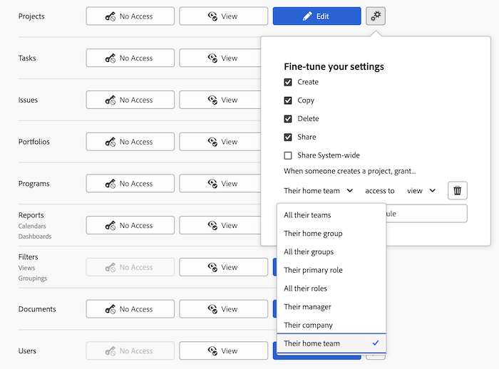
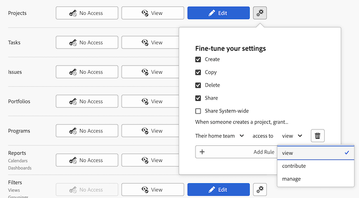

# Grant access to projects

<!-- Audited: 12/2023 -->

As an Adobe Workfront administrator, you can use an access level to define a user's access to projects, as explained in the following articles:
* [Access levels overview](../../../administration-and-setup/add-users/access-levels-and-object-permissions/access-levels-overview.md)
* [New access levels overview](/help/quicksilver/administration-and-setup/add-users/how-access-levels-work/access-level-overview.md)

For information about using custom access levels to manage users' access to other object types in Workfront, see [Create or modify custom access levels](../../../administration-and-setup/add-users/configure-and-grant-access/create-modify-access-levels.md).

## Access requirements

+++ Expand to view access requirements for the functionality in this article.

You must have the following access to perform the steps in this article: 

<table style="table-layout:auto"> 
 <col> 
 <col> 
 <tbody> 
  <tr> 
   <td role="rowheader">Adobe Workfront plan</td> 
   <td>Any</td> 
  </tr> 
    <tr> 
   <td role="rowheader">Adobe Workfront license</td> 
   <td> 
New: Standard 

 
or
 

Current: Plan 
 
</td> 
  </tr> 

  <tr> 
   <td role="rowheader">Access level configurations</td> 
   <td> 
You must be a Workfront administrator.
 </td> 
  </tr> 
 </tbody> 
</table>

For more detail about the information in this table, see [Access requirements in Workfront documentation](/help/quicksilver/administration-and-setup/add-users/access-levels-and-object-permissions/access-level-requirements-in-documentation.md).

+++

## Configure user access to projects using a custom access level

1. Begin creating or editing the access level, as explained in [Create or modify custom access levels](../../../administration-and-setup/add-users/configure-and-grant-access/create-modify-access-levels.md).
1. Click the gear icon  on the **View** or **Edit** button to the right of Projects, then select the abilities you want to grant under **Fine-tune your settings**.

   

   >[!NOTE]
   >
   >* Users with a Work license have limited project rights. They can contribute to a project, but not manage one.
   >* Users with a Review license have View rights on projects from converted issues, but their View rights are limited.
   >* For information about permissions users can grant when sharing projects with others, see [Share a project in Adobe Workfront](../../../workfront-basics/grant-and-request-access-to-objects/share-a-project.md).
   >* When you configure an access level setting for a certain type of object, that configuration doesn't affect the users' access to objects with a lower rank. For example, you can restrict users from deleting projects in their access level, but this does not restrict them from deleting tasks, which are lower-ranking than projects.For more information about the hierarchy of objects, see the section [Interdependency and hierarchy of objects](../../../workfront-basics/navigate-workfront/workfront-navigation/understand-objects.md#understanding-interdependency-and-hierarchy-of-objects) in the article [Understand objects in Adobe Workfront](../../../workfront-basics/navigate-workfront/workfront-navigation/understand-objects.md).

1. (Optional) Click **set sharing defaults** to the right of the Create option, then **Add Rule** to add a sharing rule for new projects.

   When the user with this access level creates a project, the project is shared automatically with the users you select in the menu on the left.

   

   In the menu on the right, you specify how you want the project shared with those users:

   

   >[!NOTE]
   >
   >If a user with this access level is using a project access template, the template overrides the sharing settings in the access level. For information about project access templates, see [Share a project in Adobe Workfront](../../../workfront-basics/grant-and-request-access-to-objects/share-a-project.md).

   You can repeat this step to add as many project sharing rules as you need for the access level.

1. Click the X to close the **Fine-tune your settings** box.
1. (Optional) To configure access settings for other objects and areas in the access level you are working on, continue with one of the articles listed in [Configure access to Adobe Workfront](../../../administration-and-setup/add-users/configure-and-grant-access/configure-access.md), such as [Grant access to tasks](../../../administration-and-setup/add-users/configure-and-grant-access/grant-access-tasks.md) and [Grant access to financial data](../../../administration-and-setup/add-users/configure-and-grant-access/grant-access-financial.md).
1. When you are finished, click **Save**.

   After the access level is created, you can assign it to a user. For more information, see [Edit a user's profile](../../../administration-and-setup/add-users/create-and-manage-users/edit-a-users-profile.md).

## Access to reports, dashboards, and calendars by license type

For information about what users in each access level can do with issues, see the section [Projects](../../../administration-and-setup/add-users/access-levels-and-object-permissions/functionality-available-for-each-object-type.md#projects) in the article [Functionality available for each object type](../../../administration-and-setup/add-users/access-levels-and-object-permissions/functionality-available-for-each-object-type.md).

## Access to shared projects

As the owner or creator of an issue, you can share with other users by granting them permissions to it, as explained in [Share a project in Adobe Workfront](../../../workfront-basics/grant-and-request-access-to-objects/share-a-project.md).

<!--
If you make changes here, make them also in the "Grant access to" articles where this snippet had to be converted to text:
* reports, dashboards, and calendars
* financial data
* issue
-->

When you share any object with another user, the recipient's rights on it are determined by a combination of two things:

* The permissions that you grant to your recipient for the object
* The recipient's access level settings for the object's type
