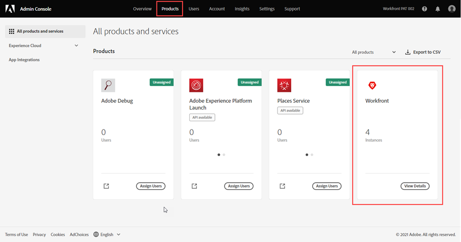
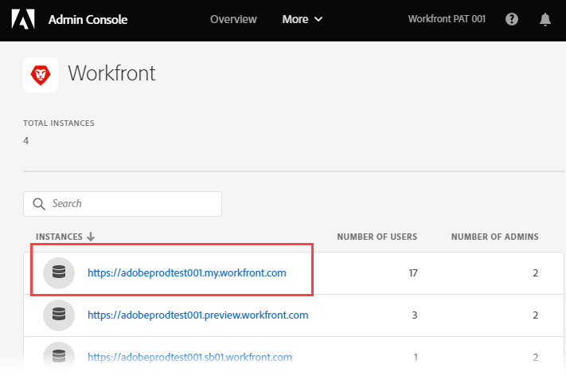
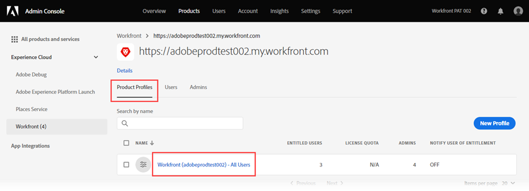
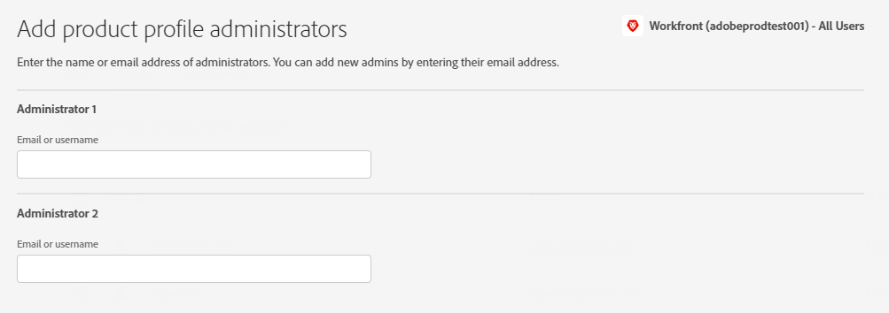

# Manage system administrators in the Adobe Admin Console

>[!IMPORTANT]
>
>The functionality in this article is available only if your organization's instance of Workfront has been onboarded to the Adobe Business Platform.
>
>For a list of procedures that differ based on whether your organization has been onboarded to the Adobe Business Platform, see [Platform-based administration differences (Adobe Workfront/Adobe Business Platform)](../../../administration-and-setup/get-started-wf-administration/actions-in-admin-console.md).

As an Adobe administrator, you can create Adobe Workfront system administrators using the Adobe Admin Console. The console is a central location for managing the Adobe entitlements across your organization. For more information, see the [Admin Console Overview](https://helpx.adobe.com/enterprise/using/admin-console.html).

>[!NOTE]
>
>We recommend adding non-system administrator users directly in Workfront. It is possible to add users in the Adobe Admin Console, but adding them in Workfront allows you to set their access level while creating them, which can save you time.

## Access requirements

You must have the following access to perform the steps in this article:

<table style="table-layout:auto"> 
 <col> 
 </col> 
 <col> 
 </col> 
 <tbody> 
  <tr> 
   <td role="rowheader">Adobe Workfront plan</td> 
   <td>Any</td> 
  </tr> 
  <tr> 
   <td role="rowheader">Adobe administrator rights</td> 
   <td> 
You must be a Product Configuration Administrator of Adobe products for your organization
 </td> 
  </tr> 
 </tbody> 
</table>

## Prerequisites

Before using the Admin Console for Workfront, you should receive an email inviting you to the console.

1. If you are new to Adobe and you have received an email telling you that you now have administer rights to manage Adobe software and services for your organization, click the button in the email to create an Adobe account and open the Admin Console.

   Or

   If you already have an Adobe account, go to the [Adobe Admin Console page](https://adminconsole.adobe.com/).

## Additional details about the Adobe Admin Console

* Workfront System Administrators can deactivate a Workfront user from within Workfront, but this does not deactivate the user in the Admin Console.

  <!--
  
For information about deactivating a user in Workfront, see 

  -->

* The user **Home Group** is determined based on the user who created them. This is not customizable from within the Admin Console.
* The Workfront System Administrator access level can only be edited from within the Adobe Admin Console.

  <!--
  DRAFTED IN FLARE:
  How is this done?
  
  -->

* Changing a user's access from System Administrator to any other access level must be done through the Admin Console first.

  <!--
   This is not clear
  -->

* To remove System Administrator access from a user in Workfront, you must use the Adobe Admin Console to remove the user as Product Profile Administrator. This changes the user's Workfront access level from System Administrator to Requestor.

  >[!IMPORTANT]
  >
  >Do not make any changes to the Product Profile itself.

## Access the user and admin area for your Production instance of Workfront {#access-the-user-and-admin-area-for-your-production-instance-of-workfront}

1. From the [Adobe Admin Console page](https://adminconsole.adobe.com/), select the **Products** tab in the top navigation bar, and then select **Workfront**.

   <!---->

1. In the list that displays, select the link at the top.

   This is your Production instance where your users work.

   <!---->

   >[!TIP]
   >
   >The second link in the list, your Preview instance, is a testing environment that replicates your live Production environment. For more information, see [The Adobe Workfront Preview Sandbox Environment](../../../administration-and-setup/set-up-workfront/workfront-testing-environments/wf-preview-sandbox-environment.md).
   >
   >
   >You might also see links to sandbox environments in the list. For more information, see [The Adobe Workfront Preview Sandbox Environment](../../../administration-and-setup/set-up-workfront/workfront-testing-environments/wf-preview-sandbox-environment.md).

1. In the list that displays, with the **Product Profiles** tab selected, click the name of the Workfront Product Profile link.

   

   This list includes all users that are already assigned to your Production instance of Workfront.

   >[!IMPORTANT]
   >
   >Do not make any changes to the Product Profile itself.

1. Continue on to one of the following sections in this article:

   * [Create users in Workfront with the Adobe Admin Console](#create-users-in-workfront-with-the-adobe-admin-console) 
   * [Create system administrators in Workfront with the Adobe Admin Console](#create-system-administrators-in-workfront-with-the-adobe-admin-console)

## Create system administrators in Workfront with the Adobe Admin Console {#create-system-administrators-in-workfront-with-the-adobe-admin-console}

<!--Audited: 12/2023-->

The System Administrator access level is granted only on the Adobe Admin Console. You cannot grant or remove admin access from within Workfront.

You must add a user to your Production instance of Workfront before you can make the user a Workfront system administrator. 

1. Go to the user and admin area in the Admin Console, as described in the section [Access the user and admin area for your Production instance of Workfront](#access-the-user-and-admin-area-for-your-production-instance-of-workfront) in this article.
1. Select the **Admins** tab above the list of users. 
1. Select **Add Admin**.
1. In the **Add product profile administrators** box, enter the email addresses or names of the administrators you want to add, then select **Save**.

   

   The system administrators are created in Workfront.

   >[!IMPORTANT]
   >
   >Do not make any changes to the Product Profile itself.

## Create users in Workfront with the Adobe Admin Console {#create-users-in-workfront-with-the-adobe-admin-console}

>[!NOTE]
>
>We recommend adding non-system administrator users directly in Workfront. It is possible to add users in the Adobe Admin Console, but adding them in Workfront allows you to set their access level while creating them, which can save you time.

* [Create users in Workfront directly in the Adobe Admin Console](#create-users-in-workfront-directly-in-the-adobe-admin-console)
* [Create users in Workfront and approve them for the Adobe Admin Console](#create-users-in-workfront-and-approve-them-for-the-adobe-admin-console)

### Create users in Workfront directly in the Adobe Admin Console

1. Go to the user and admin area in the Admin Console, as described in the section [Access the user and admin area for your Production instance of Workfront](#access-the-user-and-admin-area-for-your-production-instance-of-workfront) in this article.
1. With the **Users** tab selected above the list, select **Add User**.
1. In the **Add users to this product profile** box, enter the email address or name of a user you want to add, then select **Save**.

   The user is created in Workfront with the Requestor access level.

   >[!IMPORTANT]
   >
   >Do not make any changes to the Product Profile itself.

1. In Workfront, change the user's access level.

   For instructions on how a Workfront administrator can change the user's access level, see [Edit a user's profile](../../../administration-and-setup/add-users/create-and-manage-users/edit-a-users-profile.md).

1. Repeat steps 3 and 4 to add more users.

   >[!NOTE]
   >
   >For new Adobe users, the Admin Console delivers an email to invite them to complete the registration process. All users must complete the registration process to access any Adobe application.
   >
   >For existing Adobe users, the user may or may not receive an email about Workfront being available. This is a preference controlled by the Adobe administrator for the product. Your Adobe administrator may be a different person than your Workfront administrator.

### Create users in Workfront and approve them for the Adobe Admin Console

This workflow allows group administrators that do not have access to the Adobe Admin Console to create users.

First, the group administrator creates the user in Workfront. This creates the user in Deactivated and Pending Approval status.

Then, a Workfront administrator approves the user. This activates the user in Workfront and adds them to the Adobe Admin Console.

#### Create the user in Workfront (Group administrator)

For instructions on creating a user in Workfront, see [Add users](/help/quicksilver/administration-and-setup/add-users/create-and-manage-users/add-users.md).

#### Approve the user (Workfront administrator)

To approve a user:

{{step-1-to-users}}

1. Select the user, then click the **More** icon .

1. To approve the user, click **Approve**, then click **Submit**. 

   Or

   To reject the user and delete them from Workfront, click **Reject**, then click **Submit**.

   Approved users are automatically added to the Adobe Admin Console.

   Rejected users are automatically deleted from Workfront.

<!--

&nbsp;

&nbsp;

&nbsp;

You can create Adobe Workfront users and system administrators with the <a href="https://adminconsole.adobe.com/" alt="Admin Console link">Adobe Admin Console</a>. The console is a central location for managing the Adobe entitlements across your organization. For more information, see the <a href="https://helpx.adobe.com/enterprise/using/admin-console.html" alt="Admin Console Overview">Admin Console Overview</a>.

Before using the Admin Console for Workfront, you should receive a receive an email inviting you to the console. Click in the invitation to accept it and create an account. You can also use an existing account, if already available.

<h2>Create users</h2>

Create users in WF with the Adobe admin console

--> 

<!--

May need to add something about oging throug WF -- check with Jonah

To create users in Workfront with the Admin Console:

<ol>
<li value="1"> 
From the <a href="https://adminconsole.adobe.com/">Admin Console page</a>, select the <b>Products</b> tab and then select the <b>Workfront</b> product tile.
 </li>
<li value="2"> 
Select the link to the Workfront instance you want to change.
 </li>
<li value="3"> 
Select the Product profile link. This shows a list of the currently-assigned users. If the list is very long, you can also search for users in the search field above the list.
 </li>
<li value="4"> 
Select the <b>Add User</b> button.
 </li>
<li value="5"> 
In the <b>Add users</b> box, enter the email address or name of the user you want to add. Select <b>Save</b>. The administrator is created in Workfront with <b>Requestor</b> access level.
 </li>
</ol>
<h2>Create system administrators</h2>

To create system administrators:

<ol>
<li value="1"> 
Make product profile assignments first. To be a Workfront System Administrator, the user must be assigned the Workfront product profile and be an admin for that product profile.
 </li>
<li value="2"> 
From the console, select the <b>Products</b> tab and then select the <b>Admins</b> tab. 
 </li>
<li value="3"> 
Select <b>Add Admin</b>.
 </li>
<li value="4"> 
In the <b>Add product profile administrators</b> box, enter the email address or name of the administrator you want to add. Select <b>Save</b>. The user is created in Workfront with <b>Requestor</b> access level.
 </li>
</ol>
<h2>Additional details for the Admin Console</h2>
<ul>
<li> 
System Administrator access level is granted only on the Admin Console. You cannot grant or remove admin access from within Workfront.
 </li>
</ul>
<ul>
<li> 
Creating and deleting users inside Workfront is only possible through the Admin Console.
 </li>
<li> 
Workfront System Administrators can deactivate Workfront users from within Workfront, but this does not deactivate the user in the Admin Console.
 </li>
<li> 
All new users are are assigned <b>Requestor</b> access level upon creation. Also, the user <b>Home Group</b> is determined based on the user who created them. This is currently not customizable from within the Admin Console.
 </li>
<li> 
The Workfront System Administrator access level can only be edited from within the Adobe Admin Console.
 </li>
<li> 
Editing a user who is a system admin to any other access level must be done through the Admin Console first.
 </li>
<li> 
To remove Workfront system admin access, remove users as Product Profile Administrators. This action changes the user access level in Workfront from a system admin to a <b>Requestor</b>.
 </li>
</ul>

-->
