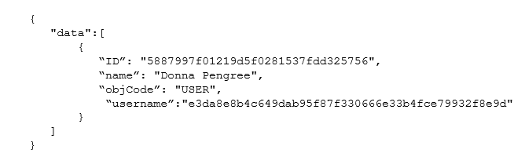

# Change the password for an auto-provisioned user

When you create users through auto provisioning, Adobe Workfront assigns them a GUID (Globally Unique Identifier) for a user name. A GUID is a unique string of random numbers and letters, for example, *5489cb430012526e1ea635e8c29f377f*.

Often, when a new user attempts to change their temporary password, they enter their email address for their user name and receive an error for an incorrect user name. In order for the user to change their password, they must enter their system-assigned user name, which is a GUID.

Because GUID user names can be difficult to use, we recommend you first change a user's user name to their Workfront mail address, then allow them to change their password.

>[!TIP]
>
>You can find a user's GUID in the following ways: 
>
>* Go to the user's profile and copy the GUID from the URL in your browser. 
>
>  For example, in the URL `https://acme.workfront.com/user/61941ab1000af22d7104628efa1c738b/details`, you would copy the string of numbers and letters between the last two forward slashes: `61941ab1000af22d7104628efa1c738b`.
>
>  For more information, see [Edit a user's profile](../../../administration-and-setup/add-users/create-and-manage-users/edit-a-users-profile.md).
>
>* Create a user report with a User > GUID column. For more information, see [Create a report](../../../reports-and-dashboards/reports/creating-and-managing-reports/create-report.md).
>
>* Query the Workfront API.
>

## Access requirements

+++ Expand to view access requirements for the functionality in this article.

You must have the following access to perform the steps in this article: 

<table style="table-layout:auto"> 
 <col> 
 <col> 
 <tbody> 
  <tr> 
   <td role="rowheader">Adobe Workfront plan</td> 
   <td>Any</td> 
  </tr> 
  <tr> 
   <td role="rowheader">Adobe Workfront license</td> 
   <td>Plan</td> 
  </tr> 
  <tr> 
   <td role="rowheader">Access level configurations</td> 
   <td> <p>You must be a Workfront administrator.</p> <p><b>NOTE</b>: If you still don't have access, ask your Workfront administrator if they set additional restrictions in your access level. For information on how a Workfront administrator can modify your access level, see <a href="../../../administration-and-setup/add-users/configure-and-grant-access/create-modify-access-levels.md" class="MCXref xref">Create or modify custom access levels</a>.</p> </td> 
  </tr> 
 </tbody> 
</table>

+++

## Change the password for an auto-provisioned user

1. Determine a user's GUID user name by passing an API request, as shown in the following example:

   https://`<domain>`.my.workfront.com/attask/api/v14.0/USER/search?fields=username&ID=`<ID of User>` Where *`<domain>`* is your company's domain and *`<ID of User>`* is the user's Workfront ID.

   You receive a response similar to the following:

   

   The return for "username" is the user's GUID.

1. Using their GUID as their user name, change the user's password.

   For more information on changing your password, see [Reset your password](../../../workfront-basics/manage-your-account-and-profile/managing-your-workfront-account/reset-your-password.md).

   If your organization uses a SSO system, only a Workfront system administrator can change a user's password. For more information, see [Overview of single sign-on in Adobe Workfront](../../../administration-and-setup/add-users/single-sign-on/sso-in-workfront.md)

1. With the user logged in to Workfront, navigate to:

```
   https://<your domain>.my.workfront.com/login/convertUsername
``` 

1. In the **Your login email address** box, verify that user's email address is correct, then click **Update Account**.

   

   The user's user name is changed to their Workfront email address.

>[!TIP]
>
>To find a user's ID:
>
>1. Click the **Main Menu** icon  in the upper-right corner of Adobe Workfront, then click **Users** . 
>
>1. Select the user.
>
>   The user's profile page opens and their user ID displays in the URL.
>
