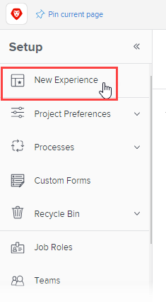

# Enroll users in the new Adobe Workfront experience

>[!NOTE]
>
>The weekly refresh of the Preview environment does not affect user enrollment in the new Adobe Workfront experience.

By default, new users have Adobe Workfront Classic as their personal Workfront environment. As a Workfront administrator or a group administrator, you can manually enroll users in the new Adobe Workfront experience, or you can manually remove users who are already enrolled.

For more information about the new experience, see [the new Workfront experience page](https://one.workfront.com/s/new-workfront-experience).

``` ```**Tip: **`````` As an Adobe Workfront administrator or a group administrator, you can change your own Workfront environment by doing one of the following:

* Selecting Switch to the new experience from the user menu in the Global Navigation Bar
* Selecting Switch to Classic in the Main Menu.

For more information, see [Switch your admin account to Adobe Workfront Classic](#switch) or [Switch your admin account to the new Adobe Workfront experience](#switch2).

## Access requirements

You must have the following to perform the steps in this article:

<table cellspacing="0"> 
 <col> 
 <col> 
 <tbody> 
  <tr> 
   <td role="rowheader">Adobe Workfront plan</td> 
   <td> <p>Any</p> </td> 
  </tr> 
  <tr> 
   <td role="rowheader">Adobe Workfront license</td> 
   <td> <p>Plan </p> </td> 
  </tr> 
  <tr> 
   <td role="rowheader">Access level configurations</td> 
   <td> <p>You must have one of the following:</p> 
    <ul> 
     <li> <p>The System Administrator access level. For information, see <a href="../../../administration-and-setup/add-users/configure-and-grant-access/grant-a-user-full-administrative-access.md" class="MCXref xref">Grant a user full administrative access</a>. </p> </li> 
     <li> <p><b>Users</b> setting in your access level configured to <b>Edit</b> access, with <b>Create</b> and at least one of the two <b>User Admin</b> options enabled under <b>Fine-tune your settings</b>. </p> <p>Of these two options, if User <b>Admin (Group Users)</b> is enabled, you must be a group administrator of a group where the user is a member.</p> <p>For more information about the <b>Users</b> setting in an access level, see <a href="../../../administration-and-setup/add-users/configure-and-grant-access/grant-access-other-users.md" class="MCXref xref">Grant access to users</a>.</p> </li> 
    </ul> </td> 
  </tr> 
 </tbody> 
</table>

## Prerequisites

To see the New Experience screen, you must meet the following conditions:

* Your organization purchased Workfront before March 2020.
* Access to Adobe Workfront Classic has not been disabled for all new and existing users.

  >[!TIP]
  >
  >Workfront Support can disable access to Adobe Workfront Classic to automatically enroll all new and existing users in the new Adobe Workfront experience. To transition your instance to the new Adobe Workfront experience, [contact Workfront Support](https://one.workfront.com/s/support?language=en_US).

## Enroll users in the new Adobe Workfront experience

1. To access the **Setup** area, do one of the following:

   * If your personal Workfront environment is in the new Adobe Workfront experience, click the **Main Menu** icon  in the upper-right corner of Workfront, then click **Setup**.
   
   * If your personal Workfront environment is in Adobe Workfront Classic, click **Setup**  in the Global Navigation Bar.

1. In the left panel, click **New Experience**.

   

1. In the **All Users** section, begin typing the name of the user, team, or group you want to enroll in to the new experience, then click the name when it appears.

   >[!TIP]
   >
   >You can enroll only 100 individual users at a time. If you need to add a larger group of users, we recommend adding the users to a group or team, then enrolling that group or team in the new experience.

   >[!NOTE]
   >
   >```If you are a Group administrator, you can only see names of users in groups that you manage.```

1. (Optional) Click **User details** inline with a user to see the user's:

   * Name
   * Job role
   * Email address
   * Profile picture

1. Select the name of each user that you want to enroll, or click the **Select All** option, then click **Enroll Selected Users**.

   Your changes save automatically and each enrolled user appears in the **Enrolled Users** section.

1. Instruct users that they must log out and log back in to Workfront in order to see the new Adobe Workfront experience.

## Remove users from the new Adobe Workfront experience

1. To access the **Setup** area, do one of the following:

   * If your personal Workfront environment is in the new Adobe Workfront experience, click the **Main Menu** icon  in the upper-right corner of Workfront, then click **Setup**.
   
   * If your personal Workfront environment is in Adobe Workfront Classic, click **Setup**  in the Global Navigation Bar.

1. Click **New Experience**.

   

1. In the **Enrolled Users** section, begin typing the name of the user, team, or group you want to remove from the new experience, then click the name when it appears.

   >[!NOTE]
   >
   >If you are a Group administrator, you can only see names of users in groups that you manage.

1. (Optional) Click **User details** inline with a user to see the user's:

   * Name
   * Job role
   * Email address
   * Profile picture

1. Select each user that you want to remove from the new experience, or click the **Select All** option, then click **Remove Selected Users**.

   Your changes save automatically and each unenrolled user appears in the **All Users** section.

1. Instruct users that they must log out and log back in to Workfront in order to see Adobe Workfront Classic.

## Switch your admin account to Adobe Workfront Classic

As a Workfront administrator or a group administrator, you can change your own Workfront environment.

1. In the upper-right corner of Workfront, click the **Main Menu** icon .
1. Click **Switch to Classic Workfront**.

   You are redirected to Adobe Workfront Classic.

   

## Switch your admin account to the new Adobe Workfront experience

As a Workfront administrator or a group administrator, you can change your own Workfront environment.

1. In the upper-right corner of Workfront, click your profile picture.
1. Click **Switch to the new experience**.

   You are redirected to the new Adobe Workfront experience.

   

