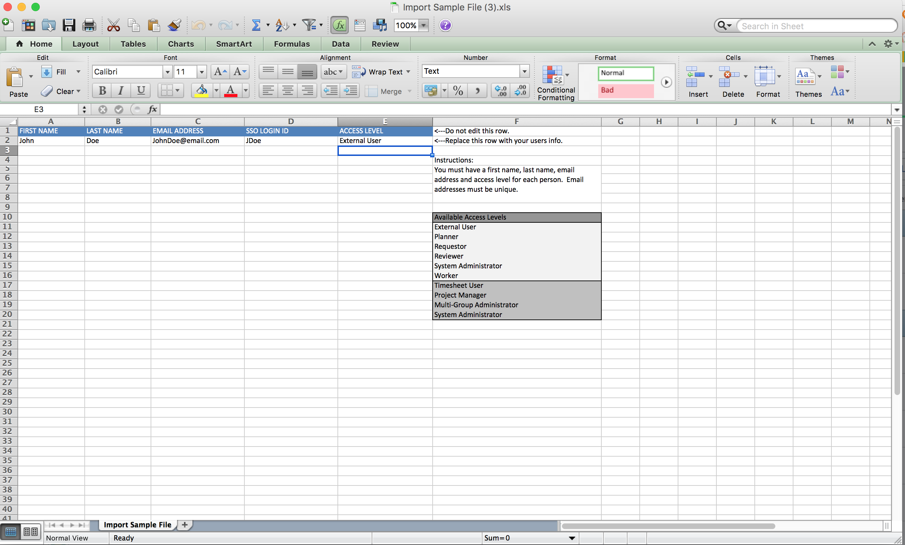

# Import users

<!--

>[!IMPORTANT]
>
>The procedure described on this page applies only to organizations that have not yet been onboarded to the Admin Console. If your organization has been onboarded to the Adobe Admin Console, you must perform this action through the Adobe Admin Console.
>
>For instructions on editing a user's profile in the Adobe Admin Console, see the section "Add users" in the article [Bulk Upload Users](https://helpx.adobe.com/enterprise/using/bulk-upload-users.html) or contact your Adobe Admin Console Administrator.
>
>For a list of procedures that differ based on whether your organization has been onboarded to the Adobe Admin Console, see [Platform-based administration differences (Adobe Workfront/Adobe Business Platform)](../../../administration-and-setup/get-started-wf-administration/actions-in-admin-console.md).

-->

You can import users using a spreadsheet import file.

Before you create a new user, first ensure that you have created all objects that you want to associate with the user. For example, if you have not created a schedule, you cannot assign a schedule to the new user, and the field you use to associate a schedule with the new user does not appear in the New User screen.

## Access requirements

+++ Expand to view access requirements for the functionality in this article.

You must have the following to perform the steps in this article:

<table style="table-layout:auto"> 
 <col> 
 <col> 
 <tbody> 
  <tr> 
   <td role="rowheader">Adobe Workfront plan</td> 
   <td>Any</td> 
  </tr> 
  <tr> 
   <td role="rowheader">Adobe Workfront license</td> 
   <td>Plan</td> 
  </tr> 
  <tr> 
   <td role="rowheader">Access level configurations</td> 
   <td> 
You must have one of the following:
 
    <ul> 
     <li> 
The System Administrator access level. For information, see <a href="../../../administration-and-setup/add-users/configure-and-grant-access/grant-a-user-full-administrative-access.md" class="MCXref xref">Grant a user full administrative access</a>. 
 </li> 
     <li> 
<b>Users</b> setting in your access level configured to <b>Edit</b> access, with <b>Create</b> and at least one of the two <b>User Admin</b> options enabled under <b>Fine-tune your settings</b> . 
 
Of these two options, if User <b>Admin (Group Users)</b> is enabled, you must be a group administrator of a group where the user is a member.
 
For more information about the <b>Users</b> setting in an access level, see <a href="../../../administration-and-setup/add-users/configure-and-grant-access/grant-access-other-users.md" class="MCXref xref">Grant access to users</a>.
 </li> 
    </ul> </td> 
  </tr> 
 </tbody> 
</table>

+++

## Use a spreadsheet import file to import users

{{step-1-to-users}}

1. Click the **New User** drop-down arrow, then click **Import Users**.

1. In the **Import Users** box that displays, download the sample file, then update the sample file to include your own user's personal information.

   Each row includes the following fields:

   * **First Name** 
   * **Last Name** 
   * **Email Address**

     Email addresses must be unique.

   * **Access Level**

     Access Levels are case sensitive.

   * **SSO Login ID**

     This field is included only if SSO is enabled in your system. You must add the Federation ID in this field for each user. When you create a user from the People tab, you can set up a password for the user if you want to allow users to log in without SSO. However, the import feature does not allow you to leave the SSO LOGIN ID blank.

   * Ensure that no extra spaces exist before or after a user's email address.

   When you are finished with a row, it should look like this:

     

1. Save the file to a location on your workstation.
1. Click **Choose File** in the **Import Users** box.

1. Navigate to and select the file that you saved.  
1. (Optional) Select the **Send an invite email to this user** option to send an email invitation to the user, notifying them that a Workfront account has been created and prompting them to set their password.

   Deselect this option if you want to set the password for the user.

1. Click **Import**.

   You receive a confirmation message at the top of the screen that the user was successfully imported.
