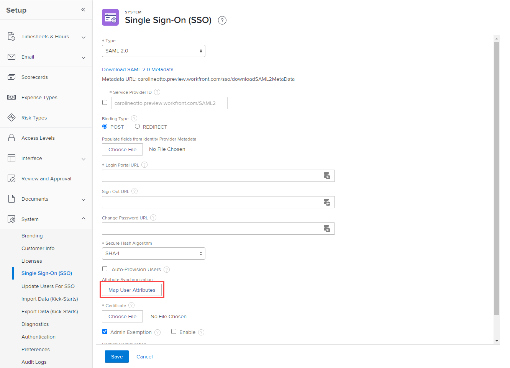
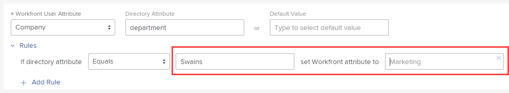

# Map user attributes

Using single sign-on (SSO), you can pass attributes from your identity provider's Active Directory to your Adobe Workfront users. 

## Access requirements

You must have the following access to perform the steps in this article: 

<table style="table-layout:auto"> 
 <col> 
 <col> 
 <tbody> 
  <tr> 
   <td role="rowheader">Adobe Workfront plan</td> 
   <td>Any</td> 
  </tr> 
  <tr> 
   <td role="rowheader">Adobe Workfront license</td> 
   <td>Plan</td> 
  </tr> 
  <tr> 
   <td role="rowheader">Access level configurations</td> 
   <td> 
You must be a Workfront administrator.
 
<b>NOTE</b>: If you still don't have access, ask your Workfront administrator if they set additional restrictions in your access level. For information on how a Workfront administrator can modify your access level, see <a href="../../../administration-and-setup/add-users/configure-and-grant-access/create-modify-access-levels.md" class="MCXref xref">Create or modify custom access levels</a>.
 </td> 
  </tr> 
 </tbody> 
</table>

## Tips for mapping attributes

Keep the following in mind when mapping attributes:

* Always test in a Preview sandbox or a Customer Refresh (CR) sandbox.
* Test with both administrator and non-administrator accounts to confirm that you are mapping attributes correctly.

## Map user attributes for your organization

The procedure for mapping attributes differs depending on whether your organization is on the Adobe unified experience.

To determine whether your organization is on the Adobe unified experience, examine the URL that you use to access Workfront.

|URL|Adobe Experience|
|---|---|
|(CompanyName).my.workfront.com|Classic experience|
|experience.adobe.com|Adobe unified experience |

* [Map user attributes in the classic experience](#map-user-attributes-in-the-classic-experience)
* [Map user attributes in the Adobe unified experience](#map-user-attributes-in-the-adobe-unified-experience)

### Map user attributes in the classic experience

1. Click the **Main Menu** icon  in the upper-right corner of Adobe Workfront, then click **Setup** .

1. Click **System** > **Single Sign-On (SSO)**.

1. In the **Type** drop-down, click **SAML 2.0**.

1. Click **Map User Attributes**.

   

1. In the row of options that appears, map the attributes you need for your Workfront users.

   You can map attributes such as Address, Manager, Job Role, Home Group, and so on.

   Attribute mappings work on a 1:1 Ratio. For example, you cannot set every group that a user belongs to; you can set only one per user.

   >[!IMPORTANT]
   >
   >The following attributes are required for each user:
   >      
   >* First Name
   >* Last Name
   >* Email Address
   >      
   >We do not recommend mapping Access Levels in the Attribute Mappings. If you do, be careful when you are setting the default value to make sure that you don't remove Admin Access inadvertently.

   The following table explains the fields you can use to map attributes:

   <table style="table-layout:auto"> 
    <col data-mc-conditions=""> 
    <col data-mc-conditions=""> 
    <tbody> 
     <tr> 
      <td role="rowheader">Workfront User Attribute</td> 
      <td>Choose the name of the attribute you are mapping</td> 
     </tr> 
     <tr> 
      <td role="rowheader">Directory Attribute</td> 
      <td>Type the SSO attribute label you want to use.</td> 
     </tr> 
     <tr> 
      <td role="rowheader">Default Value</td> 
      <td> 
After you choose a Workfront User Attribute, if the value is NULL during the connection, this field fills in with the corresponding default value in the system. Type a value here only if you plan to apply attribute mapping rules (see step 7). The default value acts as an exception to those rules.</td> 
     </tr> 
    </tbody> 
   </table>

1. (Optional) Click **Rules** to add a rule to the attribute.

   1. In the drop-down, choose the attribute modifier you want to use.
   1. In the 2 fields to the right, type the directory attribute value and the value you want to replace it with.

      

   You can click **Add Rule** to add more rules to the attribute.

1. (Optional) To map more user attributes, click **Add Mapping** and repeat steps 6-7.
1. Click **Save**.

### Map user attributes in the Adobe unified experience

1. Click the **Main Menu** icon  in the upper-left corner of Adobe Workfront, then click **Setup** .

1. Click **System** > **Single Sign-On (SSO)**.

1. Select the **Adobe** tab.

1. To create a new attribute mapping, click **Add Mapping**.

1. Click the arrow next to the Workfront field name and select the [!DNL Workfront] field that you want to map to. 

1. (Optional) If you want to create more than one rule for a given field, click the arrow next to **Always** and select the operator that you want the rule to use. 

1. (Conditional) If you have selected an operator besides Always, select the Workfront field and value that the operator applies to.

   >[!NOTE]
   >
   >The operators `Is Truthy` and `Is Falsy` do not require values.

1. Select whether you want to apply the value of a field in your identity manager to the Workfront field, or if you want to apply a specific constant value.

1. Enter the name of the identity manager field that you want to apply, or enter the text of the constant value you want to apply.

1. (Optional) To add more rules for the same Workfront field, click **Add New Rule**, and follow steps 4-9.
   
   >[!IMPORTANT]
   >
   > * Any rule below an Always rule will be ignored. If you have an Always rule, you must move it to the bottom of the list of rules. You can move rules in the list by clicking the three-dot menu to the right of the rule and move the rule up or down.
   > * To create a rule in the middle of the list, click the three-dot menu next to the rule that you want to be above or below the new rule, and select **Add Rule Above** or **Add Rule Below**.

1. To delete a rule, click the three-dot menu next to the rule you want to delete, and select **Delete**.

1. To save, scroll to the top of the page and click **Save**.

