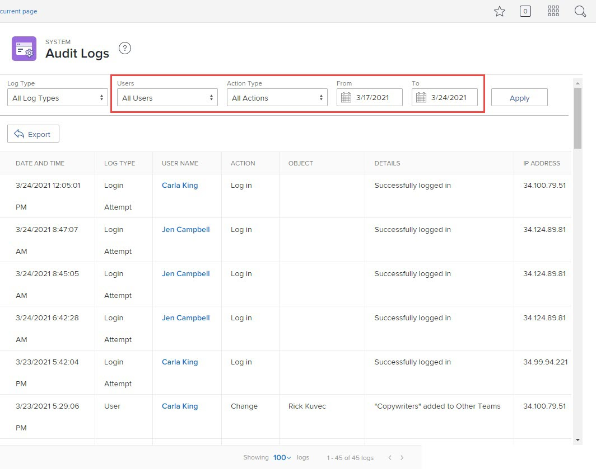

# View and export audit logs

<!--
**DON'T DELETE, DRAFT OR HIDE THIS ARTICLE. IT IS LINKED TO THE PRODUCT, THROUGH THE CONTEXT SENSITIVE HELP LINKS. **
-->

You can view all audit logs in the system, or those that meet certain filtering criteria. You can also export audit logs.

Audit logs list user-changes triggered in the system during the past 90 days.

For information about all the audit log types and what generates them, see [Audit logs](../../../administration-and-setup/add-users/create-and-manage-users/audit-logs.md).

## Access requirements

You must have the following to perform the steps in this article:

<table style="table-layout:auto"> 
 <col> 
 <col> 
 <tbody> 
  <tr> 
   <td role="rowheader">Adobe Workfront plan</td> 
   <td> 
Any
 </td> 
  </tr> 
  <tr> 
   <td role="rowheader">Adobe Workfront license</td> 
   <td> 
Plan 
 
You must be a Workfront administrator.
 </td> 
  </tr> 
 </tbody> 
</table>

## View audit logs

1. Click the **Main Menu** icon  in the upper-right corner of Adobe Workfront, then click **Setup** .

1. In the left panel, click **System > Audit Logs**.
1. In the **Log Type** drop-down menu, select the type of audit log you want to view.

   **All Log Types** is selected by default.

   For a list of all the audit log types you can view and the information they include, see [Audit logs](../../../administration-and-setup/add-users/create-and-manage-users/audit-logs.md).

1. (Optional) Set any of the available filters.

   >[!NOTE]
   >
   >The options in the Action Type drop-down menu vary depending on the audit log selected.

   

1. Click **Apply**.
1. (Optional) Click **Clear Filters** to reset changes made to the filters.

## Export audit logs

1. Click the **Main Menu** icon  in the upper-right corner of Adobe Workfront, then click **Setup** .  

1. In the left panel, click **System > Audit Logs**.  

1. In the **Log Type** drop-down menu, select an audit log.

   **All Log Types** is selected by default.

1. Set any of the available filters, then click **Apply**.

   >[!IMPORTANT]
   >
   >You can't export more than 50,000 logs at one time. Workfront exports logs based on the filters you set, not the number of logs showing on the page. You can view the total number of filtered logs in the bottom-right corner of the page.

1. Click **Export**.

