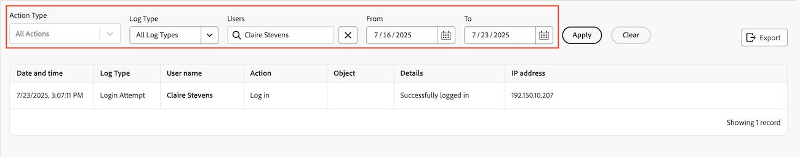

# View and export audit logs

<!--
**DON'T DELETE, DRAFT OR HIDE THIS ARTICLE. IT IS LINKED TO THE PRODUCT, THROUGH THE CONTEXT SENSITIVE HELP LINKS. **
-->

You can view all audit logs in the system, or those that meet certain filtering criteria. You can also export audit logs to a CSV file.

Audit logs list user-changes triggered in the system during the past 90 days.

For information about all the audit log types and what generates them, see [Audit logs](../../../administration-and-setup/add-users/create-and-manage-users/audit-logs.md).

## Access requirements

+++ Expand to view access requirements for the functionality in this article.

You must have the following access to perform the steps in this article: 

<table style="table-layout:auto"> 
 <col> 
 <col> 
 <tbody> 
  <tr> 
   <td role="rowheader">Adobe Workfront package</td> 
   <td>
Any
</td> 
  </tr> 
  <tr> 
  <tr> 
   <td role="rowheader">Adobe Workfront license</td> 
   <td>
Standard

       
Plan
</td>
  </tr> 
  </tr> 
  <tr> 
   <td role="rowheader">Access level configurations</td> 
   <td>
System Administrator
</td>
  </tr> 
 </tbody> 
</table>

For more detail about the information in this table, see [Access requirements in Workfront documentation](/help/quicksilver/administration-and-setup/add-users/access-levels-and-object-permissions/access-level-requirements-in-documentation.md).

+++

## View audit logs

{{step-1-to-setup}}

1. In the left panel, click **System > Audit Logs**.
1. In the **Action Type** drop-down, select the type of audit you want to view. 

   >[!NOTE]
   >
   >The options in the Action Type drop-down menu vary depending on the audit log selected.

1. In the **Log Type** drop-down menu, select the type of audit log you want to view.

   **All Log Types** is selected by default.

   For a list of all the audit log types you can view and the information they include, see [Audit logs](../../../administration-and-setup/add-users/create-and-manage-users/audit-logs.md).

1. (Optional) Set any of the available filters for the following fields:

   * **Users**: Type the name of the user who made a change. 
   * **From**: Start date of the time frame when the change was made. 
   * **To**: End date of the time frame when the change was made.

   

1. Click **Apply**.
1. (Optional) Click **Clear** to reset changes made to the filters.

## Export audit logs

{{step-1-to-setup}}  

1. In the left panel, click **System** > **Audit Logs**.  

1. In the **Log Type** drop-down menu, select an audit log.

   **All Log Types** is selected by default.

1. Set any of the available filters, then click **Apply**.

   >[!IMPORTANT]
   >
   >You can't export more than 50,000 logs at one time. Workfront exports logs based on the filters you set, not the number of logs showing on the page. You can view the total number of filtered logs in the bottom-right corner of the page.

1. Click **Export**.

   The save file box opens and you can save the exported file on your computer. 

   You can save the audit logs only in a CSV format. 

   Finish saving the exported file. You can now find it on your computer and share it with others. 
