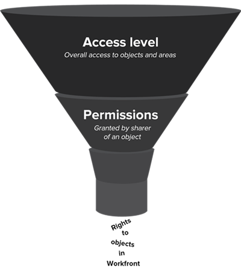

# New access levels overview

As an Adobe Workfront administrator, you assign an access level to a user for 2 purposes:

* Every user must have an access level in order to log in and work in Workfront. 
* You use the access level to control what a user can see and do with certain Workfront objects and areas.

## New built-in access levels in Adobe Workfront {#built-in-access}

Workfront has 5 new built-in access levels:

* System Administrator
* Standard
* Light
* Contributor
* External

Depending on the access level, up to 3 permissions are available for most of the Workfront object types:

<table style="table-layout:auto">
    <tr>
        <td>Edit</td>
        <td>Users can create, edit, delete, and share the Workfront object</td>
    </tr>
    <tr>
        <td>View</td>
        <td>Users can review and share the Workfront object</td>
    </tr>
    <tr>
        <td>No Access</td>
        <td>Users cannot access the Workfront object</td>
    </tr>
</table>

If you need a custom access level, you can copy the built-in access level and adjust the amount of access you want it to allow for the various Workfront object types. For information on creating a custom access level, see [Create or modify custom access levels](../../../administration-and-setup/add-users/configure-and-grant-access/create-modify-access-levels.md).

>[!IMPORTANT]
>
>We strongly recommend that you leave the built-in access levels unchanged so that you can refer to them after you set up your users.

### System Administrator access level

Attached to the Standard license, this built-in access level is designed for a user who is in charge of administering the Adobe Workfront system. You cannot modify this built-in access level.

Users with the System Administrator access level can do everything within Workfront. They can view and edit all Workfront objects and information entered in Workfront by all other users.

They also have access to the complete Setup area, where they can change any setting at the system level, and they can access all areas in the  Main Menu.

For more information, see [Grant a user full administrative access](../../../administration-and-setup/add-users/configure-and-grant-access/grant-a-user-full-administrative-access.md).

### Standard access level

Also attached to the Standard license, this access level is designed for users who:

* Plan, create, and track all projects in one place
* Automate routine processes
* Manage resources
* Track and collaborate on requests
* Track and report on project finances
* Kickoff inbound work requests
* Collaborate on projects, tasks, and issues

>[!NOTE]
>
>You can create a custom version of the Standard built-in access level and adjust the amount of access it allows for the various Workfront object types. For information on creating a custom access level, see [Create or modify custom access levels](../../../administration-and-setup/add-users/configure-and-grant-access/create-modify-access-levels.md).

#### **Access details**

The following are the highest access settings available for objects in the Standard access level:

| Workfront object type |No access |View access |Edit access |
|---|---|---|---|
| Projects |&nbsp; |&nbsp; |✓ |
| Tasks |&nbsp; |&nbsp; |✓ |
| Issues |&nbsp; |&nbsp; |✓ |
| Portfolios |&nbsp; |&nbsp; |✓ |
| Programs |&nbsp; |&nbsp; |✓ |
| Reports (including dashboards and calendar reports) |&nbsp; |&nbsp; |✓ |
| Filters, views, and groupings |&nbsp; |&nbsp; |✓ |
| Documents |&nbsp; |&nbsp; |✓ |
| Users |&nbsp; |&nbsp; |✓ |
| Templates |&nbsp; |&nbsp; |✓ |
| Financial data |&nbsp; |&nbsp; |✓ |
| Resource Management |&nbsp; |&nbsp; |✓ |
| Scenario Planner  |&nbsp; |&nbsp; |✓ (The default setting is No Access.) |
| Boards |&nbsp; |&nbsp; |✓ | 
| Home |&nbsp; |&nbsp; |✓|
| Goals  |&nbsp; |&nbsp; |✓ |

{style="table-layout:auto"}

### Light access level

Attached to the Light license, this access level is designed for users who:

* View all items and updates tied to work
* Approve projects, tasks, and issues
* View dashboards and reports
* Track time and approve timesheets
* Create and manage issues
* Make updates on work

Users with the Light access level:

* Can be assigned work items but can't complete them.
* Can access requests and documents in the Main Menu.
* Have limited ability to create objects—they can't create projects, portfolios, programs, or reports.

>[!NOTE]
>
>You can create a custom version of the Light built-in access level and adjust the amount of access it allows for the various Workfront object types. For information on creating a custom access level, see [Create or modify custom access levels](../../../administration-and-setup/add-users/configure-and-grant-access/create-modify-access-levels.md).

#### **Access details**

The following are the highest access settings available for objects in the Light access level:

<table style="table-layout:auto"> 
 <col> 
 <col> 
 <col> 
 <col> 
 <thead> 
  <tr> 
   <th>Workfront object type</th> 
   <th>No access</th> 
   <th>View access</th> 
   <th>Edit access</th> 
  </tr> 
 </thead> 
 <tbody> 
  <tr> 
   <td>Projects</td> 
   <td>&nbsp;</td> 
   <td>✓</td> 
   <td>&nbsp;</td> 
  </tr> 
  <tr> 
   <td>Tasks</td> 
   <td>&nbsp;</td> 
   <td>✓</td> 
   <td>&nbsp;</td> 
  </tr> 
  <tr> 
   <td>Issues</td> 
   <td>&nbsp;</td> 
   <td>&nbsp;</td> 
   <td>✓</td> 
  </tr> 
  <tr> 
   <td>Portfolios</td> 
   <td>&nbsp;</td> 
   <td>✓ (The default setting is No Access.)</td> 
   <td>&nbsp;</td> 
  </tr> 
  <tr> 
   <td>Programs</td> 
   <td>&nbsp;</td> 
   <td>✓ (The default setting is No Access.)</td> 
   <td>&nbsp;</td> 
  </tr> 
  <tr> 
   <td>Reports (including dashboards and calendar reports)</td> 
   <td>&nbsp;</td> 
   <td>✓</td> 
   <td>&nbsp;</td> 
  </tr> 
  <tr> 
   <td>Filters, views, and groupings</td> 
   <td>&nbsp;</td> 
   <td>&nbsp;</td> 
   <td>✓</td> 
  </tr> 
  <tr> 
   <td>Documents</td> 
   <td>&nbsp;</td> 
   <td>&nbsp;</td> 
   <td>✓</td> 
  </tr> 
  <tr> 
   <td>Users</td> 
   <td>&nbsp;</td> 
   <td>✓</td> 
   <td>&nbsp;</td> 
  </tr> 
    <tr> 
   <td>Teams</td> 
   <td>&nbsp;</td> 
   <td>✓</td> 
   <td>&nbsp;</td> 
  </tr>
  <tr> 
   <td>Templates</td> 
   <td>✓</td> 
   <td>&nbsp;</td> 
   <td>&nbsp;</td> 
  </tr> 
  <tr> 
   <td>Financial data</td> 
   <td>✓</td> 
   <td> 
&nbsp;
 </td> 
   <td>&nbsp;</td> 
  </tr> 
  <tr> 
   <td>Resource Management</td> 
   <td>&nbsp;</td> 
   <td>✓</td> 
   <td>&nbsp;</td> 
  </tr> 
  <tr> 
   <td>Scenario Planner </td> 
   <td>&nbsp;</td> 
   <td>&nbsp;</td> 
   <td>✓ (The default setting is No Access.)</td> 
  </tr> 
  <tr> 
   <td>Boards </td> 
   <td>&nbsp;</td> 
   <td>&nbsp;</td> 
   <td>✓</td> 
     <tr> 
   <td>Home </td> 
   <td>&nbsp;</td> 
   <td>&nbsp;</td> 
   <td>✓</td> 
  </tr> 
  <tr>   
   <td>Goals </td> 
   <td>&nbsp;</td> 
   <td>&nbsp;</td> 
   <td>✓</td> 
 </tbody> 
</table>

### Contributor access level

Attached to the Contributor license, this access level is designed for users who:

* Submit requests
* Track requests
* Update and review requests
* Approve requests

Users with this built-in access level:

* Can make requests and update those requests
* Can upload and approve documents
* Can review the status of issues they have submitted
* Can be assigned to work items but can't complete them
* Can access requests only from the Main Menu. For more information about request queues, see [Create a Request Queue](../../../manage-work/requests/create-and-manage-request-queues/create-request-queue.md).

>[!NOTE]
>
>You can create a custom version of the Contributor built-in access level and adjust the amount of access it allows for the various Workfront object types. For information on creating a custom access level, see [Create or modify custom access levels](../../../administration-and-setup/add-users/configure-and-grant-access/create-modify-access-levels.md).

#### **Access details**

The following are the highest access settings available for objects in the Contributor access level:

| Workfront object type |No access |View access |Edit access |
|---|---|---|---|
| Project |&nbsp; |✓ |&nbsp; |
| Task |&nbsp; |✓ |&nbsp; |
| Issue |&nbsp; |&nbsp; |✓ |
| Portfolios |✓ |&nbsp; |&nbsp; |
| Programs |✓ |&nbsp; |&nbsp; |
| Reports (including dashboards and calendar reports) |&nbsp; |✓ (Only the Details tab) |&nbsp; |
| Filters, views, and groupings |&nbsp; |&nbsp; |✓ |
| Document |&nbsp; |&nbsp; |✓ |
| User |&nbsp; |✓ |&nbsp; |
| Teams |&nbsp; |✓ |&nbsp; |
| Template |✓ |&nbsp; |&nbsp; |
| Financial data |✓ |&nbsp; |&nbsp; |
| Resource Management |✓ |&nbsp; |&nbsp; |
| Scenario Planner  |✓ |&nbsp; |&nbsp; |
| Boards |&nbsp; | &nbsp; |✓ (Simple cards) | 
| Home |&nbsp; |✓ (My updates) |&nbsp; |
| Goals  |&nbsp; |&nbsp; |✓ |

{style="table-layout:auto"}

### External User access level

This access level is not attached to a paid Workfront license. It is the most restrictive access level, designed primarily for collaborators like external consultants who don't log into Workfront, but need to review, download, or view documents occasionally.

Workfront users can assign tasks to external users even though external users can't log in to the system. But we advise against this because that work would remain unresolved in the system.

Users with the External User access level:

* Can view only documents and calendar reports that are shared with them
* View the users who share documents and calendar reports with them
* Approve the documents that are shared with them

You cannot modify this access level.

>[!IMPORTANT]
>
>External User is available only if the option "Collaborate with people without Workfront accounts by using their email address" is enabled in the System Preferences area in Setup. For more information, see [Configure system security preferences](/help/quicksilver/administration-and-setup/manage-workfront/security/configure-security-preferences.md). 

#### **Access details**

The following are the highest access settings available for objects in the External User access level.

| Workfront object type |No access |View access |Edit access |
|---|---|---|---|
| Project |✓ |&nbsp; |&nbsp; |
| Task |✓ |&nbsp; |&nbsp; |
| Issue |✓ |&nbsp; |&nbsp; |
| Portfolios |✓ |&nbsp; |&nbsp; |
| Programs |✓ |&nbsp; |&nbsp; |
| Reports (including dashboards and calendar reports) |&nbsp; |✓ (Only for calendar reports; no ability to share reports) |&nbsp; |
| Filters, views, and groupings |✓ |&nbsp; |&nbsp; |
| Document |&nbsp; |✓ (No ability to share documents) |&nbsp; |
| User |&nbsp; |✓ |&nbsp; |
| Teams |✓ |&nbsp; |&nbsp; |
| Template |✓ |&nbsp; |&nbsp; |
| Financial data |✓ |&nbsp; |&nbsp; |
| Resource Management |✓ |&nbsp; |&nbsp; |
| Scenario Planner  |✓ |&nbsp; |&nbsp; |
| Boards |✓ |&nbsp; |&nbsp; | 
| Home |✓ |&nbsp; |&nbsp; |
| Goals  |✓ |&nbsp; |&nbsp; |

## How access levels and permissions work together

Access levels define what users can see and do with general object types and areas in the system, such as projects, tasks, and issues. Permissions define what you have access to on specific objects created by other people in the system like a project created to run a marketing campaign.

The following table compares a user's general access to objects (defined by the user's access level) to permissions for a specific shared object:

<table style="table-layout:auto"> 
 <col> 
 <col> 
 <col> 
 <thead> 
  <tr> 
   <th>&nbsp;</th> 
   <th>Access level </th> 
   <th>Permissions </th> 
  </tr> 
 </thead> 
 <tbody> 
  <tr> 
   <td>Granted by a Workfront administrator in the access level of a user</td> 
   <td>✓</td> 
   <td>&nbsp;</td> 
  </tr> 
  <tr> 
   <td>Granted by a user sharing an object at the object level</td> 
   <td>&nbsp;</td> 
   <td>✓</td> 
  </tr> 
  <tr> 
   <td> 
Inherited from a higher-ranking shared object 
   </td> 
   <td>&nbsp;</td> 
   <td>✓</td> 
  </tr> 
 </tbody> 
</table>

The activities a user can do with an object are defined by a combination of their access level and the permissions given to them.

### Grant permissions through sharing objects

Users gain access to individual objects when other users share and grant certain permissions on those objects. 

>[!NOTE]
>
>* If a user shares an object with certain permissions and that object has any child objects below it, the recipient inherits the same permissions for those child objects. 
>* If an access level restricts users from deleting certain objects, this doesn't keep them from deleting child objects that are contained in those objects.

A user can grant the recipient any of the following permissions to the individual object:

* **View**: This level of permission allows the recipient to share the object in one of the following ways:

  * System-wide so that all users can see it (not available for all objects)
  * With external users who don't have a Workfront license (not available for all objects)
  * With an email address (available only for documents and calendars)

* **Contribute**: (not available for all objects)
* **Manage**: When someone shares an object, the recipient's rights to the object are determined by a combination of the recipient's access level and the permissions to the object that were granted by the sharer. The lowest degree of access available in that combination is what determines what the recipient can do with the object.

### Example scenarios

#### **Scenario 1**

If the recipient's access level doesn't allow project editing, that person can't edit or delete a project even if the sharer granted permissions to manage it.

Or, if the recipient's access level allows project editing, but the sharer granted view-only permissions to a project, the user cannot edit or delete the project.

#### **Scenario 2**

When Olivia shares a Workfront project with Tony, Tony's access to it is determined by a combination of two things:

* Tony's access level, assigned by the Workfront administrator
* Tony's permissions to the project, specified by Olivia

Tony's actions on the project can be further restricted on the project, but they cannot be unrestricted beyond what is allowed on his access level:

* If Tony's access level doesn't allow him to create tasks, he can't add tasks to the project , even if Olivia gave him permissions to add tasks to it.
* If Tony's access level does allow him to create tasks, but Olivia did not grant permissions to add tasks to the project, he can't add tasks to that project, but he can add tasks to other projects where he has been granted permissions to do so.
