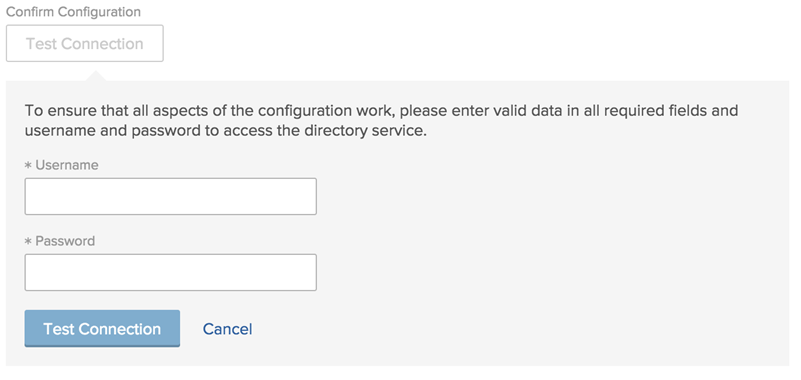

# Configure Adobe Workfront with Active Directory

<!--
**DON'T DELETE, DRAFT OR HIDE THIS ARTICLE. IT IS LINKED TO THE PRODUCT, THROUGH THE CONTEXT SENSITIVE HELP LINKS. **

-->

{{important-admin-console-onboard}}

To connect Adobe Workfront with an Active Directory Server:

1. Click the **Main Menu** icon  in the upper-right corner of Adobe Workfront, then click **Setup** .  

1. Expand **System**, then click **Single Sign-On (SSO)**.

1. In the **Type** drop-down list, select **Active Directory**.  

1. Specify the following information:

   <table style="table-layout:auto"> 
    <col> 
    <col> 
    <tbody> 
     <tr> 
      <td role="rowheader">Server</td> 
      <td> 
The URL of the Active Directory server where your directory service is running, such as <code>ldap://hostname.com</code>. Or, if the Active Directory server requires an SSL connection, <code>ldaps://hostname.com</code>.
 </td> 
     </tr> 
     <tr> 
      <td role="rowheader">Port</td> 
      <td>The port number used for LDAP communication with the Active Directory server. The default port number for non-secure LDAP connections is 389. The default port number for secure LDAP connections (LDAPS) is 636.</td> 
     </tr> 
     <tr> 
      <td role="rowheader">Search Base</td> 
      <td>Specify where in the LDAP directory tree Workfront should find and synchronize initial user information from User objects. This is the container where Workfront begins searching for users on the Active Directory server. 
      
Use the following format: <code>ou=people,dc=example,dc=com</code>
</td> 
     </tr> 
     <tr> 
      <td role="rowheader">Active Directory Domain</td> 
      <td>Specify the Windows domain of the Active Directory connection. Obtain this information from your Active Directory Workfront administrator.</td> 
     </tr> 
     <tr> 
      <td role="rowheader">Auto-Provision Users</td> 
      <td>When this option is enabled, Workfront automatically creates a user in the system when a new user with a user name and password in Active Directory  attempts to log in to Workfront for the first time. In order for users to be created in Workfront, you need to map Workfront data attributes with the data attributes in Active Directory. See the explanation about Attribute Synchronization below.</td> 
     </tr> 
     <tr> 
      <td role="rowheader">Attribute Synchronization</td> 
      <td> 
Click <strong>Map User Attributes</strong>, select the Workfront User Attribute that you want to map from the drop-down list, then specify the corresponding Directory Attribute in the Active Directory server. You can also specify a Default Value for the attribute if you want one to be set. Click <strong>Add Mapping</strong> to include additional attributes, then click <strong>Save</strong> when you are finished.

      
When a discrepancy exists between user information in Workfront and Active Directory, and Active Directory is enabled, the information in the Active Directory will update the user information in Workfront.
 
      
<b>IMPORTANT</b>: Workfront attempts to map these attributes every time a user with these attributes logs into the system. If you have existing users in the system, make sure you are not overwriting their current access level, or any other attributes, by applying this mapping.
 
      
You can map the following Workfront attributes:
 
       <ul> 
        <li>Access Level</li> 
        <li>Address</li> 
        <li>Address2</li> 
        <li>Billing Per Hour</li> 
        <li>City</li> 
        <li>Company</li> 
        <li>Cost Per Hour</li> 
        <li>Email Address</li> 
        <li>Extension</li> 
        <li>First Name</li> 
        <li>Home Group</li> 
        <li>Home Team</li> 
        <li>Job Role</li> 
        <li>Last Name</li> 
        <li>Layout Template</li> 
        <li>Manager</li> 
        <li>Mobile Phone</li> 
        <li>Phone Number</li> 
        <li>Postal Code</li> 
        <li>Schedule</li> 
        <li>State</li> 
        <li>Timesheet Profile</li> 
        <li>Title</li> 
       </ul> </td> 
     </tr> 
     <tr> 
      <td role="rowheader">Change Password URL</td> 
      <td>Specify a URL that provides the ability for users to re-set their user name or password. This URL is used when Workfront users attempt to change their password through the Workfront interface. Because the Active Directory credentials are used to access Workfront, users need to be redirected to a page where they can change their password in Active Directory instead of completing this activity through Workfront.</td> 
     </tr> 
     <tr> 
      <td role="rowheader">Certificate</td> 
      <td>If <strong>SSL/TLS</strong> is selected, you must upload a valid SSL certificate to ensure a secure connection between the directory service and Workfront. For OnDemand accounts, a certificate is always required.</td> 
     </tr> 
     <tr> 
      <td role="rowheader">Admin Exemption</td> 
      <td> 
Select this option to allow Workfront administrators to access Workfront via the native Workfront login screen with Workfront login credentials. If this option is not selected, Workfront administrators must use their Active Directory user name and password.
 
      
Workfront first attempts to log in to Workfront via LDAP for users with the Workfront administrator access level. If the authentication to Active Directory fails, Workfront uses Workfront authentication for Workfront administrators.
 
      
We recommend that you always have this option selected, to provide your Workfront administrator a way for logging into Workfront in the event that your LDAP server is temporarily unavailable.
 
      </td> 
     </tr> 
     <tr> 
      <td role="rowheader">Enable</td> 
      <td> 
Select this option to activate SSO on the Workfront system. Ensure that you have communicated login instructions to your users.
 
After you enable your SSO configuration in Workfront, you must update users for SSO to enable the <strong>Only Allow Active Directory Authentication</strong> setting for all users.
 
      
For more information about updating users for SSO, see <a href="../../../administration-and-setup/add-users/single-sign-on/update-users-sso.md" class="MCXref xref">Update users for single sign-on</a>.
 
      
For more information about user settings, see <a href="../../../administration-and-setup/add-users/create-and-manage-users/edit-a-users-profile.md" class="MCXref xref">Edit a user's profile</a>.
 </td> 
     </tr> 
     <tr> 
      <td role="rowheader">Confirm Configuration</td> 
      <td> 
Verify that your Workfront account can connect to the Active Directory server using the connection information and credentials provided. Click<strong>Test Connection</strong>.
 
  
 
      
Specify the <strong>Username</strong> and <strong>Password</strong> for a user who can successfully log in to your environment using Active Directory. These are their Active Directory credentials.
 
      
Click <strong>Test Connection</strong> to test the connection from Workfront to your Active Directory server.
 
You should receive an on-screen confirmation when the connection is successful.
 </td> 
     </tr> 
    </tbody> 
   </table>

1. Click **Save** to save the Active Directory configuration.
