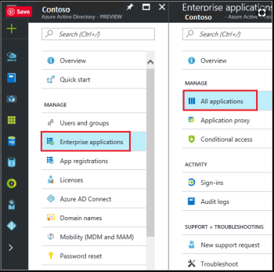
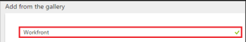
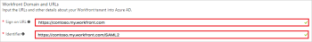
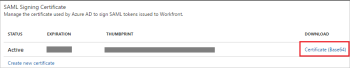

# Configure Adobe Workfront with Azure Active Directory

{{important-admin-console-onboard}}

Adobe Workfront single sign-on (SSO) supports the integration with Azure Active Directory. You configure Workfront SSO with Azure Active Directory using the Security Assertion Markup Language (SAML) 2.0 option in Workfront.

>[!NOTE]
>
>This is not available if your organization's Workfront instance uses a custom SSO portal.>
><!--
><MadCap:conditionalText data-mc-conditions="QuicksilverOrClassic.Draft mode">>
>or is enabled with Adobe IMS>
></MadCap:conditionalText>>
>-->
>See your network or IT administrator if you need more information.

## Access requirements

You must have the following access to perform the steps in this article: 

<table style="table-layout:auto"> 
 <col> 
 <col> 
 <tbody> 
  <tr> 
   <td role="rowheader">Adobe Workfront plan</td> 
   <td> 
Any
 </td> 
  </tr> 
  <tr> 
   <td role="rowheader">Adobe Workfront license</td> 
   <td> 
Plan 
 </td> 
  </tr> 
  <tr> 
   <td role="rowheader">Access level configurations</td> 
   <td> 
You must be a Workfront administrator.
 
<b>NOTE</b>: If you still don't have access, ask your Workfront administrator if they set additional restrictions in your access level. For information on how a Workfront administrator can modify your access level, see <a href="../../../administration-and-setup/add-users/configure-and-grant-access/create-modify-access-levels.md" class="MCXref xref">Create or modify custom access levels</a>.
 </td> 
  </tr> 
 </tbody> 
</table>

## Prerequisites

To configure Workfront Single Sign-On with Azure Active Directory, you need the following items:

* An Azure Active Directory subscription
* A Workfront subscription enabled for using Single Sign-On integrations
* An Azure Active Directory system administrator
* A Workfront administrator

>[!NOTE]
>
>Workfront is not responsible for setting up and troubleshooting your Azure Active Directory configuration. You must have an in-house system administrator that manages that part of the integration, in addition to a Workfront administrator.

## Add Workfront from the Azure Gallery

To configure the integration of Workfront SSO with Azure Active Directory, you need to add Workfront from the Azure gallery to your list of managed SaaS apps.

1. Go to the following URL to access the **Azure Portal**: [https://portal.azure.com/](https://portal.azure.com/) 

1. In the **Azure Portal**, on the left navigation panel, click the **Azure Active Directory** icon.

   

1. Navigate to **Enterprise applications**. Then go to **All applications**.

   

1. To add a new application, click the **New application** button on the top of the dialog.

   

1. In the search box, type **Workfront**.

   

1. In the results panel, select **Workfront**, and then click **Add** button to add the application.

## Configure Azure Active Directory single sign-on

1. In the Azure Portal, on the **Workfront** application integration page, click **Single sign-on**.
1. On the **Single sign-on** dialog box, select **Mode** as **SAML-based Sign-on** to enable Single Sign-On.

   

1. In the **Workfront Domain and URLs** section, specify the following information:  

   * **Sign-on URL**: your Workfront URL using the following pattern: https://`<companyname>`.my.workfront.com  
   * **Identifier**: your Workfront SAML 2.0 URL using the following pattern: https://`<companyname>`.my.workfront.com/SAML2

   

1. In the **SAML Signing Certificate** section, click **Certificate(Base64)** and then save the Certificate file on your computer.

   

1. Click **Save**.
1. In the **Workfront Configuration** section, click **Configure Workfront** to open **Configure sign-on** window.
1. Copy the **Sign-Out URL** and**SAML Single Sign-On Service URL** from the **Quick Reference** section.

   

## Configure Workfront with Azure Active Directory

1. Log in to Workfront as a Workfront administrator.
1. Click the **Main Menu** icon  in the upper-right corner of Adobe Workfront, then click **Setup** .  

1. At the bottom of the left panel, click **System** > **Single Sign-On (SSO)**.

1. Click the **Type** box, then click **SAML 2.0**. 

1. Select the check box next to **Service Provider ID**, then specify that ID using the following format:

   https://`<companyname>`.my.workfront.com/SAML2

1. Paste the **SAML Single Sign-On Service URL** into the **Login Portal URL** field.

1. Paste the **Single Sign-Out URL** into the **Sign-Out URL** field.

1. Specify the **Change Password URL**.
1. Click **Save**.

