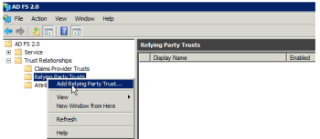
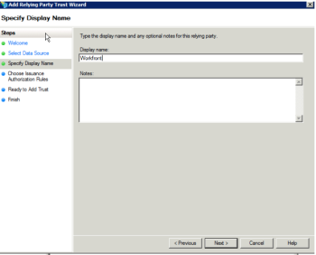
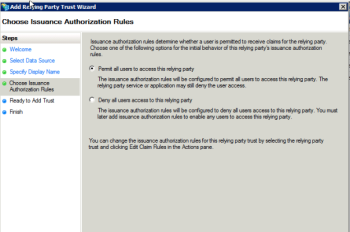
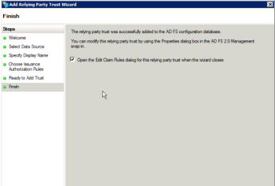
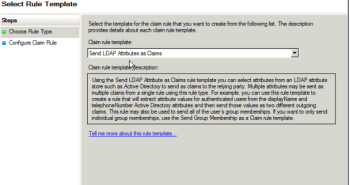
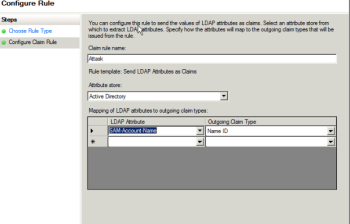
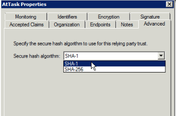
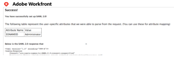

# Configure Adobe Workfront with SAML 2.0 using ADFS

>[!IMPORTANT]
>
>The procedure described on this page applies only to organizations that are not yet onboarded to the Adobe Admin Console.
>
>If your organization has been onboarded to the Adobe Admin Console, see [Platform-based administration differences (Adobe Workfront/Adobe Business Platform)](../../../administration-and-setup/get-started-wf-administration/actions-in-admin-console.md).

As an Adobe Workfront administrator, you can integrate Workfront with a Security Assertion Markup Language (SAML) 2.0 solution for single sign-on while using Active Directory Federation Services (ADFS).

This guide focuses on setting up ADFS without auto provisioning or attribute mappings. We recommend that you complete the setup and test it prior to setting up any auto provisioning.

>[!NOTE]
>
>This is not available if your organization’s Workfront instance is enabled with Adobe IMS. See your network or IT administrator if you need more information.

## Access requirements

You must have the following access to perform the steps in this article: 

<table cellspacing="0"> 
 <col> 
 <col> 
 <tbody> 
  <tr> 
   <td role="rowheader">Adobe Workfront plan</td> 
   <td> 
Any
 </td> 
  </tr> 
  <tr> 
   <td role="rowheader">Adobe Workfront license</td> 
   <td> 
Plan 
 </td> 
  </tr> 
  <tr> 
   <td role="rowheader">Access level configurations</td> 
   <td> 
You must be a Workfront administrator. For more information, see <a href="../../../administration-and-setup/add-users/configure-and-grant-access/grant-a-user-full-administrative-access.md" class="MCXref xref">Grant a user full administrative access</a>.
 
Note: If you still don't have access, ask your Workfront administrator if they set additional restrictions in your access level. For information on how a Workfront administrator can modify your access level, see <a href="../../../administration-and-setup/add-users/configure-and-grant-access/create-modify-access-levels.md" class="MCXref xref">Create or modify custom access levels</a>.
 </td> 
  </tr> 
 </tbody> 
</table>

## Enable authentication to Workfront with SAML 2.0

To enable authentication to the Workfront web application and the Workfront mobile application with SAML 2.0, complete the following sections:

* [Retrieve the Workfront SSO metadata file](#retrieve-the-workfront-sso-metadata-file) 
* [Configure Relying Party Trusts](#configure-relying-party-trusts) 
* [Configure Claim Rules](#configure-claim-rules) 
* [Upload the metadata file and test the connection](#upload-the-metadata-file-and-test-the-connection)

### Retrieve the Workfront SSO metadata file {#retrieve-the-workfront-sso-metadata-file}

1. Click the **Main Menu** icon  in the upper-right corner of Adobe Workfront, then click **Setup** .
1. In the left panel, click **System** > **Single Sign-On (SSO)**.
1. In the **Type** drop-down menu, click **SAML 2.0** to display additional information and options.  
1. Copy the URL that displays after **Metadata URL**. 
1. Continue to the following section, [Configure Relying Party Trusts](#configure-relying-party-trusts).

### Configure Relying Party Trusts {#configure-relying-party-trusts}

1. Open the **ADFS Manager** using the Windows server 2008 R2 (version may vary).
1. Go to **Start.**
1. Click **Administration Tools.**
1. Click **ADFS 2.0 Management.**
1. Select **ADFS** and expand **Trust Relationships**.
1. Right-click **Relying Party Trusts**, then select **Add Relying Party Trust** to launch the Add Relying Party Trust Wizard.

   

1. From the **Welcome Page**, select **Start**. 
1. In the **Select Date Source** section, paste the metadata URL from Workfront.
1. Click **Next**.
1. Click **OK** to acknowledge the warning message.

   This opens the **Specify Display Name** section.

1. Add a **Display Name** and **Notes** to distinguish the Trust, then click **Next**.

   

1. Select **Permit all user to access this relying party** (Or **None** if you want to configure this later).

   

1. Click **Next**.

   This takes you to the **Ready to Add Trust** section.

1. Continue to the following section [Configure Claim Rules](#configure-claim-rules).

### Configure Claim Rules {#configure-claim-rules}

*   Click **Next** in the **Ready to Add Trust** section, then ensure that the **Open the Edit Claim Rules dialog box** option is selected.
    
    This will allow you to edit Claim Rules in a future step.

    
    
1. Click **Close**.
1. Click **Add Rule.**
1. Select **Send LDAP Attribute as Claims**.
    
   
    
1. Click **Next** to display the **Configure Claim Rule** step.  

   

1. Specify the following minimum requirements to configure the claim rule: (This will go in the **Federation ID** on the user setup and is used to distinguish who is logging in.)
    
**Claim rule name:**
    
1. Specify a name for the claim rule. For example, "Workfront."
    
   Attribute store
    
    Select **Active Directory** from the drop-down menu.
    
    LDAP Attribute
    
    This can be any type of attribute. We recommend using **SAM-Account-Name** for this attribute.
    
    Outgoing Claim Type
    
    You must select **Name ID** as the outgoing claim type
    
1. (Optional) In order to establish auto provisioning, add the following additional claims in both the LDAP Attribute and Outgoing Claim Type:
    
    *   **Given Name**
    *   **Surname**
    *   **E-Mail Address**

1. Click **Finish**, then click **OK** on the next screen.
1. Right-click the new **Relying Party Trust**, then select **Properties**.
    
   
    
1. Select the**Advanced Tab**. And under **Secure Hash Algorithm** select SHA-1 or SHA-256.

   >[!NOTE]
   >
   >What you select under Secure Hash Algorithm here must match the Secure Hash Algorithm field in Workfront under Setup > System > Single Sign-ON (SSO).

   

1. Continue to the following section [Upload the metadata file and test the connection](#upload-the-metadata-file-and-test-the-connection).

### Upload the metadata file and test the connection {#upload-the-metadata-file-and-test-the-connection}

1. Open a browser and navigate to https://`<yourserver>`/FederationMetadata/2007-06/FederationMetadata.xml.

   This should download a Metadata file FederationMetadata.xml file.

1. Click **Choose File** under **Populate fields from Identity Provider Metadata**, and select the **FederationMetadata.xml** file.

1. (Optional) If the certificate information did not populate with the metadata file, you can upload a file separately. Select **Choose File** in the **Certificate** section.

1. Click **Test Connection**. If set up correctly, you should see a page similar to the one shown below:

   

   >[!NOTE]
   >
   >If you want to set up attribute mapping, ensure that you copy the attributes from the Test Connection into the Directory Attribute. For more information, see Mapping User Attributes.

1. Select **Admin Exemption** to allow Workfront administrators to log in using Workfront credentials with the bypass url.

   Bookmarks pointing to `<yourdomain>`.my.workfront.com/login bypass the redirect.

1. Select the **Enable** box to enable the configuration.
1. Click **Save**.

## About updating users for SSO

Following this guide, the **SSO Username** will be their **Active Directory Username**.

As a Workfront administrator, you can bulk update users for SSO. For more information about updating users for SSO, see [Update users for single sign-on](../../../administration-and-setup/add-users/single-sign-on/update-users-sso.md).

As a Workfront administrator, you can also manually assign a Federation ID editing the user's profile and completing the Federation ID field. For more information about editing a user, see [Edit a user's profile](../../../administration-and-setup/add-users/create-and-manage-users/edit-a-users-profile.md).

>[!NOTE]
>
>When editing users' profiles to include a Federation ID, selecting **Only Allow SAML 2.0 Authentication** removes the ability to log in to Workfront using the bypass url (`<yourdomain>`.my.workfront.com/login).

