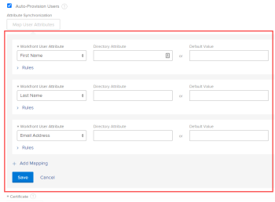

# Configure Adobe Workfront with SAML 2.0

<!--

***DON'T DELETE, DRAFT OR HIDE THIS ARTICLE. IT IS LINKED TO THE PRODUCT, THROUGH THE CONTEXT SENSITIVE HELP LINKS. ** 

-->

{{important-admin-console-onboard}}

As an Adobe Workfront administrator, you can configure the Workfront web and mobile applications to integrate with a Security Assertion Markup Language (SAML) 2.0 solution for single sign-on (SSO).

After you have configure SAML 2.0 in Workfront, as described in the following sections, you can maintain the configuration, as described in [Update SAML 2.0 metadata in your identity provider](../../../administration-and-setup/add-users/single-sign-on/update-saml-2-metadata-ip.md).

## Access requirements

You must have the following access to perform the steps in this article: 

<table style="table-layout:auto"> 
 <col> 
 <col> 
 <tbody> 
  <tr> 
   <td role="rowheader">Adobe Workfront plan</td> 
   <td> 
Any
 </td> 
  </tr> 
  <tr> 
   <td role="rowheader">Adobe Workfront license</td> 
   <td> 
Plan 
 </td> 
  </tr> 
  <tr> 
   <td role="rowheader">Access level configurations</td> 
   <td> 
You must be a Workfront administrator.
 
<b>NOTE</b>: If you still don't have access, ask your Workfront administrator if they set additional restrictions in your access level. For information on how a Workfront administrator can modify your access level, see <a href="../../../administration-and-setup/add-users/configure-and-grant-access/create-modify-access-levels.md" class="MCXref xref">Create or modify custom access levels</a>.
 </td> 
  </tr> 
 </tbody> 
</table>

## Enable authentication to Workfront with SAML 2.0

1. Click the **Main Menu** icon  in the upper-right corner of Adobe Workfront, then click **Setup** .

1. Click **System** > **Single Sign-On (SSO).**

1. In the **Type** drop-down list, click **SAML 2.0.**

1. Near the top of the options that appear, click **Download SAML 2.0 Metadata** to download the file on your computer.

   Your SAML 2.0 Identity Provider requires an XML file with information generated in your Workfront instance. After the file is downloaded, you need to go to your SAML 2.0 Identity Provider server and upload the Workfront SAML 2.0 Metadata XML file there.

1. Specify the following information:

   <table style="table-layout:auto"> 
    <col> 
    <col> 
    <tbody> 
     <tr> 
      <td role="rowheader"><strong>Service Provider ID</strong> </td> 
      <td> This URL, already populated for you, identifies Workfront to your identity provider. For example: <strong>&lt;yourcompany&gt;.com/SAML2</strong>.</td> 
     </tr> 
     <tr> 
      <td role="rowheader">Binding Type </td> 
      <td> 
Select the method supported by your IDP server for sending authentication information:
 
       <ul> 
        <li>POST</li> 
        <li>REDIRECT</li> 
       </ul> </td> 
     </tr> 
     <tr> 
      <td role="rowheader"><strong>Populate fields from Identity Provider Metadata</strong> </td> 
      <td>In your SAML 2.0 Identity Provider solution, export a Service Provider Metadata XML file and save it to a temporary location on your computer. Select <strong>Choose File</strong>, then find and select the file you saved to add it to your Workfront configuration.</td> 
     </tr> 
     <tr> 
      <td role="rowheader">Login Portal URL </td> 
      <td>Specify your organization's common login portal. This is the URL where users log in to access Workfront and all other applications integrated with SAML 2.0.</td> 
     </tr> 
     <tr> 
      <td role="rowheader">Sign-Out URL </td> 
      <td> 
Specify the sign-out URL for the IDP server. Workfront sends an HTTP request to this URL before signing out of Workfront. This closes the user's session on the remote server when the Workfront session is closed.
 
<b>NOTE</b>:  You are redirected to the sign-out URL only if you have the option Only Allow SAML 2.0 Authentication enabled in your user profile.
 </td> 
     </tr> 
     <tr> 
      <td role="rowheader"><strong>Change Password URL</strong> </td> 
      <td> 
 Specify the URL where users will be redirected to change their passwords. 
 
Because the SAML 2.0 credentials are used to access Workfront, users need to be redirected to a page where they can change their SAML 2.0 password instead of completing this activity through Workfront.
 </td> 
     </tr> 
     <tr> 
      <td role="rowheader"><strong>Secure Hash Algorithm</strong> </td> 
      <td> 
Select the Secure Hash Algorithm (SHA) that your IDP supports:
 
       <ul> 
        <li>SHA-1</li> 
        <li>SHA-256</li> 
       </ul> </td> 
     </tr> 
     <tr> 
      <td role="rowheader">Auto-Provision Users </td> 
      <td> 
Automatically creates a user in the system when a new user with a directory username and password attempts to log in to Workfront for the first time.
 
In order to create users in Workfront, you need to map Workfront data attributes with the following user data attributes in your directory provider:
 
       <ul> 
        <li>First Name</li> 
        <li>Last Name</li> 
        <li>Email Address</li> 
       </ul> 
The following options display to allow you to do this:
 
  
 
Select the Workfront User Attribute that you want to map from the drop-down list, then specify the corresponding Directory Attribute in the user directory.
 
The <strong>Directory Attribute</strong> field should contain the Directory Attribute Name from the User Attribute table you saved when successfully testing your SAML 2.0 configuration.
 
You can set a Default Workfront Value in the <strong>Default Value</strong> field. You can also set rules based on the values from your SAML 2.0 Identity Provider.
 
<b>WARNING</b>: Workfront attempts to map the attributes listed below every time a user logs into the system. Because of this, we do not recommend mapping access levels. You can easily remove administrative access if an attribute is mapped incorrectly. Click Add Mapping to add additional rules.<em> </em>
 
You can map the following Workfront attributes:
 
       <table style="table-layout:auto"> 
        <col> 
        <col> 
        <tbody> 
         <tr> 
          <td> 
           <ul> 
            <li> 
Access Level
 </li> 
           </ul> 
           <ul> 
            <li> 
Address
 </li> 
            <li> 
Address2
 </li> 
            <li> 
Billing Per Hour
 </li> 
            <li> 
City
 </li> 
            <li> 
Company
 </li> 
            <li> 
Cost Per Hour
 </li> 
            <li> 
Email Address
 </li> 
            <li> 
Extension
 </li> 
            <li> 
First Name
 </li> 
            <li> 
Home Group
 </li> 
            <li> 
Home Team
 </li> 
            <li> 
Job Role
 </li> 
            <li> 
Last Name
 </li> 
            <li> 
Layout Template
 </li> 
            <li> 
Manager
 </li> 
            <li> 
Mobile Phone
 </li> 
            <li> 
Phone Number
 </li> 
            <li> 
Postal Code
 </li> 
            <li> 
Schedule
 </li> 
            <li> 
State
 </li> 
            <li> 
Timesheet Profile
 </li> 
            <li> 
Title
 </li> 
           </ul> </td> 
          <td> 
 
 </td> 
         </tr> 
        </tbody> 
       </table> 
Click <strong>Save</strong> when you are finished mapping user attributes.
 </td> 
     </tr> 
     <tr> 
      <td role="rowheader"><strong>Certificate</strong> </td> 
      <td> 
Upload a valid SSL certificate to ensure a secure connection between the authentication service and Workfront. For OnDemand accounts, a certificate is always required. You can obtain this certificate from your SAML 2.0 system administrator.
 </td> 
     </tr> 
     <tr> 
      <td role="rowheader"><strong>Admin Exemption</strong> </td> 
      <td> 
Allows Workfront administrators to access Workfront using their Workfront login. If this option is not selected, Workfront administrators must use their SAML 2.0 username and password.
 
Workfront first attempts to log in to Workfront via SAML 2.0 for users with the Workfront System Administrator access level. If the SAML 2.0 authentication fails, Workfront uses local authentication for Workfront administrators. 
 
We recommend that you always have this option selected so that your Workfront administrator can log in to Workfront if your SAML 2.0 provider is ever temporarily unavailable. 
 </td> 
     </tr> 
     <tr> 
      <td role="rowheader"><strong>Enable</strong> </td> 
      <td> 
Activates SSO on the Workfront system. Ensure that you have communicated login instructions to your users.
 
After you enable your SSO configuration in Workfront, you must enable the <strong>Only Allow SAML 2.0 Authentication</strong> setting for all users so that they can use SSO.
 
For more information about updating users for SSO, see <a href="../../../administration-and-setup/add-users/single-sign-on/update-users-sso.md" class="MCXref xref">Update users for single sign-on</a>.
 
For more information about user settings, see <a href="../../../administration-and-setup/add-users/create-and-manage-users/edit-a-users-profile.md" class="MCXref xref">Edit a user's profile</a>.
 </td> 
     </tr> 
     <tr> 
      <td role="rowheader"><strong>Confirm Configuration</strong> </td> 
      <td> 
Click <strong>Test Connection</strong> to verify that Workfront and the SAML 2.0 Identity Provider can communicate with each other. This connection is successful only if you exchanged the XML files.
 
After you successfully test the link between your SAML 2.0 Identity Provider and Workfront, you see a screen similar to the one below. 
<b>NOTE</b>:  This screen is displayed in a browser pop-up, so ensure that you disable pop-up blockers in your browser. 
Save the information displayed in the table for later use. 
 </td> 
     </tr> 
    </tbody> 
   </table>

1. Click **Save** to save the SAML 2.0 configuration.

