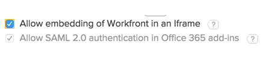

# Enable Outlook for use with Workfront and SAML 2.0

>[!IMPORTANT]
>
>[Microsoft is in the process of disabling support for legacy Exchange online tokens](https://learn.microsoft.com/en-us/office/dev/add-ins/outlook/faq-nested-app-auth-outlook-legacy-tokens), which are currently used by the Workfront Outlook add-in for authentication. This change by Microsoft has already started affecting customers and will continue to roll out in phases through October 2025.
>
>* **After Microsoft fully disables these tokens, the Workfront for Microsoft Outlook integration will no longer function.** 
>
>As part of this change, Microsoft has made the decision to change the way tokens are re-enabled. After **June 30, 2025**, admins will no longer be able to re-enable tokens themselves—only Microsoft Support can grant exceptions. **On October 1, 2025, legacy tokens will be turned off for all tenants. Exceptions will not be granted.**  

If you enable SAML 2.0 authentication and you want your users to be able to log in to Workfront from Microsoft Outlook using their SAML 2.0 credentials, you must enable SAML 2.0 to authenticate in Office add-ins.

>[!NOTE]
>
>This is not available if your organization's Workfront instance uses a custom SSO portal.>
>
>See your network or IT administrator if you need more information.

## Access requirements

+++ Expand to view access requirements for the functionality in this article.

<table style="table-layout:auto"> 
 <col> 
 <col> 
 <tbody> 
  <tr> 
   <td role="rowheader">Adobe Workfront package</td> 
   <td>
Any
</td> 
  </tr> 
  <tr> 
   <td role="rowheader">Adobe Workfront license</td> 
   <td>
Standard

Plan
</td> 
  </tr> 
  <tr> 
   <td role="rowheader">Access level configurations</td> 
   <td> 
You must be a Workfront administrator.
 
 </td> 
  </tr> 
 </tbody> 
</table>

For information, see [Access requirements in Workfront documentation](/help/quicksilver/administration-and-setup/add-users/access-levels-and-object-permissions/access-level-requirements-in-documentation.md). 

+++

## Enable Outlook for use with Workfront and SAML 2.0

{{step-1-to-setup}}

1. Click **System** > **Preferences**.

1. In the **Security** section, make sure that **Allow SAML 2.0 authentication in Office 365 add-ins**is enabled.

   This option enables embedding of Workfront in an Iframe only for Office 365 add-ins. This does not open a click-jacking breach as there is no clickable content involved.

   This option is enabled by default.

   >[!NOTE]
   >
   >If you enable the option **Allow embedding of Workfront in an iframe**, the option **Allow SAML 2.0 authentication in Office 365 add-ins** is dimmed and enabled.
   >
   >
   >

1. Click **Save**.

   The changes that you saved here affect the experience of all the users in Workfront.
