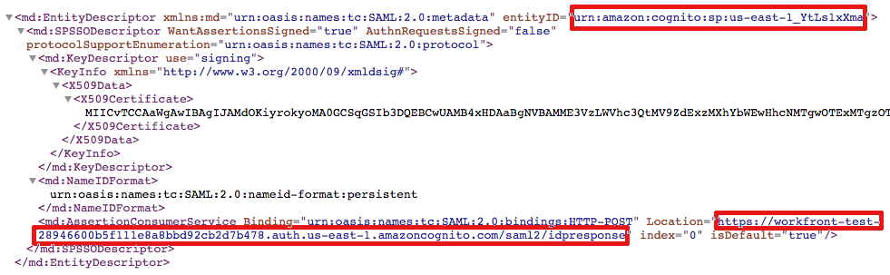
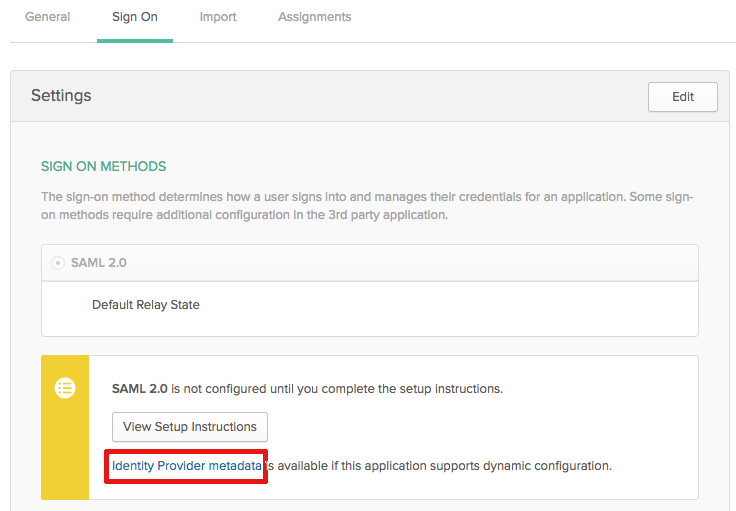

# Update SAML 2.0 metadata in your IDP when using enhanced authentication

<!-- enhanced authentication is no longer available for workfront customers -->

{{important-admin-console-onboard}}

As an Adobe Workfront administrator, you can integrate Workfront single sign-on (SSO) with any identity provider that supports the Security Assertion Markup Language (SAML) 2.0 protocol.

The following sections describe the integration process when your Workfront account has been upgraded to the enhanced authentication experience (not yet available to all organizations). For more information about the enhanced authentication experience, see [Enhanced Authentication overview](../../../administration-and-setup/manage-workfront/security/get-started-enhanced-authentication.md).

For information about configuring SAML prior to your migration to the enhanced authentication experience, see [Update SAML 2.0 metadata in your identity provider](../../../administration-and-setup/add-users/single-sign-on/update-saml-2-metadata-ip.md).

## Access requirements

You must have the following access to perform the steps in this article: 

<table style="table-layout:auto"> 
 <col> 
 <col> 
 <tbody> 
  <tr> 
   <td role="rowheader">Adobe Workfront plan</td> 
   <td>Any</td> 
  </tr> 
  <tr> 
   <td role="rowheader">Adobe Workfront license</td> 
   <td>Plan</td> 
  </tr> 
  <tr> 
   <td role="rowheader">Access level configurations</td> 
   <td> 
You must be a Workfront administrator.
 
<b>NOTE</b>: If you still don't have access, ask your Workfront administrator if they set additional restrictions in your access level. For information on how a Workfront administrator can modify your access level, see <a href="../../../administration-and-setup/add-users/configure-and-grant-access/create-modify-access-levels.md" class="MCXref xref">Create or modify custom access levels</a>.
 </td> 
  </tr> 
 </tbody> 
</table>

## Use Okta as your identity provider

Okta is an example of an identity provider that supports SAML 2.0. This section describes how to use Okta as your identity provider. Similar steps would be required when configuring another identity provider that supports SAML 2.0.

>[!NOTE]
>
>Users are mapped based on their email address. In order to log in to Workfront using Okta, you must have a user with the same (case-insensitive) email address created in your Workfront customer.

Complete the following sections to configure Okta as your identity provider in Workfront.

* [Create a Workfront app in Okta](#create-a-workfront-app-in-okta) 
* [Add your Okta instance as an identity provider in Workfront](#add-your-okta-instance-as-an-identity-provider-in-workfront)

### Create a Workfront app in Okta {#create-a-workfront-app-in-okta}

1. Log in to your Okta environment. 
1. Ensure that **Classic UI** is selected in the upper-left corner of the Okta interface.
1. In the menu, click **Applications** > **Applications**.

1. Click **Add Application**, then click **Create New App**.

1. In the **Create a New Application Integration dialog** box, select **SAML 2.0**, then click **Create**.

1. Specify a name for your Workfront app, then click **Next**.
1. In the SAML Settings page that displays, locate information required for the SAML Settings page:

   1. Without exiting the browser tab where the Okta interface is displayed, open a separate browser tab or window.
   1. Specify the following URL in the browser:

      `https://[your_customer_subdomain].my.workfront.com/auth/saml2/metadata`
   
   1. In the resulting XML file, identify the values for **entityID** and **Location**.

      

   1. Copy the value from the **entityID** field to your system clipboard. Do not close this browser tab.

1. Go back to the SAML Settings page that you opened in Step 6. 
1. Paste the value from the **entityID** field into the **Audience URI (SP Entity ID)** field.

1. In the XML file in your other browser tab, copy the value from the **Location** field.
1. Paste the value from the **Location** field into the **Single sign on** **URL** field.

1. Scroll to the **Attribute Statements (Optional)** section.
1. In the **Name** field, specify **email**.

1. In the **Value** field, specify **user.email**.

1. (Optional) Add any advanced values.
1. Click **Next**.
1. Select, **I'm an Okta customer adding an internal app**, then click **Finish**.

### Add your Okta instance as an identity provider in Workfront {#add-your-okta-instance-as-an-identity-provider-in-workfront}

This procedure provides essential information for configuring Okta as an identity provider in Workfront. For additional information about other mappings or configuration options, see [Configure Adobe Workfront with SAML 2.0](../../../administration-and-setup/add-users/single-sign-on/configure-workfront-saml-2.md).

1. Download the identity provider metadata for your Okta instance:

   1. Log in to your Okta environment. 
   1. Ensure that **Classic UI** is selected in the upper-left corner of the Okta interface.
   1. In the menu, click **Applications** > **Applications**.
   
   1. Click the Workfront app that you created, as described in the section, [Create a Workfront app in Okta](#create-a-workfront-app-in-okta)
   1. On the **Sign On** tab, click **Identity Provider metadata**.

      

      The metadata is opened as XML in a new browser tab.
   
   1. Copy the URL that is displayed in the browser URL field.

1. Log in to Workfront as a Workfront administrator.
1. Click the **Main Menu** icon  in the upper-right corner of Adobe Workfront, then click **Setup** .

1. In the left panel, click **System** > **Single Sign-On (SSO)**.

1. (Conditional) If you see two tabs, click the **New SSO Providers** tab.

   

   >[!IMPORTANT]
   >
   >Do not delete your existing SSO configuration settings in the **Current SSO Provider** tab until your account is updated to the enhanced authentication experience and the new SSO configuration is fully functional.

1. Click **New SSO Provider**.
1. Specify a name, such as Okta IDP, then specify a description.
1. In the **Populate fields from Identity Provider Metadata** section, paste the URL that you copied in Step 1 into the **Metadata URL** field.   
   Alternatively, you can click **Choose File** to upload an .xml file, but we recommend that you paste the URL.

1. In the **Map User Attributes** section, in the **Directory Attribute** field, type **email**. (**Email Address** is already populated in the **Workfront User Attribute** field.)

1. (Optional) Enable **Make Default SSO Provider** to send unathenticated users to the identity provider login screen instead of to the Workfront login screen for authentication. We recommend that you enable this option only if all users in your system access Workfront through the identity provider.
1. Select the **Enable** checkbox. Before doing this, ensure that users in your system are aware of the new login experience to ensure they do not lose access to the Workfront system.
1. Click **Test Connection**.  
   You should see a message telling you the connection is successful. 

1. Click **Save**.

## Using other identity providers

When using identity providers other than Okta (such as Ping or Centrify), you must re-upload the Workfront metadata to your identity provider.
