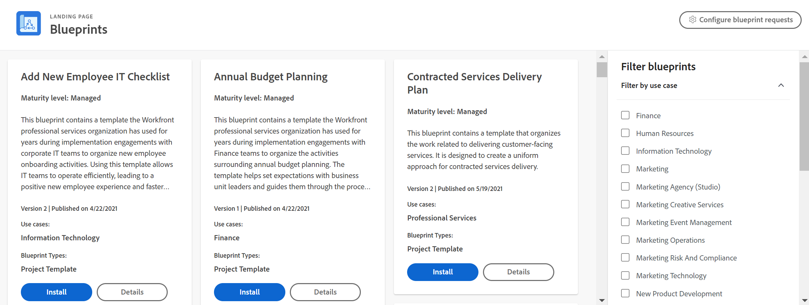

# Blueprints overview

<!--Audited: 01/2024-->

Blueprints are sets of Workfront objects that address common use cases in Workfront. You can download and install a blueprint, and then configure the objects for your specific use case. 

>[!INFO]
>
>Examples:
>
>* **Human Resources Organization Setup**
>
>   This blueprint contains the configuration of organizational structures to expand to a Human Resources department.
>
>* **Add New Employee IT Checklist**
>
>   This blueprint contains a template to organize new employee onboarding activities. Using this template allows IT teams to operate efficiently, leading to a positive new employee experience and faster track to productivity.
>
>* **Inherited Instance Basics | Checklist**
>
>    This blueprint contains a project template (or checklist) that you can review with a short list of questions, resources, and links for a clear understanding of how your Workfront instance has been configured. Use this when you recently inherited a Workfront instance and need guidance on where to start.
>
>To review the current blueprints, see [List of available blueprints](/help/quicksilver/administration-and-setup/blueprints/list-of-available-blueprints.md).

Blueprints provide basic building blocks to help you create a work management system that grows with you. System administrators can browse the blueprints catalog and install ready-to-use project templates, dashboards, and organizational structures. Other users can browse the catalog and request installation of a blueprint. For more information, see [Browse the blueprints catalog and request installation of blueprints](../../administration-and-setup/blueprints/browse-catalog.md).

Each blueprint is targeted to a department and specific maturity level to help you implement proven best practices in your system faster. The maturity levels detailed below are indicated in the blueprint catalog card and details.

* **[!UICONTROL Managed]:** Managed project templates help support the adoption of a new business process before activities and deliverables are fully accepted as a standard procedure. They contain tasks to ensure each step of the new process is being followed.

* **[!UICONTROL Integrated]:** Integrated project templates assume that business functions are supported through a standard operating procedure. Contributors to the process know the steps and tasks they need to complete to follow the process. The project templates to support this process contain fewer tasks to track only milestones and other key deliverables necessary for reporting purposes.

## Find the right blueprint

You can browse blueprints by use case, maturity level, installation status, and type with the filters on the right side of the catalog. Once you've found a blueprint that interests you, you can view details on the details page.

### Blueprint types

The blueprint type shows what's included in the blueprint. The type is listed on the bottom of the blueprint card in the catalog. Note that a blueprint can have more than one type.

The following types of blueprints are available:

* **Project templates**: Includes standard objects associated with a project template (tasks, issues, roles, and teams), and some preferences related to those objects. For more information, see [Configure a blueprint](../../administration-and-setup/blueprints/configure-template-package.md).
* **Organizational structures**: Includes objects associated with the structure of an organization (companies, groups, roles, and teams). For more information, see [Configure a blueprint](../../administration-and-setup/blueprints/configure-template-package.md).
* **Dashboards**: Includes one or more dashboards for a specific use case, such as implementation services.
<!--
* Request queues: Includes one or more projects configured as request queues.
* Custom forms: Includes custom forms attached to another object type, such as a project or portfolio.
* Setup features: Includes one or more elements that are configured in the Setup area of Workfront, such as layout templates.
-->

To review the current blueprints, see [List of available blueprints](/help/quicksilver/administration-and-setup/blueprints/list-of-available-blueprints.md).

### View details

Each blueprint contains a Details page. From this page, you can:

* View a summary of the workflow content
* Read a brief summary of the blueprint
* View installation history (click **[!UICONTROL See Details]** to see the full list of objects installed with the blueprint)
* See role, team, company, and group descriptions
* See a visual example of the specific blueprint, such as a project template (you can preview the full image in the browser or download it)

![[!UICONTROL Blueprint Details] page](assets/blueprint-details-page-2022.png)

## Install a blueprint

A Workfront administrator can install a blueprint directly in any environments (Production, Preview, or Sandbox environments). To learn more, see [Install a blueprint](../../administration-and-setup/blueprints/blueprints-install.md) or [Configure a blueprint](../../administration-and-setup/blueprints/configure-template-package.md).

After installation, you might be unsure about the best next actions to take. For information, see [Actions to take after installing a blueprint](../../administration-and-setup/blueprints/best-next-actions-after-install.md).

## Additional notes on blueprints and templates

Blueprints do not replace the project templates functionality in [!DNL Adobe Workfront]. Blueprints are a way for you to create new templates faster to organize more of your work in [!DNL Workfront].

You cannot copy or edit a blueprint. However, once you have installed the solution from a blueprint, you can modify the project template, job roles, or teams that are created from the blueprint the same way you normally update those records in the [!DNL Workfront] interface. Also, when you install a blueprint, the template is stored in the [!UICONTROL Templates] area of [!DNL Workfront] and the original blueprint stays in the [!UICONTROL Blueprints] area. You do not need to make a copy of the template before you begin tailoring it to your needs.

Blueprints do not remove or replace anything configured in your environment. If you intend to replace an existing template by installing a blueprint that creates a new template, we recommend that you deactivate the previous version to avoid confusion among your planners who build projects from templates.
