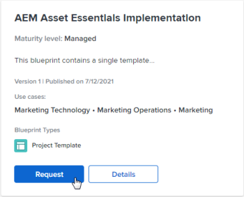

# Browse the blueprints catalog and request installation of blueprints

Blueprints provide basic building blocks to help you create a work management system that grows with you. All [!DNL Adobe Workfront] users can browse the catalog of blueprints. You can additionally make a request to have your [!DNL Workfront] administrator install a specific blueprint for you, if your administrator has enabled blueprint requests.

Only the system administrator can install blueprints. For information, see [Install a blueprint](../../administration-and-setup/blueprints/blueprints-install.md).

## Access requirements

+++ Expand to view access requirements for the functionality in this article.

You must have the following access to perform the steps in this article:

<table style="table-layout:auto"> 
 <col> 
 <col> 
 <tbody> 
  <tr> 
   <td role="rowheader">[!DNL Adobe Workfront] plan</td> 
   <td>Any</td> 
  </tr> 
  <tr> 
   <td role="rowheader">[!DNL Adobe Workfront] license</td> 
   <td>
   
New: Contributor or higher

   
or

   
Current: Request or higher
</td> 
  </tr>
 </tbody> 
</table>

For more detail about the information in this table, see [Access requirements in Workfront documentation](/help/quicksilver/administration-and-setup/add-users/access-levels-and-object-permissions/access-level-requirements-in-documentation.md).

+++

## Browse the blueprints catalog

The catalog displays all of the blueprints that are available for your organization. For information about blueprints such as blueprint types and maturity levels, see [Blueprints overview](../../administration-and-setup/blueprints/blueprints-overview.md).

{{step1-to-blueprints}}

1. Browse the catalog of blueprints.
1. Use the filter panel on the right to filter the catalog by the following options:

   * Use case (such as [!UICONTROL Human Resources] or [!UICONTROL Marketing])
   * Maturity level ([!UICONTROL managed] or [!UICONTROL integrated])
   * Installation status ([!UICONTROL installed] or not [!UICONTROL installed])
   * Blueprint type (<!--Custom Form, -->[!UICONTROL Dashboard], [!UICONTROL Organizational Structure], [!UICONTROL Project Template]<!--, Request Queue, Setup Feature-->)

1. (Optional) Click **[!UICONTROL Details]** on a blueprint to learn how it works.

   For information about the content available on the [!UICONTROL Details] page, see [Blueprints overview](../../administration-and-setup/blueprints/blueprints-overview.md).

## Request installation of a blueprint

You can request the installation of a blueprint if your system administrator allows blueprint requests. For more information, see [Configure access to blueprints](../../administration-and-setup/blueprints/configure-access-to-blueprints.md).

When you request to have a blueprint installed, the request is sent to the system administrator. You are notified when the request is completed, according to your notification preferences.

{{step1-to-blueprints}}

1. Find the blueprint you want to install. You can filter by use case, maturity level, installation status, and type using the filters in the right panel.
1. Click **[!UICONTROL Request]** on the blueprint.

   If the **[!UICONTROL Request]** button does not appear on the blueprint, your system administrator has not enabled requests.

   
