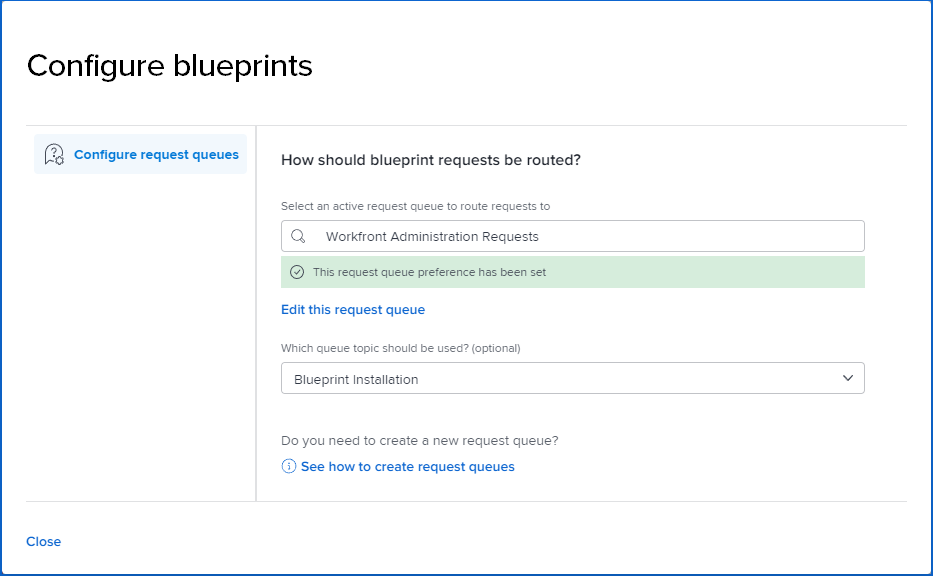

# Configure access to blueprints

{{highlighted-preview}}

All Adobe Workfront users can browse the catalog of blueprints.

As a system administrator, you can:

* Add Blueprints to the main menu in layout templates and assign the layout template to users or groups. For more information, see [Customize the Main Menu using a layout template](/help/quicksilver/administration-and-setup/customize-workfront/use-layout-templates/customize-main-menu.md) and [Assign users to a layout template](/help/quicksilver/administration-and-setup/customize-workfront/use-layout-templates/assign-users-to-layout-template.md).

  >[!NOTE]
  >
  >* Users who do not have a layout template assigned to them will see the Blueprints icon in the Main Menu.
  >* When you create a new layout template, the Blueprints icon is included in the Active Items list for the Main Menu by default.

* Enable access for users to request installation of blueprints by setting up a request queue to store the requests. There, you have a single location to track and update requests. For more information, follow the procedure below.
* Install blueprints. For information, see [Install a blueprint](../../administration-and-setup/blueprints/blueprints-install.md).

## Access requirements

You must have the following access to perform the steps in this article:

<table style="table-layout:auto"> 
 <col> 
 <col> 
 <tbody> 
  <tr> 
   <td role="rowheader"><strong>Adobe Workfront plan</strong></td> 
   <td> 
 Any
 </td> 
  </tr> 
  <tr> 
   <td role="rowheader"><strong>Adobe Workfront license</strong></td> 
   <td>Plan</td> 
  </tr> 
  <tr> 
   <td role="rowheader"><strong>Access level configurations</strong></td> 
   <td> 
System Administrator
 </td> 
  </tr> 
 </tbody> 
</table>

## Prerequisites {#prerequisites}

* You must use an existing request queue to store blueprint requests. The project must be saved as a request queue and it must be in Current status.
* The request queue must be public. In the request queue details, "Who can add requests to this queue?" must be set to **Anyone**.

>[!TIP]
>
>If you want to create a new request queue for blueprint requests, you should build it before configuring blueprints access. For information on creating a request queue, see [Create a Request Queue](../../manage-work/requests/create-and-manage-request-queues/create-request-queue.md).

## Select the request queue to store blueprint requests

Before users can request that you install blueprints for them, you must select a request queue for those requests. Until the request queue is defined, users can only browse the blueprints catalog.

1. Click the **Main Menu** icon  in the upper-right corner of Adobe Workfront, then click **Blueprints**.
1. Click **Configure blueprint requests** on the top right of the catalog screen.

   <!--
   <li value="3" data-mc-conditions="QuicksilverOrClassic.Draft mode"> 
In the <strong>Configure blueprints</strong> dialog, ensure that the <strong>Configure request queues</strong> tab is selected.
 </li>
   -->

1. On the **Configure blueprints** dialog, begin typing the name of an active request queue, and select it when it appears in the search results.

   >[!IMPORTANT]
   >
   >Only public request queues appear in this list. To make your request queue public, see the [Prerequisites](#prerequisites) section above.

   The request queue preference is set, and users can now request blueprint installation.

   

1. (Optional) To make changes to the actual request queue, click **Edit this request queue**.

   The request queue project opens in a new browser tab and you can update it as needed.

1. (Optional) If the request queue contains topic groups or queue topics, you can select them from the list.
1. To return to the blueprints catalog, click **Close**.

>[!NOTE]
>
>When you install a requested blueprint, you should change the issue status to **Closed** or **Resolved** in the request queue so that the requestor is notified. For information about installing a blueprint, see [Install a blueprint](../../administration-and-setup/blueprints/blueprints-install.md).
