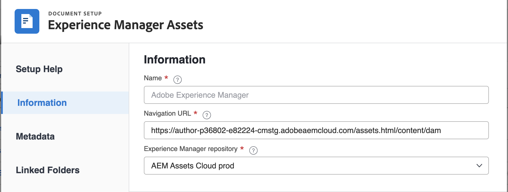
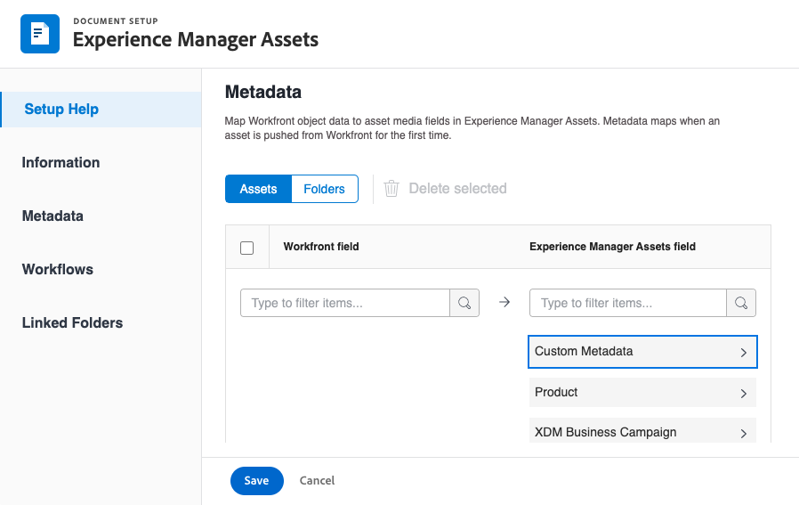
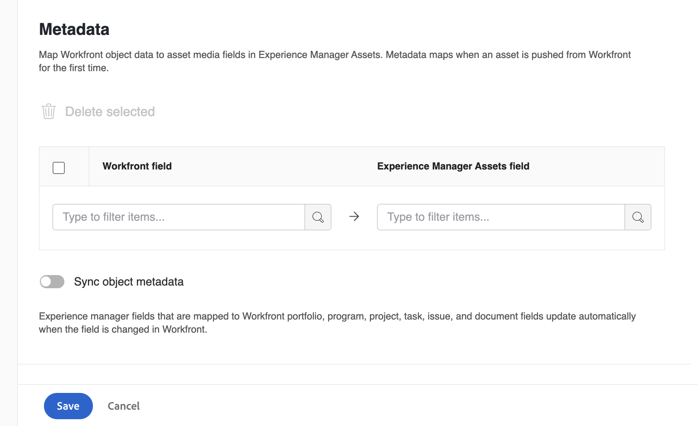
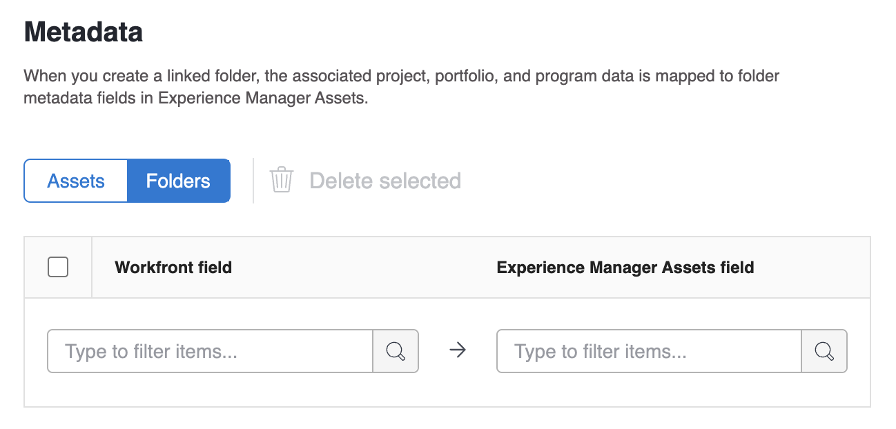
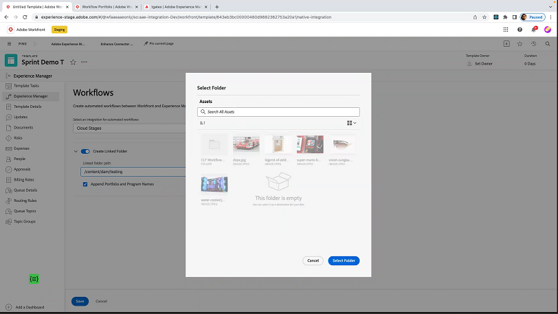

# Configure the [!UICONTROL Experience Manager Assets as a Cloud Service] integration

>[!IMPORTANT]
>
>This functionality is available only to organization that have been onboarded to the [!DNL Adobe Admin Console].

You can connect your work with your content in [!DNL Experience Manager Assets]​:

* Push assets and metadata from [!DNL Adobe Workfront] to [!DNL Experience Manager Assets]​
* Link assets from [!DNL Experience Manager Assets] to your projects and tasks in [!DNL Workfront​]
* Facilitate versioning use cases
* Create folders linked to [!DNL Experience Manager Assets]
* Track metadata for assets and folders
* Sync project metadata between [!DNL Workfront] and [!DNL Experience Manager Assets]

>[!NOTE]
>
>You can also connect several [!DNL Experience Manager Assets] repositories to one [!UICONTROL Workfront] environment, or several [!DNL Workfront] environments to one [!DNL Experience Manager Assets] repository across Organization IDs. Follow the configuration instructions in this article for each integration you'd like to set up. 

## Access requirements

You must have the following:

<table>
  <tr>
   <td><strong>[!DNL Adobe Workfront] plan*</strong>
   </td>
   <td>Any
   </td>
  </tr>
  <tr>
   <td><strong>[!DNL Adobe Workfront] licenses*</strong>
   </td>
   <td>[!UICONTROL Plan]
   </td>
  </tr>
  <tr>
   <td><strong>[!DNL Experience Manager] license</strong>
   </td>
   <td>[!UICONTROL Standard]
   </td>
  </tr>
  <tr>
   <td><strong>Product</strong>
   </td>
   <td>You must have [!DNL Experience Manager Assets as a Cloud Service], and you must be added to the product as a user.
   </td>
  </tr>
  <tr>
   <td>Access level configurations*
   </td>
   <td>You must be a [!DNL Workfront] administrator. For information on [!DNL Workfront] administrators, see <strong>Grant a user full administrative access</strong>.
   </td>
  </tr>
</table>

*To find out what plan, license type, or access you have, contact your Workfront administrator.

## Prerequisites

Before you begin,

* You must have [!DNL Workfront] and [!DNL Adobe Experience Manager Assets] associated with an Organization ID in the [!DNL Adobe Admin Console]. For more information see, [Platform-based administration differences ([!DNL Adobe Workfront]/[!DNL Adobe Business Platform])](/help/quicksilver/administration-and-setup/get-started-wf-administration/actions-in-admin-console.md).

## Set up the integration information

1. Click the **[!UICONTROL Main Menu]** icon  in the upper-right corner of Adobe Workfront, then click **[!UICONTROL Setup]** .
1. Select **[!UICONTROL Documents]** in the left panel, then select **[!UICONTROL [!DNL Experience Manager] Integration]**.

    >[!NOTE]
    >
    >This configuration area appears only if your [!DNL Workfront] environment is included under an [!DNL Adobe Admin Console].

1. Select **[!UICONTROL Add [!DNL Experience Manager] Integration]**.
1. In the **[!UICONTROL Name]** field, enter the name you want users to see when interacting with this integration in Workfront and Experience Manager Assets.
1. In the **[!UICONTROL Navigation URL]** field, the system automatically populates the Navigation URL. This read-only URL is used to link to your organization's [!DNL Experience Manager] instance from the [!UICONTROL Main Menu] for quick access.
1. Choose a repository from the **[!UICONTROL [!DNL Experience Manager] Assets repository]** drop-down menu. The system automatically populates any [!DNL Experience Manager] repositories associated with the Organization ID that your user profile is assigned to.

1. Click **[!UICONTROL Save]** or move on to the [Set up metadata (Optional)](#set-up-metadata-optional) section in this article.

    >[!NOTE]
    >
    >Due to the complexity of the integration, you can't change the repository after you save the initial configuration.

## Set up metadata (Optional)

You can map [!DNL Workfront] object data to asset media fields in [!DNL Experience Manager] Assets.

>[!IMPORTANT]
>
>You can map metadata only in one direction: from [!DNL Workfront] to [!DNL Experience Manager]. Metadata for documents linked to [!DNL Workfront] from [!DNL Experience Manager] cannot be transferred to [!DNL Workfront].

### Configure metadata fields

Before you begin mapping metadata fields, you must configure metadata fields in both Workfront and Experience Manager Assets.

To configure metadata fields:

1. Configure a metadata schema in [!DNL Experience Manager Assets] as explained in [Configure asset metadata mapping between Adobe [!DNL Workfront] and [!DNL Experience Manager Assets]](https://experienceleague.adobe.com/docs/experience-manager-cloud-service/content/assets/integrations/configure-asset-metadata-mapping.html?lang=en).

1. Configure custom form fields in Workfront. [!DNL Workfront] has many built-in custom fields you can use. However, you can also create your own custom fields as explained in [Create or edit a custom form](/help/quicksilver/administration-and-setup/customize-workfront/create-manage-custom-forms/create-or-edit-a-custom-form.md).

+++ **Expand to see more information about supported Workfront and Experience Manager Assets fields** 

**Experience Manager Assets Tags**

You can map any Workfront supported field to a tag in Experience Manager Assets. To do this, you must ensure that tag values in Experience Manager Assets match Workfront. 

* Tags and Workfront field values must be an exact match in spelling, and format. 
* Workfront field values that are mapped to experience Manager assets tags must be all lowercase, even if the tag in Experience Manager Assets appears to have uppercase letters.
* Workfront field values must not include spaces.
* The field value in Workfront must also include the folder structure of the Experience Manager Assets tag.
* To map multiple single-line text fields to tags, enter a comma-separated list of the tag values into the Workfront side of the metadata mapping, and `xcm:keywords` on the Experience Manager Assets side. Each field value maps to a separate tag. You can use a calculated field to combine multiple Workfront fields into a single comma-separated text field.
* You can map values from drop-down, radio button, or checkbox fields by entering a comma-separated list of the available values in that field.

>[!INFO]
>
>**Example**:  To match the tag shown in the folder structure here, the field value in Workfront would be `landscapes:trees/spruce`. Note the lowercase letters in the Workfront field value.
>
>If you want the tag to be leftmost item in the tag tree, it must be followed by a colon. In this example, to map to the landscapes tag, the field value in Workfront would be `landscapes:`.
>
>

After you have created the tags in Experience Manager Assets, they will appear under the Tags drop-down in the Metadata section. To link a field to a tag, select `xcm:keywords` in the Experience Manager Assets field dropdown in the metadata mapping area.

For more information on tags in Experience Manager Assets, including how to create and manage tags, see [Administering Tags](https://experienceleague.adobe.com/docs/experience-manager-64/administering/contentmanagement/tags.html).

**Experience Manager Assets custom metadata schema fields**

You can map both built-in and custom Workfront fields to custom metadata schema fields in Experience Manager Assets. 

Custom metadata fields created in Experience Manager Assets are organized in their own section in the Metadata setup area.

<!-- 
link to documentation about creating schema - waiting on response from Anuj about best article to link to
-->

**Workfront fields**

You can map both built-in and custom Workfront fields to Experience Manager Assets. The following field values must match in both case and spelling between Workfront and Experience Manager Assets:

* Drop-down fields
* Multi-select fields

>[!TIP]
>
> To check if the field values match exactly, go to 
>
> * Setup > Custom Forms in Workfront or the field in the object
> * Assets > metadata schemas in Experience Manager Assets

+++

### Map metadata for assets

Metadata maps when an asset is pushed from [!DNL Workfront] for the first time. Documents with the built-in or custom fields automatically map to the specified fields the first time an asset is sent to [!DNL Experience Manager Assets].

To map metadata for assets: 

<!--
1. Select **[!UICONTROL Assets]** above the metadata table.
-->
1. In the **[!UICONTROL [!DNL Workfront] field]** column, choose a built-in or custom Workfront field.

    >[!NOTE]
    >
    >You can map a single [!DNL Workfront] field to multiple [!UICONTROL Experience Manager Assets] fields. You can't map multiple [!DNL Workfront] fields to a single [!DNL Experience Manager Assets] field.
    ><!--To map a Workfront field to an Experience Manager Assets tag, see -->

1. In the [!DNL Experience Manager Assets] field, search through the pre-populated categories or enter at least two letters in the search field to access additional categories.
1. Repeat steps 2 and 3 as needed.

1. Click [!UICONTROL Save] or move on to the [Set up Workflows](#set-up-workflows-optional) section in this article.

<!--

### Map metadata for folders

When users create a linked folder on a project, the associated project, portfolio, and program data is mapped to folder metadata fields in [!DNL Experience Manager Assets].

>[!NOTE]
>
>This integration does not support custom metadata from [!DNL Adobe Experience Manager].

To map metadata for folders: 

1. Select **[!UICONTROL Folders]** above the metadata table.
1. In the **[!UICONTROL [!DNL Workfront] field]** column, choose a built-in or custom Workfront field.

    >[!NOTE]
    >
    >You can map a single Workfront field to multiple Experience Manager Assets fields. You can't map multiple [!DNL Workfront] fields to a single [!DNL Experience Manager Assets] field.

1. In the **[!DNL Experience Manager Assets]** field, search through the pre-populated categories or enter at least two letters in the search field to access additional categories.
1. Repeat steps 2 and 3 as needed.

1. Click **[!UICONTROL Save]** or move on to the [Project metadata sync](#project-metadata-sync) section in this article.

### Object metadata sync

An [!DNL Experience Manager] fields that is mapped to [!DNL Workfront] portfolio, program, project, task, issue, and document fields update automatically when the field is changed in [!DNL Workfront].

When this option is enabled, any asset that has been pushed to Adobe Experience manager includes a card on the Document Details page that displays a real-time view of the document's Adobe Experience Manager metadata.

>[!IMPORTANT]
>
>Users must have write access in [!DNL Experience Manager] for assets living in the object in order for the metadata to sync when it's updated.

1. Enable the **[!UICONTROL Sync object metadata]** field.
1. Click **Save** or move on to the [Set up workflows (Optional)](#set-up-workflows-optional) section in this article.-->

## Set up workflows (Optional)

A workflow is a set of actions that connect Workfront to Adobe Experience Manager as a Cloud Service. As a Workfront administrator, you can configure workflows in Workfront, then assign them to Project Templates. When a Project is created using a Project Template to which a workflow is assigned, the actions defined in the workflow are triggered. 

The default workflow values that you set in the integration can be overridden at the Project Template and Project levels.

The followings workflows are available in the Adobe Experience Manager integration:

* [Create Adobe Experience Manager linked folders](#create-adobe-experience-manager-linked-folders)
* [Publish assets that are sent to Adobe Experience Manager Assets](#publish-assets-that-are-sent-to-adobe-experience-manager-assets)

### Create Adobe Experience Manager linked folders

1. Toggle the **[!UICONTROL Create Linked folder]** on.
1. Choose a folder path to indicate where you want all linked folders associated with this integration. 
   
1. Enable the **[!UICONTROL Append Portfolio and Program Names]** option to automatically include Portfolio and Program names at the end of the linked folder's name.
1. Click **[!UICONTROL Save]** or move on to the [Publish assets that are sent to Adobe Experience Manager Assets](#publish-assets-that-are-sent-to-adobe-experience-manager-assets) section in this article.

### Publish assets that are sent to Adobe Experience Manager Assets

1. Toggle on **[!UICONTROL Publish assets automatically]**.
1. Check the box next to the location where you want to publish assets sent to Adobe Experience Manager assets. You may enable either or both options. 
1. (Conditional) If you have enabled the Brand Portal option, Select the Brand Portal where you want to publish assets.
1. Click **[!UICONTROL Save]** or move on to the [Set up linked folders (Optional)](#set-up-linked-folders-optional) section in this article.

## Set up linked folders (Optional)

You can allow users to create folders linked to [!DNL Experience Manager] while in a [!DNL Workfront] project. When a folder is linked, any asset added to the folder automatically shows up in both [!DNL Workfront] and [!DNL Experience Manager]. When an asset is added to the linked folder in [!DNL Workfront] for the first time, the asset's metadata is pushed to [!DNL Experience Manager Assets].

In the steps below, you indicate where you want the linked folders created. Each integration can have only one location for all linked folders.

To set up linked folders:

1. Toggle the **[!UICONTROL Enable Linked folder]** on.
1. Choose a folder path to indicate where you want all linked folders associated with this integration. 

    >[!NOTE]
    >
    >Users need write access in [!DNL Adobe Experience Manager Assets] to the folder specified to create a linked folder.

1. Click **[!UICONTROL Save]**.
