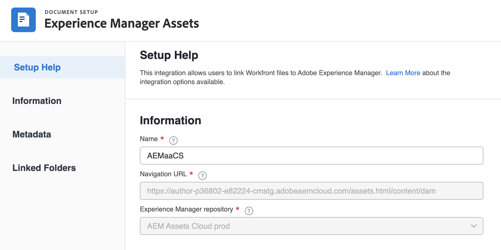

# Configure the Experience Manager Assets as a Cloud Service integration

The highlighted information on this page refers to functionality not yet generally available. It is available only in the Preview Sandbox environment.

You can connect your work with your content in Experience Manager Assets​:

* Push assets and metadata from Adobe Workfront to Experience Manager Assets​
* Link assets from Experience Manager Assets to your projects and tasks in Workfront​
* Facilitate versioning use cases
* Create folders linked to Experience Manager Assets
* Track metadata for assets and folders
* Sync project metadata between Workfront and Experience Manager Assets

## Access requirements

You must have the following:

<table>
  <tr>
   <td><strong>Adobe Workfront plan*</strong>
   </td>
   <td>Any
   </td>
  </tr>
  <tr>
   <td><strong>Adobe Workfront licenses*</strong>
   </td>
   <td>Plan
   </td>
  </tr>
  <tr>
   <td><strong>Product</strong>
   </td>
   <td>You must have Experience Manager Assets as a Cloud Service, and you must be added to the product as a user.
   </td>
  </tr>
  <tr>
   <td>Access level configurations*
   </td>
   <td>You must be a Workfront administrator. For information on Workfront administrators, see <strong>Grant a user full administrative access</strong>.
   </td>
  </tr>
</table>

*To find out what plan, license type, or access you have, contact your Workfront administrator.

## Prerequisites

Before you begin,

* You must have Workfront and Adobe Experience Manager Assets associated with your Organization ID in the Adobe Admin Console. For more information see, [Platform-based administration differences (Adobe Workfront/Adobe Business Platform)](/help/quicksilver/administration-and-setup/get-started-wf-administration/actions-in-admin-console.md).

## Set up the integration information

1. Click the **Main Menu** icon  in the upper-right corner of Adobe Workfront, then click **Setup** .
1. Select **Documents** in the left panel, then select **Experience Manager Integration**.
1. Select **Add Experience Manager Integration**.
1. In the **Name** field, enter the name you want users to see when interacting with this integration in Workfront and Experience Manager Assets.
1. In the **Navigation URL** field, the system automatically populates the Navigation URL. This URL is used to link to your organization's Experience Manager instance from the Main Menu for quick access.

    >[!TIP]
    >
    >You can change the end of the populated URL to direct users into a specific folder from the Assets icon in the Main Menu.

1. Choose a repository from the **Experience Manager Assets repository** drop-down menu. The system automatically populates any Experience Manager repositories associated with the Organization ID that your user profile is assigned to.

1. Click **Save** or move on to the [Set up metadata (Optional)](#set-up-metadata-optional) section in this article.

    >[!NOTE]
    >
    >Due to the complexity of the integration, you can't change the repository after you save the initial configuration.

## Set up metadata (Optional)

You can map Workfront object data to asset media fields in Experience Manager Assets.

>[!IMPORTANT]
>
>You can map metadata only in one direction: from Workfront to Experience Manager. Metadata for documents linked to Workfront from Experience manager cannot be transferred to Workfront.

### Configure metadata fields

1. Configure a metadata schema in Experience Manager Assets as explained in [Configure asset metadata mapping between Adobe Workfront and Experience Manager Assets](https://experienceleague.adobe.com/docs/experience-manager-cloud-service/content/assets/integrations/configure-asset-metadata-mapping.html?lang=en).
1. Configure custom form fields in Workfront. Workfront has many built-in custom fields you can use. However, you can also create your own custom fields as explained in [Create or edit a custom form](/help/quicksilver/administration-and-setup/customize-workfront/create-manage-custom-forms/create-or-edit-a-custom-form.md).

### Assets

Metadata maps when an asset is pushed from Workfront for the first time. Documents with the built-in or custom fields automatically map to the specified fields the first time an asset is sent to Experience Manager Assets. 

>[!NOTE]
>
>This integration does not support custom metadata from Adobe Experience Manager.

To map metadata for assets: 

1. Select **Assets** above the metadata table.
1. In the **Workfront field** column, choose a built-in or custom Workfront field.

    >[!NOTE]
    >
    >You can map a single Workfront field to multiple Experience Manager Assets fields. You can't map multiple Workfront fields to a single Experience Manager Assets field.

1. In the Experience Manager Assets field, search through the pre-populated categories or enter at least two letters in the search field to access additional categories.
1. Repeat steps 2 and 3 as needed.

1. Click Save or move on to the [Folders](#folders) section in this article.

### Folders

When users create a linked folder on a project, the associated project, portfolio, and program data is mapped to folder metadata fields in Experience Manager Assets.

>[!NOTE]
>
>This integration does not support custom metadata from Adobe Experience Manager.

To map metadata for folders:

1. Select **Folders** above the metadata table.
1. In the **Workfront field** column, choose a built-in or custom Workfront field.

    >[!NOTE]
    >
    >You can map a single Workfront field to multiple Experience Manager Assets fields. You can't map multiple Workfront fields to a single Experience Manager Assets field.

1. In the **Experience Manager Assets** field, search through the pre-populated categories or enter at least two letters in the search field to access additional categories.
1. Repeat steps 2 and 3 as needed.

1. Click **Save** or move on to the [Project metadata sync](#project-metadata-sync) section in this article.

### Project metadata sync

An Experience Manager fields that is mapped to Workfront project fields update automatically when the field is changed in Workfront.

In the Preview environment, an Experience Manager fields that is mapped to Workfront portfolio, program, project, task, issue, and document fields update automatically when the field is changed in Workfront.

>[!IMPORTANT]
>
>Users must have write access in Experience Manager for assets living in the object in order for the metadata to sync when it's updated.

1. Enable the **Sync Project metadata** field.
1. Click Save or move on to the [Set up linked folders (Optional)](#set-up-linked-folders-optional) section in this article.

## Set up linked folders (Optional)

You can allow users to create folders linked to Experience Manager while in a Workfront project. When a folder is linked, any asset added to the folder automatically shows up in both Workfront and Experience Manger. When an asset is added to the linked folder in Workfront for the first time, the asset's metadata is pushed to Experience Manager Assets.

In the steps below, you indicate where you want the linked folders created. Each integration can have only one location for all linked folders.

To set up linked folders:

1. Toggle the **Enable Linked folder** on.
1. Choose a folder path to indicate where you want all linked folders associated with this integration. 

    >[!NOTE]
    >
    >Users need write access in Adobe Experience Manager Assets to the folder specified to create a linked folder.

1. Click **Save**.
