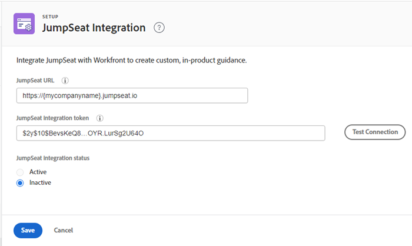

# Configure the JumpSeat integration

You can integrate [!DNL JumpSeat] with [!DNL Workfront] to create custom, in-product guidance.

## Access requirements

+++ Expand to view access requirements for the functionality in this article.

You must have the following access to perform the steps in this article:

<table style="table-layout:auto"> 
 <col> 
 <col> 
 <tbody> 
  <tr> 
   <td role="rowheader">[!DNL Adobe Workfront] plan*</td> 
   <td> 
[!UICONTROL Enterprise] 
 </td> 
  </tr> 
  <tr> 
   <td role="rowheader">[!DNL Adobe Workfront] license*</td> 
   <td>[!UICONTROL Plan]</td> 
  </tr> 
  <tr> 
   <td role="rowheader">Product</td> 
   <td>You must have an active [!DNL JumpSeat] plan.</td> 
  </tr> 
  <tr> 
   <td role="rowheader">Access level configurations*</td> 
   <td> 
 You must be a [!DNL Workfront] administrator. For information on [!DNL Workfront] administrators, see <a href="../../administration-and-setup/add-users/configure-and-grant-access/grant-a-user-full-administrative-access.md" class="MCXref xref">Grant a user full administrative access</a>.
 </td> 
  </tr> 
 </tbody> 
</table>

&#42;To find out what plan, license type, or access you have, contact your [!DNL Workfront] administrator.

+++

## Prerequisites

Before you begin, you must

* Add and activate [!DNL Workfront] as an application in [!DNL JumpSeat]. For more information, see [How To Add Or Delete An Application](https://support.jumpseat.io/article/how-to-add-an-application/).

## Configure the [!DNL JumpSeat] integration

We recommend setting up a [!DNL JumpSeat] integration in both your Preview and Production environments.

>[!TIP]
>
>You need to add and activate two separate [!DNL Workfront] applications in [!DNL JumpSeat]—one for Preview and one for Production. See [How To Add Or Delete An Application](https://support.jumpseat.io/article/how-to-add-an-application/) for more information.

To configure the [!DNL JumpSeat] integration:

{{step-1-to-setup}}

1. In the left panel, click **[!UICONTROL System]** > **[!UICONTROL [!DNL JumpSeat] Integration]**.
1. Enter your **[!UICONTROL [!DNL JumpSeat] URL]**, which can be found on your extension icon in [!DNL JumpSeat].

   **Example:** [!DNL https]://{mycompanyname}.jumpseat.io

1. Enter the **[!UICONTROL [!DNL JumpSeat] integration token]**. You can find this on the **[!UICONTROL Configuration]** page in [!DNL JumpSeat].

   **Example:** $2y$10$BevsKeQ8....OYR.LurSg2U64O

1. Click **[!UICONTROL Test configuration]**.
1. Choose if you want the integration to be **[!UICONTROL Active]** or **[!UICONTROL Inactive]**.

   >[!IMPORTANT]
   >
   >The configuration test performed in step 5 must pass in order to activate the integration.

   

1. Click **[!UICONTROL Save]**.

>[!TIP]
>
>For more information about configuring your [!DNL JumpSeat] integration, see the [!DNL JumpSeat] documentation for [JumpSeat+Workfront](https://jumpseat.io/landing-page/jumpseat-workfront/).
