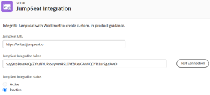

# Configure the JumpSeat integration

You can integrate JumpSeat with Workfront to create custom, in-product guidance.

## Access requirements

You must have the following access to perform the steps in this article:

<table style="table-layout:auto"> 
 <col> 
 <col> 
 <tbody> 
  <tr> 
   <td role="rowheader"><strong>Adobe Workfront plan*</strong></td> 
   <td> 
Enterprise 
 </td> 
  </tr> 
  <tr> 
   <td role="rowheader"><strong>Adobe Workfront license*</strong></td> 
   <td> 
Plan 
 </td> 
  </tr> 
  <tr> 
   <td role="rowheader"><strong>Product</strong></td> 
   <td>You must have an active JumpSeat plan.</td> 
  </tr> 
  <tr> 
   <td role="rowheader"><strong>Access level configurations*</strong></td> 
   <td> 
 You must be a Workfront administrator. For information on Workfront administrators, see <a href="../../administration-and-setup/add-users/configure-and-grant-access/grant-a-user-full-administrative-access.md" class="MCXref xref">Grant a user full administrative access</a>.
 </td> 
  </tr> 
 </tbody> 
</table>

&#42;To find out what plan, license type, or access you have, contact your Workfront administrator.

## Prerequisites

Before you begin, you must

* Add and activate Workfront as an application in JumpSeat. For more information, see [How To Add Or Delete An Application](https://support.jumpseat.io/article/how-to-add-an-application/).

## Configure the JumpSeat integration

We recommend setting up a JumpSeat integration in both your Preview and Production environments.

>[!TIP]
>
>You need to add and activate two separate Workfront applications in JumpSeat—one for Preview and one for Production. See [How To Add Or Delete An Application](https://support.jumpseat.io/article/how-to-add-an-application/) for more information.

To configure the JumpSeat integration:

1. Click the **Main Menu** icon  in the upper-right corner of Adobe Workfront, then click **Setup**.
1. In the left panel, click **System**> **JumpSeat Integration**.
1. Enter your **JumpSeat URL**.

   **Example:** https://{mycompanyname}.jumpseat.io

1. Enter the **JumpSeat integration token**. You can find this on the **Configuration**page in JumpSeat.

   **Example:** $2y$10$BevsKeQ8....OYR.LurSg2U64O

1. Click **Test configuration**.
1. Choose if you want the integration to be **Active**or **Inactive**.

   >[!IMPORTANT]
   >
   >The configuration test performed in step 5 must pass in order to activate the integration.

   

