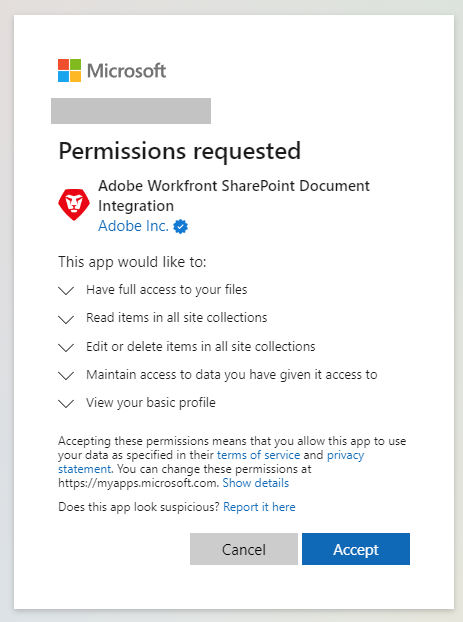
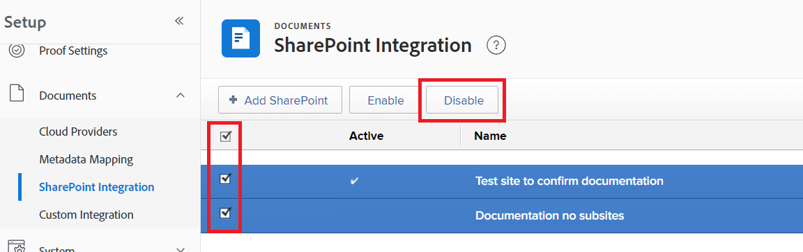

# Configure the [!DNL SharePoint] integration

<!--
<p data-mc-conditions="QuicksilverOrClassic.Draft mode">**DON'T DELETE, DRAFT OR HIDE THIS ARTICLE. IT IS LINKED TO THE PRODUCT, THROUGH THE CONTEXT SENSITIVE HELP LINKS. **</p>
-->

>[!IMPORTANT]
>
>The new [!DNL SharePoint] integration was released to production with the 22.3 release (July 2022.) Although your users can still access documents linked through the legacy [!DNL SharePoint] integration, they must use the new [!DNL SharePoint] integration to link documents from SharePoint.
>
>* The new SharePoint integration does not require configuration by an administrator, and can be set up by individual users. However, to ensure a smooth transition to the new SharePoint integration, a Workfront administrator must make some small settings changes in the Workfront Setup area.
>
>    For information and instructions, see [Configure the legacy SharePoint integration for continued access to documents](#configure-the-legacy-sharepoint-integration-for-continued-access-to-documents) in this article.
>    
>* We recommend that users link documents that are currently linked through the legacy [!DNL SharePoint] integration through the new integration.
>    
>    For instructions on linking documents, see [Link documents from external applications](../../documents/adding-documents-to-workfront/link-documents-from-external-apps.md).

You can integrate [!DNL Workfront] with [!DNL SharePoint Online], providing users with the ability to navigate to, link, and add [!DNL SharePoint] documents within Workfront. The functionality provided is similar to that of other [!DNL Workfront] integrations, such as [!DNL Google Drive], [!DNL Box], and [!DNL Dropbox].

This integration is compatible only with [!DNL SharePoint Online]. On-premise instances of [!DNL SharePoint] are not supported.

## Access requirements

You must have the following to perform the steps in this article:

<table style="table-layout:auto"> 
 <col> 
 <col> 
 <tbody> 
  <tr> 
   <td role="rowheader">[!DNL Adobe Workfront] plan</td> 
   <td>Any</td> 
  </tr> 
  <tr> 
   <td role="rowheader">[!DNL Adobe Workfront] license</td> 
   <td>[!UICONTROL Plan]</td> 
  </tr> 
  <tr> 
   <td role="rowheader">Access level configurations*</td> 
   <td>You must be a [!DNL Workfront] administrator. For information on [!DNL Workfront] administrators, see <a href="../../administration-and-setup/add-users/configure-and-grant-access/grant-a-user-full-administrative-access.md" class="MCXref xref">Grant a user full administrative access</a>. </td> 
  </tr> 
 </tbody> 
</table>

&#42;To find out what plan, license type, or access you have, contact your [!DNL Workfront] administrator.

## Prerequisites

You must have any necessary access or permissions in [!DNL SharePoint] to modify or configure your [!DNL SharePoint] integration.

## Link documents through the new SharePoint integration

Individual users can link documents through the new [!DNL SharePoint] integration. The integration does not require administrator configuration. Instead, the user logs onto their [!DNL Microsoft] account when linking a document, which enables the integration to access documents available in the user's [!DNL SharePoint].

The first time a user connects the [!DNL Workfront] [!DNL SharePoint] integration to their [!DNL SharePoint] account, they will see and agree to all of the permissions that [!DNL Workfront] uses when interacting with their [!UICONTROL SharePoint] account. Read permissions allow [!DNL Workfront] to see and access files on [!DNL SharePoint], and write permissions allow the user to upload files to [!DNL SharePoint].



For instructions on linking documents through the new [!DNL SharePoint] integration, see [Link an external document to [!DNL Workfront]](../../documents/adding-documents-to-workfront/link-documents-from-external-apps.md#link-an-external-document-to-workfront)

>[!NOTE]
>
>* A [!DNL SharePoint] integration can connect to a single [!DNL SharePoint] instance. Therefore, a user can set up an integration for one [!DNL SharePoint], but cannot set up an integration to a second [!DNL SharePoint], even if they have permissions to and documents on the second [!DNL SharePoint].
>
>* A user has access to the same sites, collections, folders, subfolders, and files through the [!DNL Workfront] [!DNL SharePoint] integration as they have in their [!DNL SharePoint] account.

### Link documents from SharePoint

For instructions on linking documents from SharePoint through the new [!DNL SharePoint] integration, see [Link an external document to [!DNL Workfront]](../../documents/adding-documents-to-workfront/link-documents-from-external-apps.md#link-an-external-document-to-workfront).

### Send documents to SharePoint

To send a document to SharePoint:

1. Click the **Send to** icon  and select SharePoint (Graph API).
1. (Optional) Search in the search bar for the site or folder where you want to send the document.
1. Select the site or folder from the list.

   * Sites are marked with .

   * Folders are marked with .

   * Files are not marked with an icon.

1. Click **Save**.


## Security, access, and authorization information for the [!DNL SharePoint] integration

### Authentication and authorization

[!DNL Workfront] uses OAuth2 to retrieve an access token and a refresh token. This access token is used for authorization with all [!DNL SharePoint] areas.

### Access and permissions

The first time a user adds a document to [!DNL Workfront] from [!DNL SharePoint], they are directed to a screen that requests the following permissions:

| Access | Reason |
|---|---|
| Have full access to your files | Allows [!DNL Workfront] to access a user's files to link assets. When documents are sent from [!DNL Workfront] to [!DNL SharePoint], [!DNL Workfront] requires access to create the asset. |
| Read items in all site collections | Allows [!DNL Workfront] to read assets to enable user navigation. | 
| Edit or delete items in all site collections | Allows [!DNL Workfront] to create assets in sites and site collections. Delete is used only when cleaning up after unsuccessful link attempts.|
| Maintain access to data you have given it access to | Allows [!DNL Workfront] to generate a refresh token. |
| Sign in and read user profile | Allows [!DNL Workfront] to use the access token to act of behalf of the user, through the OAuth2 login flow. |

* This access is granted by the user the first time they use the integration, and can be revoked at any time.
* The permissions requested for this integration are **delegated** permissions.
* [!DNL Workfront] requests the minimum access required to perform operations in the integration.
* Access to view, edit, or delete an [!DNL Adobe Workfront] document linked to [!DNL SharePoint] is based on the user's access in [!DNL Workfront]. However, any navigation, downloading, or editing of a [!DNL SharePoint] file or folder requires access to [!DNL SharePoint], and access to these actions is controlled by [!DNL SharePoint]. 
* Users can view thumbnails and preview images sourced from [!DNL SharePoint], and can see file and folder names in [!DNL SharePoint], without logging into [!DNL SharePoint].
* A user's access token is used only when the user is offline and another user views the contents of a folder that is linked to [!DNL Workfront]. The access token is used to discover if any documents in the folder have been added, removed, or edited.

### Security

All communication between [!DNL Workfront] and [!DNL SharePoint] is conducted over HTTPS, which encrypts the information.

[!DNL Workfront] does not store, copy, or duplicate data from [!DNL SharePoint]. The only exception is that [!DNL Workfront] stores thumbnails from [!DNL SharePoint] to display in the list view and in Preview.

If an asset was first uploaded to [!DNL Workfront], and then sent to [!DNL SharePoint], [!DNL Workfront] retains the data for the first file because users can download a previous version of a [!DNL Workfront] document. If a document was created in [!DNL SharePoint], [!DNL Workfront] does not store that file data.

## Configure the legacy [!DNL SharePoint] integration for continued access to documents

To ensure that your users have continued access to documents linked to Workfront through the legacy [!DNL SharePoint] integration, you must reconfigure access to the legacy [!DNL SharePoint] integration and keep the SharePoint Client Secret up to date.

* [Reconfigure access to the legacy [!DNL SharePoint] integration](#reconfigure-access-to-the-legacy-dnl-sharepoint-integration)
* [Configure the Client Secret for continued access to the legacy [!DNL SharePoint] integration](#configure-the-client-secret-for-continued-access-to-the-legacy-dnl-sharepoint-integration)

### Reconfigure access to the legacy [!DNL SharePoint] integration

Reconfiguring the legacy [!DNL SharePoint] integration allows your users to access documents linked through the legacy [!DNL SharePoint] integration, while ensuring that your users cannot link new documents through that integration. 

>[!NOTE]
>
> * The legacy [!DNL SharePoint] integration is labeled "[!DNL SharePoint]."
> * The new [!DNL SharePoint] integration is labeled "[!UICONTROL [!DNL SharePoint] (Graph API)]." 

1. Click the **[!UICONTROL Main Menu]** icon  in the upper-right corner of Adobe Workfront, or (if available), click the **[!UICONTROL Main Menu]** icon  in the upper-left corner, then click **[!UICONTROL Setup]** .
1. Select **[!UICONTROL Documents]** in the left navigation, then select **[!UICONTROL Cloud Providers]**.
1. Make sure that the **[!DNL SharePoint]** option and **[!UICONTROL [!DNL SharePoint] (Graph API)]** option are both enabled.
1. Click **[!UICONTROL Save]**.
1. Select **[!UICONTROL Documents]** in the left navigation, then select **[!UICONTROL [!DNL SharePoint] Integration]**.
1. Select the checkmark on the left of the list for all existing integrations, then select **[!UICONTROL Disable]**.
   
    

### Configure the Client Secret for continued access to the legacy [!DNL SharePoint] integration

Your [!DNL SharePoint] Client Secret expires once a year. To ensure continued access to the documents in your legacy [!DNL SharePoint] integration, you must keep its [!DNL SharePoint] Client Secret up to date.

>[!IMPORTANT]
>
> Because [!DNL SharePoint] Client Secrets are handled by [!DNL Microsoft], Client Secret features and procedures may change based on updates to [!DNL SharePoint] made by [!DNL Microsoft]. Always check the [!DNL Microsoft] documentation for the latest information about procedures and features in [!DNL SharePoint].

<!--1. Go to the site that your [!DNL SharePoint] integration uses. This may be a site that you created when setting up the integrations, or it may be your organization's root site.

1. Add `/_layouts/15/appregnew.aspx` to the end of the URL in the search bar at the top of your browser window.-->

1. Generate a new client secret as described in [Replace an expiring client secret in a [!DNL SharePoint] Add-in](https://docs.microsoft.com/en-us/sharepoint/dev/sp-add-ins/replace-an-expiring-client-secret-in-a-sharepoint-add-in#generate-a-new-secret).
1. Copy this Client Secret to a secure location. 
1. Log into [!DNL Workfront] as an administrator.
1. In Workfront, click the **[!UICONTROL Main Menu]** icon  in the upper-right corner of Adobe Workfront, or (if available), click the **[!UICONTROL Main Menu]** icon  in the upper-left corner, then click **[!UICONTROL Setup]** .
1. In the left panel, click **[!UICONTROL Documents]** > **[!UICONTROL [!DNL SharePoint] Integration]**.
1. Click on the [!DNL SharePoint] integration you want to update, then click **[!UICONTROL Edit]**.
1. Locate the **Connection Info** section of the editing window, then enter the new Client Secret into the **[!UICONTROL SharePoint Client Secret]** field.
1. Click **[!UICONTROL Save]**.

<!--

## Instructions for setting up the legacy SharePoint integration

>[!IMPORTANT]
>
>This integration has been deprecated. The instructions here are for information only and will be removed in the near future.


Workfront connects to [!DNL SharePoint] Online using OAuth 2.0, a standard used by most web-based integrations for the authentication and authorization of users.

To configure OAuth, you need to create a [!DNL SharePoint] site and a Site App within [!DNL SharePoint]. This process is described in the following sections.

For more information about OAuth, see [http://oauth.net](http://oauth.net/).

>[!TIP]
>
>To make it easy to copy and paste information between [!DNL Workfront] and [!DNL SharePoint] in these steps, we recommend keeping both applications open in separate tabs.

* [Create and configure a [!DNL SharePoint] site](#create-and-configure-a-sharepoint-site) 
* [Grant write permissions to the site app](#grant-write-permissions-to-the-site-app) 
* [Create a [!DNL Workfront] [!DNL SharePoint] integration instance](#create-a-workfront-sharepoint-integration-instance) 
* [Complete your integration](#complete-your-integration) 
* [Add documents](#add-documents)

### Create and configure a [!DNL SharePoint] site  {#create-and-configure-a-sharepoint-site}

In order for [!DNL Workfront] to authenticate with [!DNL SharePoint], [!DNL Workfront] ca use a master site where users have the [!UICONTROL Full Control] permission level or specific Manage permissions. This master site acts as an Authentication Entry Point for [!DNL Workfront].

To create and configure a [!DNL SharePoint] Site:

1. (Optional) If you do not want to use your organization's root site, you can create a master site in [!DNL SharePoint].

   For instructions, visit [Create a site](https://docs.microsoft.com/en-us/sharepoint/create-site-collection) in the [!DNL Microsoft] Documentation.

   * Select the **[!UICONTROL Team Site]** option when creating the site.

1. (Conditional) If you created a site in step 1, go to the site you just created.

   Or

   If you did not create a site in step 1, go to your organization's root site.

1. Add `/_layouts/15/appregnew.aspx` to the end of the URL in the search bar at the top of your browser window.
1. Configure the following fields:

   <table style="table-layout:auto"> 
    <col> 
    <col> 
    <tbody> 
     <tr> 
      <td role="rowheader"> <p>[!UICONTROL Client ID]</p> </td> 
      <td> <p>Click <strong>[!UICONTROL Generate]</strong> to generate a Client ID. Copy this ID to a secure location. You will use it later when you set up the [!DNL SharePoint] integration in [!DNL Workfront].</p> </td> 
     </tr> 
     <tr> 
      <td role="rowheader"> <p>[!UICONTROL Client Secret]</p> </td> 
      <td> <p>Click <strong>[!UICONTROL Generate]</strong> to generate a Client Secret. Copy this Secret to a secure location. You will use it later when you set up the [!DNL SharePoint] integration in [!DNL Workfront].</p> </td> 
     </tr> 
     <tr> 
      <td role="rowheader"> <p>Title</p> </td> 
      <td> <p>Enter a title, such as [!DNL Workfront] Site App. Users see this title when adding documents..</p> </td> 
     </tr> 
     <tr> 
      <td role="rowheader"> <p>[!UICONTROL App Domain]</p> </td> 
      <td> <p><code>my.workfront.com</code> </p> </td> 
     </tr> 
     <tr> 
      <td role="rowheader"> <p>[!UICONTROL Redirect URI]</p> </td> 
      <td> <p><code>https://oauth.my.workfront.com/oauth2/redirect</code> </p> </td> 
     </tr> 
    </tbody> 
   </table>

1. Click **[!UICONTROL Create]**
1. Continue to [Grant write permissions to the site app](#grant-write-permissions-to-the-site-app).

### Grant write permissions to the site app  {#grant-write-permissions-to-the-site-app}

At this point, you have successfully created a Site App and registered it within [!DNL Workfront]. This site app is also known as an app principal in [!DNL SharePoint]. It resides within your tenant. New site apps do not automatically have access to site collections within the tenant. Permissions must be granted explicitly, for each site collection. The steps below will show you how to grant Write permission to the new Site App a site collection. Repeat these steps for each of the site collections you added under [!UICONTROL Visible Site Collections] in the steps above.

This site app must have [!UICONTROL Write] permission to any site collections that users need to access through [!DNL Workfront].

1. Add '/_layouts/15/appinv.aspx' to the URL in [!DNL Sharepoint].

   **Example:**

   ```
   https://mycompany.sharepoint.com/sites/mysite/_layouts/15/appinv.aspx
   ```

1. Configure the following fields

   <table style="table-layout:auto"> 
    <col> 
    <col> 
    <tbody> 
     <tr> 
      <td role="rowheader">[!UICONTROL App ID]</td> 
      <td> <p>Add the Client ID that you created in <a href="#create-and-configure-a-sharepoint-site" class="MCXref xref">Create and configure a [!DNL SharePoint] site </a>and click <strong>[!UICONTROL Lookup]</strong>.</p> </td> 
     </tr> 
     <tr> 
      <td role="rowheader"> <p>[!UICONTROL Client] / [!UICONTROL App Domain] / [!UICONTROL Redirect URL]</p> </td> 
      <td> <p>These automatically fill when you click [!UICONTROL Lookup].</p> </td> 
     </tr> 
     <tr> 
      <td role="rowheader">[!UICONTROL Permission Request XML]</td> 
      <td> <p>Copy the following XML to the [!UICONTROL Permission Request XML] field. Make sure that it is added exactly as shown without additional spaces etc. in order to avoid errors.</p> 
      <div></a> 
      <div style="mc-code-lang: XML;" class="codeSnippetBody" data-mc-continue="False" data-mc-line-number-start="1" data-mc-use-line-numbers="False"> 
       <pre><code><span style="color: #63a35c; ">&lt;AppPermissionRequests&gt;</span><br><span style="color: #63a35c; ">&lt;AppPermissionRequest <span style="color: #795da3; ">Scope</span><span style="color: #df5000; ">="http://sharepoint/content/sitecollection/web"</span> <span style="color: #795da3; ">Right</span><span style="color: #df5000; ">="Write"</span>/&gt;</span><br><span style="color: #63a35c; ">&lt;/AppPermissionRequests&gt;</span></code></pre> 
      </div> 
      </div> </td> 
     </tr> 
    </tbody> 
   </table>

1. Click **[!UICONTROL Create]**. 
1. In the dialog that appears, click **[!UICONTROL Trust it]**.
1. Verify that the site app has access to the site collection by clicking the **[!UICONTROL Site collection app permissions]** link in [!UICONTROL Site Settings].
1. Repeat the steps above for the remaining site collections, then continue with [Create a [!DNL Workfront] [!DNL SharePoint] integration instance](#create-a-workfront-sharepoint-integration-instance).

### Create a [!DNL Workfront] [!DNL SharePoint] integration instance {#create-a-workfront-sharepoint-integration-instance}

When you have created a site app in [!DNL SharePoint], you can now copy information from the site app into [!DNL Workfront]. The site app is an app principal and acts as the conduit through which OAuth requests are made to access documents within site collections.

1. Log into [!DNL Workfront] as an administrator.
1. Click the **[!UICONTROL Main Menu]** icon  in the upper-right corner of Adobe Workfront, then click **[!UICONTROL Setup]** .

1. In the left panel, click **[!UICONTROL Documents]** > **[!UICONTROL [!DNL SharePoint] Integration]**.
1. Click **[!UICONTROL Add [!DNL SharePoint]]**.
1. Configure the following fields:

   <table style="table-layout:auto"> 
    <col> 
    <col> 
    <tbody> 
     <tr> 
      <td role="rowheader"> <p>[!UICONTROL Name]</p> </td> 
      <td> <p>Enter a name for the [!DNL SharePoint] integration. Users see this name when they click [!UICONTROL Add] &gt; [!UICONTROL From] 'name of integration'. </p> </td> 
     </tr> 
     <tr> 
      <td role="rowheader"> <p>[!UICONTROL [!DNL SharePoint] Host Instance]</p> </td> 
      <td> <p><code>&lt;YourDomain&gt;.sharepoint.com</code> </p> </td> 
     </tr> 
     <tr> 
      <td role="rowheader"> <p>[!UICONTROL [!DNL Azure] Access Domain]</p> </td> 
      <td> <p><code>&lt;YourDomain&gt;.onmicrosoft.com</code> </p> <p>This refers to the Master Site that users will use to authenticate through. It is likely the same domain as the [!UICONTROL [!DNL SharePoint] Host Instance].</p> </td> 
     </tr> 
     <tr> 
      <td role="rowheader"> <p>
      </p> </td> 
      <td> <b>Important</b> Site collections are used only in the Legacy [!DNL SharePoint] Integration.
       <ul> 
        <li> <p><b>If you are using your organization's root site</b><b>:</b> </p> <p>Enter <code>/</code></p> </li> 
        <li> <p><b>If you are using a master site and subsites:</b> </p> <p><b>IMPORTANT</b>: [!DNL Microsoft SharePoint] no longer recommends the use of subsites.</p> <p>Enter the URL stem for the site collection that you created in the section above.</p> <p>This is the section of the URL after .com.</p> <p>Example: for the URL <code>https://mycompany.sharepoint.com/sites/mysite</code>, the stem would be <code>/sites/mysite</code>.</p> </li> 
       </ul> </td> 
     </tr> 
     <tr> 
      <td role="rowheader">[!UICONTROL [!DNL SharePoint] Client ID]</td> 
      <td>Enter the Client ID that you generated in <a href="#create-and-configure-a-sharepoint-site" class="MCXref xref">Create and configure a [!DNL SharePoint] site </a>.</td> 
     </tr> 
     <tr> 
      <td role="rowheader">[!UICONTROL [!DNL SharePoint] Client Secret]</td> 
      <td>Enter the Client Secret that you generated in <a href="#create-and-configure-a-sharepoint-site" class="MCXref xref">Create and configure a [!DNL SharePoint] site </a>.</td> 
     </tr> 
     <tr> 
      <td role="rowheader">[!UICONTROL Visible Site Collections]</td> 
      <td> <b>Important</b> Site collections are used only in the Legacy [!DNL SharePoint] integration.
       <ul> 
        <li> <p><b> If you are using your organization's root site</b><b>:</b> </p> <p>Enter <code>/</code></p> </li> 
        <li> <p><b>If you are using a master site and subsites:</b> </p> <p><b>IMPORTANT</b>: [!DNL Microsoft SharePoint] no longer recommends the use of subsites.</p> <p>For each subsite you want to add to your [!DNL SharePoint] integration, enter the stem of the subsite.</p> <p>Example: for the URL<code>https://mycompany.sharepoint.com/sites/mysite/mysubsite</code>, the stem would be <code>/sites/mysite/mysubsite</code>.</p> <p><b>NOTE</b>:   <p>If you want to test your configuration only (no subsites), enter the stem of the master site. </p> <p>Example: for the URL <code> https://mycompany.sharepoint.com/sites/mysite</code>, the stem would be <code>/sites/mysite</code>.</p> <p>When you have tested your configuration as described in <a href="#complete-your-integration" class="MCXref xref">Complete your integration</a>, you must remove the master site and enter the subsites.</p> 
          <ol> 
           <li value="1">Click the <strong>[!UICONTROL Main Menu]</strong> icon  in the upper-right corner of [!DNL Adobe Workfront], then click <strong>[!UICONTROL Setup]</strong> .<li><p>In the left panel, click <strong>[!UICONTROL Documents]</strong> &gt; <strong>[!UICONTROL [!DNL SharePoint] Integration]</strong>.</p></li><li><p>Click the [!DNL SharePoint] integration you are setting up, then click Edit.</p></li><li><p>Delete the stem for the master site from the [!UICONTROL Visible Site Collections] field.</p></li><li><p>For each subsite you want to add to your [!DNL SharePoint] integration, enter the stem of the subsite.</p></li><p>Example: for the URL<code>https://mycompany.sharepoint.com/sites/mysite/mysubsite</code>, the stem would be <code>/sites/mysite/mysubsite</code>.</p></li> 
          </ol> </p> </li> 
       </ul> <p> </p> <p> </p> </td> 
     </tr> 
    </tbody> 
   </table>

1. Click **[!UICONTROL Save]**
1. Continue to [Complete your integration](#complete-your-integration).

### Complete your integration {#complete-your-integration}

The basic configuration is almost complete.

1. In Workfront, Click the **[!UICONTROL Main Menu]** icon  in the upper-right corner of Adobe Workfront, then click **[!UICONTROL Documents]** .
1. Click **[!UICONTROL Add new]**.
1. Click **[!UICONTROL From] `<title of your [!DNL SharePoint] site>`** in the dropdown.

   A dialog that invites you to Trust this site appears.

   >[!NOTE]
   >
   >If this dialog does not appear, your [!DNL SharePoint] integration is not configured correctly.

1. Click **[!UICONTROL Trust it]**.

### Add documents {#add-documents}

You can now add documents from your [!DNL SharePoint] site.

For instructions, see [Link an external document to [!DNL Workfront]](../../documents/adding-documents-to-workfront/link-documents-from-external-apps.md#linking-existing-documents) in [Link documents from external applications](../../documents/adding-documents-to-workfront/link-documents-from-external-apps.md)

>[!IMPORTANT]
>
>If the user who linked a folder no longer has access to the external application, [!DNL Workfront] can no longer access the contents of the folder. This may happen, for example, if the user who originally linked the folder leaves the company. To ensure continued access, a user with access to the folder must re-link the folder.
> 

-->

## Troubleshooting

* [Problem: Users experience authentication-based errors when using the [!DNL SharePoint] integration.](#problem-users-experience-authentication-based-errors-when-using-the-sharepoint-integration) 
* [Problem: When attempting to browse [!DNL SharePoint] files in [!DNL Workfront], I do not see any or all of my site collections.](#problem-when-attempting-to-browse-sharepoint-files-in-workfront-i-do-not-see-any-or-all-of-my-site-collections) 
* [Problem: I cannot access previously linked folders and documents in [!DNL SharePoint].](#problem-i-cannot-access-previously-linked-folders-and-documents-in-sharepoint)

### Problem: Users experience authentication-based errors when using the [!DNL SharePoint] integration. {#problem-users-experience-authentication-based-errors-when-using-the-sharepoint-integration}

Solutions:

Users must have appropriate permissions to the [!DNL SharePoint] site.

Users with [!UICONTROL Full Control] access have all necessary permissions for your [!DNL SharePoint] integration. If you do not want to grant Full Control access to your users, you must grant the following permissions:

<table style="table-layout:auto"> 
 <col> 
 <col> 
 <tbody> 
  <tr> 
   <td role="rowheader"> <p>[!UICONTROL Design]</p> </td> 
   <td> <p>Can view, add, update, delete, approve, and customize</p> </td> 
  </tr> 
  <tr> 
   <td role="rowheader"> <p>[!UICONTROL Edit]</p> </td> 
   <td> <p>Can add, edit, and delete lists; can view, add, update, and delete list items and documents</p> </td> 
  </tr> 
  <tr> 
   <td role="rowheader"> <p>[!UICONTROL Contribute]</p> </td> 
   <td> <p>Can view, add, update, and delete list items and documents</p> </td> 
  </tr> 
  <tr> 
   <td role="rowheader"> <p>[!UICONTROL View only]</p> </td> 
   <td> <p>Can view pages, list items, and documents (Document types with server-side file handlers can be viewed in the browser but not downloaded)</p> </td> 
  </tr> 
 </tbody> 
</table>

For instructions on creating and editing permissions levels, see [How to create and edit permission levels](https://docs.microsoft.com/en-us/sharepoint/how-to-create-and-edit-permission-levels) in the Microsoft documentation.

<!--

### Problem: As a [!DNL Workfront] user, I am unable to provision a new [!DNL SharePoint] instance. When I attempt to do I see an error. {#problem-as-a-workfront-user-i-am-unable-to-provision-a-new-sharepoint-instance-when-i-attempt-to-do-i-see-an-error}

Solutions:

This can be caused by a number of things, originating in either [!DNL Workfront] or [!DNL SharePoint]'s configuration. Verify that:

* The Client ID, Client Secret, return URL and other configuration fields are correctly mapped between the [!DNL Workfront] [!DNL SharePoint] Integration instance and the [!DNL SharePoint] Site App.
* The user has [!UICONTROL Full Control] permission to the Site Collection used for authentication.
* The Site App is listed under [!UICONTROL Site App Permissions] for the [!UICONTROL Site Collection] used for authentication.

-->

### Problem: When attempting to browse [!DNL SharePoint] files in [!DNL Workfront], I do not see any or all of my site collections. {#problem-when-attempting-to-browse-sharepoint-files-in-workfront-i-do-not-see-any-or-all-of-my-site-collections}

Solutions:

To see a site collection in [!DNL Workfront], the following conditions must be met:

<!--

* The site collection must be registered in the [!DNL Workfront] [!DNL SharePoint] Integration instance.

  To verify this in [!DNL Workfront]:

   1. Go to [!UICONTROL Setup] > [!UICONTROL Documents] > [!UICONTROL [!DNL SharePoint] Integration].
   1. Edit the [!DNL SharePoint] Integration instance information.
   1. Verify that the site collection is listed under [!UICONTROL Visible Site Collections].
   -->

* The user must have view access to the site collection in [!DNL SharePoint].

  To verify this in [!DNL SharePoint], check the site collection's permissions in SharePoint.

<!--* The [!DNL SharePoint] Site App must have access to the site collection.

  To verify this in [!DNL SharePoint]:

   1. Go to the site collection > [!UICONTROL Settings] > [!UICONTROL Site app permissions].
   1. Ensure that the [!UICONTROL Site App] used by [!DNL Workfront] is listed here.
   1. (Conditional) If the Site App is not listed, add to the site collection using _layouts/15/appinv.aspx.

      For information about adding the site collection, see Granting Write Permissions To The Site App.
      
-->

### Problem: I cannot access previously linked folders and documents in [!DNL SharePoint]. {#problem-i-cannot-access-previously-linked-folders-and-documents-in-sharepoint}

Solution:

If the user who linked a [!DNL SharePoint] folder can no longer authenticate, [!DNL Workfront] can no longer access the contents of the folder. This may happen, for example, if the user who originally linked the folder leaves the company.

To ensure continued access, a user with access to the folder must re-link the folder.

For information on linking folders from external providers, see [Link documents from external applications](../../documents/adding-documents-to-workfront/link-documents-from-external-apps.md).

<!--

### Problem: I see a "404 not found" error when attempting to add a document from [!DNL Sharepoint]

#### Solution:

This error might occur if one of the sites configured in the [!UICONTROL Visible Site Collections] list has been deleted in Sharepoint. Check the [!UICONTROL Visible Site Collections] list, and remove any sites that have been deleted in Sharepoint.-->