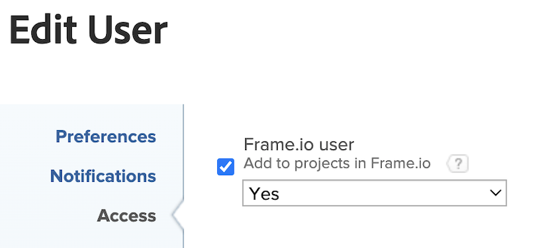

# Configure the [!DNL Workfront] and [!DNL Frame.io] integration

The Workfront administrator enables the integration between Workfront and Frame.io by configuring the default Frame.io account in the Setup area and then designating Frame.io users in Workfront. This allows the project coordinator to plan and initiate work using Workfront Projects and formal review and approval workflows. 

## Access requirements

>[!IMPORTANT]
>
>This functionality is available only to organization that have been onboarded to the [!DNL Adobe Admin Console].

You must have the following:

<table>
  <tr>
   <td><strong>[!DNL Adobe Workfront] plan</strong>
   </td>
   <td>Any
   </td>
  </tr>
  <tr>
   <td><strong>[!DNL Adobe Workfront] licenses</strong>
   </td>
   <td>Current: [!UICONTROL Plan]  
   New: [!UICONTROL Standard]
   </td>
  </tr>
  <tr>
   <td><strong>Product</strong>
   </td>
   <td>You must have Frame.io.
   </td>
  </tr>
  <tr>
   <td><strong>Access level configurations</strong>
   </td>
   <td>You must be a [!DNL Workfront] administrator.
   </td>
  </tr>
 
</table>

For more detail about the information in this table, see [Access requirements in Workfront documentation](/help/quicksilver/administration-and-setup/add-users/access-levels-and-object-permissions/access-level-requirements-in-documentation.md).

## Configure a default [!DNL Frame.io] account [!BADGE Coming soon]{type=Informative}

Once a default [!DNL Frame.io] account is set up, any projects created in [!DNL Workfront] have a mirror project created in Frame.io.

>[!IMPORTANT]
>
>This feature is coming soon. For now, Frame.io accounts are added manually by the Workfront team. Contact your Adobe account representative. 

## Configure a single Frame.io account with a Workfront group

You can connect a single Workfront group with a single Frame.io account that is different from the default account.

To configure a single Frame.io account with a Workfront group:

{{step-1-to-setup}}

1. In the left panel, click **Groups**.
1. Choose an existing group, or click **Create group**. 
1. In the left panel, click **Connect to Frame.io**. 

1. Enter the API developer token.
1. Click **Initiate Connection**.
1. (Conditional) If you are the administrator of more than one Frame.io account, select the account you want to use. <!--is this accurate-->

## Enable Frame.io users

Workfront users who regularly use Frame.io should be marked as Frame.io users. Workfront administrators can designate Frame.io users in the Workfront User Profile.

>[!TIP]
>
>We recommend enabling users who regularly work in creative tools and upload assets for review and approval as Frame.io users.

When a user is marked as a Frame.io user in Workfront and is added to a project,

* They are added as a Collaborator in Frame.io <!--do we need to be more explicit about a frame license being provisioned for them?-->
* They can send assets from Frame.io to Workfront for formal review and approval
* They can view information in the one-way sync folder from Workfront

To enable Frame.io users:

{{step-1-to-users}}

1. Select one or more users, then click the **Edit** icon . 
1. In the Access section, enable the Add to projects in Frame.io checkbox, then select Yes in the drop-down menu. 
    

    >[!NOTE]
    >
    >If this box is unchecked, the user retains access to past assignments and are not assigned moving forward. If the user is deactivated, they lose all access to previous assignments and are removed from the Frame.io account.

