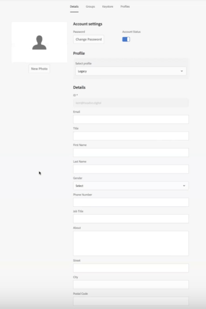

# Configure [!DNL Workfront] with [!DNL Adobe Experience Manager] legacy connector

As an [!DNL Adobe Workfront] administrator, you can integrate [!DNL Workfront] with [!UICONTROL Adobe Experience Manager (AEM) Assets] and provide your organization with a comprehensive content management solution for the creation, sharing, and maintenance of assets within your workflow.

## Access requirements

+++ Expand to view access requirements for the functionality in this article.

You must have the following access to perform the steps in this article:

<table style="table-layout:auto"> 
 <col> 
 <col> 
 <tbody> 
  <tr> 
   <td role="rowheader">[!DNL Adobe Workfront] plan*</td> 
   <td>Any</td> 
  </tr> 
  <tr> 
   <td role="rowheader">[!DNL Adobe Workfront] license*</td> 
   <td>[!UICONTROL Plan]</td> 
  </tr> 
  <tr> 
   <td role="rowheader">Access level configurations*</td> 
   <td> <p>You must be a [!DNL Workfront] administrator. For information on [!DNL Workfront] administrators, see <a href="../../administration-and-setup/add-users/configure-and-grant-access/grant-a-user-full-administrative-access.md" class="MCXref xref">Grant a user full administrative access</a>.</p> </td> 
  </tr> 
 </tbody> 
</table>

&#42;To find out what plan, license type, or access you have, contact your [!DNL Workfront] administrator.

+++

## [!DNL Workfront for AEM Assets]

The [!DNL Workfront for AEM Assets connector] allows your organization to do the following:

* Collaborate and manage creative content by linking AEM assets and folders to projects, tasks, issues, and requests in [!DNL Workfront].

   For more information about configuring documentation integrations with third-party applications, see  [Configure document integrations](../../administration-and-setup/configure-integrations/configure-document-integrations.md).

* Integrate with the [!DNL AEM Digital Asset Managemen]t (DAM) repository, allowing you to use [!DNL Workfront] to manage and share digital assets stored in the DAM.

   For more information about linking documents and asset folders, see   [Link documents from external applications](../../documents/adding-documents-to-workfront/link-documents-from-external-apps.md).

* Combine and apply metadata from both applications to an asset.
* View an all-inclusive communication stream for an asset. Updates and comments made to an asset either in [!DNL Workfront] or [!UICONTROL AEM Assets] are synchronized to the other application, establishing a comprehensive history of communications made to the asset.

   For more information about making comments in [!DNL Workfront], see [Add an update to a document](../../documents/managing-documents/add-update-documents.md).

## Prerequisites for installing the [!DNL AEM Assets] connector

Before you can install the [!DNL Workfront] connector for [!UICONTROL AEM Assets], ensure that the following prerequisites are met:

* [!UICONTROL AEM Assets] installed and configured, version 6.5 or later. For information about installing [!UICONTROL AEM Assets], see the [[!DNL Adobe Experience Manager] documentation](https://experienceleague.adobe.com/docs/experience-manager.html).
* (Conditional) If your firewall rules don't allow traffic as expected, add your cluster's IP address and/or domain to your allowlist. For more information, see [Configure your firewall's allowlist](../../administration-and-setup/get-started-wf-administration/configure-your-firewall.md).

## Install the [!DNL Workfront for AEM Assets] connector package {#install-the-workfront-for-aem-assets-connector-package}

>[!IMPORTANT]
>
>The following instructions are for a [!DNL Workfront with AEM Assets] legacy connector which has been replaced by the [[!DNL Workfront for Experience Manager] enhanced connector](../../documents/workfront-and-experience-manager-integrations/workfront-for-experience-manager-enhanced-connector/workfront-for-aem-enhanced-connector.md). Please contact your Account Rep for more information.

To install the [!DNL Workfront for AEM Assets] connector, you must import the connector into AEM as a package using the [!UICONTROL CRX Package Manager].

1. On a workstation where you have already installed AEM, download the [!DNL Workfront for AEM Assets] Connector installation file.

   You can get the [!DNL Workfront for AEM Assets] connector from your [!DNL Workfront] representative.

1. Log in to AEM using an administrator account.
1. Click **[!UICONTROL Tools]** > **[!UICONTROL Deployment]** > **[!UICONTROL Packages]**.

   The [!UICONTROL CRX Package Manager] opens.

1. Click **[!UICONTROL Upload Package].**

1. In the [!UICONTROL Upload Package] dialog box, browse for and select the [!UICONTROL Workfront Connector] package, then click **[!UICONTROL OK]**.\
   The package displays in the [!UICONTROL CRX Package Manager].

1. Click **[!UICONTROL Install].**

1. On the [!UICONTROL Package] dialog box, ignore the advanced settings and click **[!UICONTROL Install]**.
1. (Optional) To confirm the connector successfully installed, ensure the following statement displays in the [!UICONTROL Activity Log]:

   ```
   Package installed in <time>
   ```

1. Close the [!UICONTROL CRX Package Manager].

   The connector is installed and you can now configure [!DNL AEM Assets] to integrate with [!DNL Workfront].

1. Continue with [Configure [!DNL AEM Assets] to integrate with [!DNL Workfront]](#configure-aem-assets-to-integrate-with-workfront).

## Configure [!DNL AEM Assets] to integrate with [!DNL Workfront] {#configure-aem-assets-to-integrate-with-workfront}

After you install the connector, import the connector package to AEM and configure AEM to link with documents in [!DNL Workfront].

For information on installing the connector, see  [Install the [!DNL Workfront for AEM Assets] connector package](#install-the-workfront-for-aem-assets-connector-package).

* [Prerequisites](#prerequisites)
* [Integrate AEM with [!DNL Workfront]](#integrate-aem-with-workfront)
* [Configure the [!UICONTROL AEM Externalizer]](#configure-the-aem-externalizer)

### Prerequisites {#prerequisites}

Before you begin, you must enable permissions for workfront-service:

1. In AEM, go to **[!UICONTROL Tools]**> **[!UICONTROL Security]**> **[!UICONTROL Permissions]**.
1. In the top-left corner, choose **[!UICONTROL Users]**&#x200B;in the drop-down menu and enter *[!UICONTROL workfront-service]* in the **[!UICONTROL Search]**&#x200B;field. Select the [!UICONTROL workfront-service] user.
1. On the right side of the screen, select **[!UICONTROL Add ACE]** to create new entries.
1. In the&#x200B;**[!UICONTROL Add New Entry]**&#x200B;window, select checkbox icon in the **[!UICONTROL Path]**&#x200B;field and choose the folder: */conf*
1. In the Privileges field enter: *jcr:read*
1. Select **[!UICONTROL Add]**&#x200B;in the top-right corner
1. (Optional) Repeat the steps to create more entries.

### Integrate AEM with [!DNL Workfront] {#integrate-aem-with-workfront}

1. Log in to AEM Assets as an Administrator.
1. Click **[!UICONTROL Tools]** >**[!UICONTROL Cloud Services]**>**[!UICONTROL Workfront Integration Configuration]** >**[!UICONTROL Global-Workfront].**&#x200B;**&#x200B;**

1. (Conditional) If you have not yet done so, create a [!DNL Workfront] cloud configuration file.

   1. Click  **[!UICONTROL Create]** in the upper-right corner of the [!DNL Global-Workfront] page.
   1. In the **[!UICONTROL Workfront URL]** box, specify the URL for your [!DNL Workfront] instance.

      For example, [!DNL https]://`<account>`.my.workfront.com, where `<account>` is the account you use for integrations with AEM.

   1. In the&#x200B;**[!UICONTROL Base Folder]** field, select the checkbox icon, then in the drop-down menu select the path where documents that are linked to [!DNL Workfront] objects are stored.
   1. In the AEM modal that appears, follow the path to the folder with the documents that are connected to [!DNL Workfront] objects. Choose the folder and press **[!UICONTROL Select]**&#x200B;in the top-right corner.

      You can link to any folder beneath the root /content/dam/.

   1. In the **[!UICONTROL Workfront API Key]** box, specify your [!UICONTROL Workfront] API Key.

      To retrieve your [!DNL Workfront] API key:

      1. Open a browser tab, and log into your [!DNL Workfront] account as a [!DNL Workfront] administrator.

      {{step-1-to-setup}}

      1. Click **[!UICONTROL System]** >**[!UICONTROL Customer Info]**.

         If you have already generated an API key, your [!DNL Workfront] API Key displays under the Your User's API Key label.

      1. (Conditional) If you have not yet generated an API key, you need to generate one:

         1. In the **[!UICONTROL API Key Settings]** section, ensure that the **[!UICONTROL After Creation, API keys expire in]** option is set to None.

            If you select an expiration period, the connector will stop working after the API Key expires. You will then to need to re-generate an API Key and update your [!DNL Workfront] configuration.

         1. Under the **[!UICONTROL Your User's API Key]** label, click **[!UICONTROL Generate API Key]**.

            An API Key for [!DNL Workfront] generates and displays.
      1. Copy the API Key to your clipboard.
      1. Open the browser tab for AEM Connector and in the **[!DNL Workfront API Key]** box, paste the API Key you copied.
   1. (Conditional) Click the **[!UICONTROL Advanced]** tab in the upper-left corner of the [!UICONTROL [!DNL Workfront] Integration Configuration] page, and select the following options if applicable:

      **[!UICONTROL Allow Collection Browsing]:**&#x200B;Select this option if your organization allows [!DNL Workfront] users to link AEM Assets collections to [!DNL Workfront] objects.

      **[!UICONTROL User Federated ID]:** Select this option if your organization is using Federated IDs or Single Sign-On (SSO) when logging into Workfront.

      **[!UICONTROL Ignore Email Domain]:** Select this option if your AEM users do not use the domain name in their user ID.

      **[!UICONTROL Restrict Access]:** Select this option to specify the appropriate [!DNL Workfront] IP addresses that need to be added to the allowlist. For more information about the allowlist, see [Configure your firewall's allowlist](../../administration-and-setup/get-started-wf-administration/configure-your-firewall.md).

   1. Click the **[!UICONTROL Basic]** tab in the upper-left corner of the Workfront Integration Configuration page, and then click **[!UICONTROL Connect]**.

      >[!NOTE]
      >
      >Changes may take some time to apply. Restarting the bundle may speed up the process.


1. (Conditional) If you already created a [!DNL Workfront] cloud configuration file, select **[!UICONTROL Global-[!DNL Workfront]]**, and then in the upper-left corner, click **[!UICONTROL Properties]**.

1. Generate the AEM API Key by clicking **[!UICONTROL Generate Key],** then copy the AEM API key to your clipboard.

   You will need the AEM API Key later when you configure [!UICONTROL Workfront] to integrate with [!UICONTROL AEM Assets]. For more information, see [Configure Workfront to integrate with AEM assets](#configure-workfront-to-integrate-with-aem-assets).

1. In the upper-right corner, click **[!UICONTROL Save]**.

   The [!UICONTROL Global-[!DNL Workfront]] window displays.

   

1. (Optional) Synchronize bi-directional communication between AEM and [!DNL Workfront].

   1. Click **[!UICONTROL Global-[!DNL Workfront]].**
   1. In the upper-left corner of the window, click **[!UICONTROL Properties]**.

      The [!UICONTROL [!DNL Workfront] Integration Configuration] page displays.

      

   1. (Optional) To enable the synchronization of comments between [!UICONTROL AEM Assets] and [!DNL Workfront], click **[!UICONTROL Enable Comment Sync]**.

      >[!IMPORTANT]
      >
      >You must enable [!UICONTROL Document Sync] to synchronize the assets.

   1. (Optional) To turn off comment synchronization, click **[!UICONTROL Disable Comment Sync].**

      Or

      Delete the [!UICONTROL NOTE CREATE] event subscription registered to your AEM instance.

      For information on event subscriptions, see [Event Subscription API](../../wf-api/general/event-subs-api.md).

1. Continue with [Configure the [!UICONTROL AEM Externalizer]](#configure-the-aem-externalizer).

### Configure the [!UICONTROL AEM Externalizer] {#configure-the-aem-externalizer}

The [!UICONTROL AEM Externalizer] allows AEM to pass URLs in a format that can be used in [!DNL Workfront]. If not properly configured, [!DNL Workfront] cannot make calls to the AEM API, and the URLs linking AEM documents in Workfront will not work.

1. In AEM, click **[!UICONTROL Tools]** > **[!UICONTROL Operations]** >**[!UICONTROL Web Console]**.

1. Click **[!UICONTROL OSGI]**, then click **[!UICONTROL Configuration]** in the drop-down menu.

1. In the configuration list, select&#x200B;**[!UICONTROL Day CQ Link Externalizer].**

   The [!UICONTROL Externalizer] page displays.

1. In the **[!UICONTROL Domains]** section, ensure the domain listed in the [!UICONTROL Author] field is the domain name externally accessible to AEM users.

   The domain name in the [!UICONTROL author] field should match the domain listed in the URL line of your AEM instance.

   ![[!DNL Extenalizer].png](assets/extenalizer-350x128.png)

1. (Conditional) If necessary, update the domain in the [!UICONTROL Author] field.
1. Click **[!UICONTROL Save]**.

   [!UICONTROL AEM Assets] is now configured to link documents with [!DNL Workfront]

1. Continue with [Configure [!DNL Workfront] to integrate with [!DNL AEM assets]](#configure-workfront-to-integrate-with-aem-assets).

## Configure [!DNL Workfront] to integrate with [!DNL AEM assets] {#configure-workfront-to-integrate-with-aem-assets}

After you install the [!UICONTROL Workfront for AEM Assets] Connector (as described in [Install the [!UICONTROL Workfront for AEM Assets] connector package](#install-the-workfront-for-aem-assets-connector-package)) and configure [!UICONTROL AEM Assets] (as described in [Configure[!UICONTROL  AEM Assets] to integrate with [!DNL Workfront]](#configure-aem-assets-to-integrate-with-workfront)), you need to configure [!DNL Workfront] to link documents between [!DNL Workfront] and [!DNL AEM Assets].

1. Log in to [!DNL Workfront] as a [!UICONTROL Workfront] administrator.

   >[!TIP]
   >
   >[!UICONTROL Workfront] recommends creating a [!UICONTROL Workfront] administrator dedicated solely to your AEM integration. For more information about assigning the [!UICONTROL Workfront] administrator access level to a user, see [Grant users administrative access to certain areas](../../administration-and-setup/add-users/configure-and-grant-access/grant-users-admin-access-certain-areas.md).

{{step-1-to-setup}}

1. Click **[!UICONTROL Documents]**> **[!UICONTROL Custom Integration].**

1. Click **[!UICONTROL Add Custom Integration]**.
1. In the **[!UICONTROL Name]** box, specify the name of the custom integration.

   This is the name users see when using the integration within [!UICONTROL Workfront]; for example, you could enter *"[!DNL AEM Assets]"* for the name.

1. In the **[!UICONTROL Base API URL]** box, specify the URL for your AEM instance.

   The base API URL consists of the URL for your AEM instance followed by the path: /bin/webhooks/api/

   

1. In the **[!UICONTROL Authentication Type]** drop-down menu, select **[!UICONTROL ApiKey].**

1. In the&#x200B;**[!UICONTROL API Key]** box, paste the AEM API Key you copied when you configured [!UICONTROL AEM Assets].
1. Click **[!UICONTROL Save]**.
1. (Optional) Ensure the integration is marked [!UICONTROL Active].\
   

   [!DNL Workfront] is now configured to work with [!DNL AEM Assets].

   In order to access assets in AEM, each [!DNL Workfront] user who needs to use the connector must be set up as a user in AEM. For information on creating users, see  [Set up users to use the connector](#set-up-users-to-use-the-connector).

## Set up users to use the connector {#set-up-users-to-use-the-connector}

In order for users to access the connector, they must have a user profile in AEM and belong to a [!DNL Workfront] group that has Access levels that include the [!UICONTROL Create] and [!UICONTROL Delete] permissions.

For more information about [!DNL Workfront] permissions, see [Create or modify custom access levels](../../administration-and-setup/add-users/configure-and-grant-access/create-modify-access-levels.md).

* [Set up users in [!DNL AEM assets]](#set-up-users-in-aem-assets)

### Set up users in [!DNL AEM assets] {#set-up-users-in-aem-assets}

1. Log in to [!DNL AEM Assets] as a [!DNL Workfront] administrator.
1. Click **[!UICONTROL Tools]** >**&#x200B;**&#x200B;**[!UICONTROL Security]** >**[!UICONTROL Users]**.

1. (Conditional) If the user does not have a user profile in AEM, create an AEM user profile.

   1. Click **[!UICONTROL Create User].**
   1. Enter the user's personal information.

      

      The only required field is the ID field. The user's AEM ID must match their [!DNL Workfront] ID, which is the user's [!DNL Workfront] email address.

      If you selected the [!UICONTROL Ignore Email Domain] option when you configured AEM to integrate with [!DNL Workfront], then the AEM ID will not match the [!DNL Workfront] email address.

1. (Conditional) If the user has an AEM profile, open the user's AEM profile.

   1. Click&#x200B;**[!UICONTROL User].**

      The [!UICONTROL User Management] page displays.

   1. Click the user you want to add, then click **[!UICONTROL Properties]**.

      The user's settings page displays.

1. Click the **[!UICONTROL Groups]** tab.

   

1. Ensure the user belongs to at least one [!DNL Workfront] group that has Access levels that include the [!UICONTROL Create] and [!UICONTROL Delete] permissions.

   1. To add the user to an existing group, begin typing the group name in the **[!UICONTROL Type Group Name]** box, then select the group when it appears in the drop-down menu.

      Or

      To select a group to which the user is a member, select a group in the **[!UICONTROL Groups that this user is a member of]** section.

1. Click **[!UICONTROL Save].**
