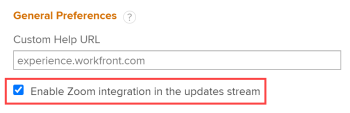

# Install the Zoom integration

As an Adobe Workfront administrator, you need to enable the Zoom integration in Workfront before users can use it in the Updates area.

For information how users can insert a Zoom link into a comment or a reply in the Updates area, see the section [Add an update to a work item](../../workfront-basics/updating-work-items-and-viewing-updates/update-work.md#add) in the article [Update work](../../workfront-basics/updating-work-items-and-viewing-updates/update-work.md). (Your Workfront users do not have the Zoom icon in the Updates area if you have not yet enabled the integration for your organization.)

Users can uninstall the Zoom integration any time. For more information, see [Uninstall the Zoom integration](../../workfront-integrations-and-apps/zoom-integration-with-wf/uninstall-zoom-integration.md).

## Access requirements

You must have the following to perform the steps in this article:

<table style="table-layout:auto"> 
 <col> 
 <col> 
 <tbody> 
  <tr> 
   <td role="rowheader">Adobe Workfront plan</td> 
   <td> 
Any
 </td> 
  </tr> 
  <tr> 
   <td role="rowheader">Adobe Workfront license</td> 
   <td> 
Plan 
 </td> 
  </tr> 
  <tr> 
   <td role="rowheader">Access level configurations*</td> 
   <td> 
You must be a Workfront administrator. For information on Workfront administrators, see <a href="../../administration-and-setup/add-users/configure-and-grant-access/grant-a-user-full-administrative-access.md" class="MCXref xref">Grant a user full administrative access</a>.
 </td> 
  </tr> 
 </tbody> 
</table>

&#42;To find out what plan, license type, or access you have, contact your Workfront administrator.

## Enable the Zoom integration in Workfront:

1. Click the **Main Menu** icon  in the upper-right corner of Adobe Workfront, then click **Setup** .

1. In the left panel, click **System** > **Preferences**.

1. At the bottom of the **System Preferences** page, select the option **Enable Zoom integration in the updates stream**.

   

1. Click **Save**.

