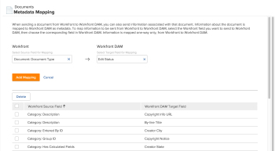

# Set up metadata mapping

Metadata is descriptive information associated with a document. You can set up Adobe Workfront to include metadata with documents sent to Workfront applications.

## Access requirements

You must have the following access to perform the steps in this article: 

<table> 
 <col> 
 <col> 
 <tbody> 
  <tr> 
   <td role="rowheader">Adobe Workfront plan</td> 
   <td> 
Any
 </td> 
  </tr> 
  <tr> 
   <td role="rowheader">Adobe Workfront license</td> 
   <td> 
Plan 
 </td> 
  </tr> 
  <tr> 
   <td role="rowheader">Access level configurations</td> 
   <td> 
You must be a Workfront administrator. For more information, see <a href="../../administration-and-setup/add-users/configure-and-grant-access/grant-a-user-full-administrative-access.md" class="MCXref xref">Grant a user full administrative access</a>.
 
<b>Note<>: If you still don't have access, ask your Workfront administrator if they set additional restrictions in your access level. For information on how a Workfront administrator can modify your access level, see <a href="../../administration-and-setup/add-users/configure-and-grant-access/create-modify-access-levels.md" class="MCXref xref">Create or modify custom access levels</a>.
 </td> 
  </tr> 
 </tbody> 
</table>

## About Workfront metadata

Metadata for documents in Workfront can include information such as the related project name, task description, or Planned Completion Date. As a Workfront administrator, you can configure Workfront to include metadata with documents sent from Workfront to the following Workfront applications:

* Workfront Library 
* Workfront DAM

Before metadata can be sent with documents, you must first specify, or map, the metadata that you want included. You can map any field used in Workfront. Once you set up metadata mapping, all documents uploaded to a Workfront application will include the mapped metadata.

When a user sends a document from Workfront to a Workfront application, mapped metadata is transferred along the document. While the version of the document in the Workfront application is linked to Workfront, changes made to the document's metadata in Workfront are not reflected in the metadata of the document in the Workfront application. If a mapped field in Workfront is changed, you must send a new version of the document with the updated metadata to the Workfront application.

>[!NOTE]
>
>You can map metadata only in one direction: from Workfront to Workfront DAM or Workfront Library. Metadata for documents linked to Workfront from Workfront Library or Workfront DAM cannot be transferred to Workfront.

You can map the same Workfront field to various metadata fields in Workfront Library or Workfront DAM, but you cannot use a metadata field in either of those applications for multiple Workfront metadata fields.

To configure multiple Workfront fields to export to one metadata field in a Workfront application, first create a calculated custom field in Workfront to display all the individual custom fields of an object. Then, map the calculated Workfront field to a metadata field in the Workfront application. For more information about calculated custom fields, see [Add calculated data to a custom form](../../administration-and-setup/customize-workfront/create-manage-custom-forms/add-calculated-data-to-custom-form.md).

Before you can map fields for the metadata mapping process, you must enable the application in Workfront . For more information, see [Configure document integrations](../../administration-and-setup/configure-integrations/configure-document-integrations.md).

## Configure Workfront to send metadata

1. Click the **Main Menu** icon  in the upper-right corner of Adobe Workfront, then click **Setup** .  

1. In the left panel, click **Documents** > **Metadata Mapping**.

   

1. In the **Select Source Field for Mapping** box, begin typing the name of the Workfront field you want to map to Workfront Library or Workfront DAM, then select it when you see it in the list.
1. In the **Select Target Field for Mapping** box, select the field you want to populate with the information in the selected Workfront field.  

1. Click **Add Mapping**.

   The mapped field displays in the mapped fields listed at the bottom of the page.

1. Repeat Steps 5 and 6 until you add all the desired Workfront fields and their corresponding Workfront Library or Workfront DAM fields.

## Delete mapped fields

1. Log in to Workfront as the administrator.
1. Click the **Main Menu** icon  in the upper-right corner of Adobe Workfront, then click **Setup** .  

1. In the left panel click **Documents** > **Metadata Mapping**.

1. In the list of mapped fields, select the fields you want to remove from metadata mapping.
1. Click **Delete**.

   The designated fields are no longer mapped. Now when a user sends a document from Workfront to Workfront Library or Workfront DAM, the metadata contained within the deleted fields is not transferred with the document.

   A document sent prior to you deleting the mapped fields retains the original metadata sent with it, including the metadata for the deleted fields.

