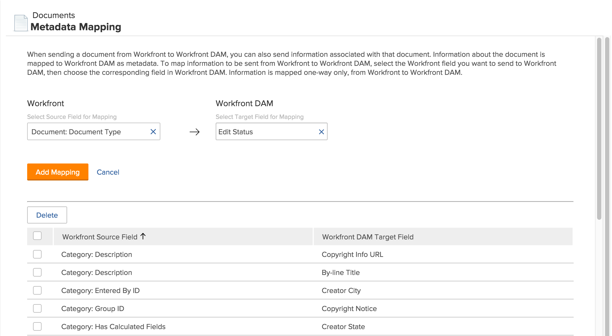

# Set up metadata mapping

Metadata is descriptive information associated with a document. You can set up [!DNL Adobe Workfront] to include metadata with documents sent to [!DNL Workfront] applications.

## Access requirements

You must have the following access to perform the steps in this article:

<table style="table-layout:auto"> 
 <col> 
 <col> 
 <tbody> 
  <tr> 
   <td role="rowheader">[!DNL Adobe Workfront] plan</td> 
   <td>Any</td> 
  </tr> 
  <tr> 
   <td role="rowheader">[!DNL Adobe Workfront] license</td> 
   <td>[!UICONTROL Plan]</td> 
  </tr> 
  <tr> 
   <td role="rowheader">Access level configurations</td> 
   <td> 
You must be a [!DNL Workfront] administrator. For more information, see <a href="../../administration-and-setup/add-users/configure-and-grant-access/grant-a-user-full-administrative-access.md" class="MCXref xref">Grant a user full administrative access</a>.
 
<b>NOTE</b>: If you still don't have access, ask your [!DNL Workfront] administrator if they set additional restrictions in your access level. For information on how a [!DNL Workfront] administrator can modify your access level, see <a href="../../administration-and-setup/add-users/configure-and-grant-access/create-modify-access-levels.md" class="MCXref xref">Create or modify custom access levels</a>.
 </td> 
  </tr> 
 </tbody> 
</table>

## About [!DNL Workfront] metadata

Metadata for documents in [!DNL Workfront] can include information such as the related project name, task description, or Planned Completion Date. As a [!DNL Workfront] administrator, you can configure [!DNL Workfront] to include metadata with documents sent from [!DNL Workfront] to the following [!DNL Workfront] applications:

* [!DNL Workfront DAM]

Before metadata can be sent with documents, you must first specify, or map, the metadata that you want included. You can map any field used in [!DNL Workfront]. Once you set up metadata mapping, all documents uploaded to a [!DNL Workfront] application will include the mapped metadata.

When a user sends a document from [!DNL Workfront] to a [!DNL Workfront] application, mapped metadata is transferred along the document. While the version of the document in the [!DNL Workfront] application is linked to [!DNL Workfront], changes made to the document's metadata in [!DNL Workfront] are not reflected in the metadata of the document in the [!DNL Workfront] application. If a mapped field in [!DNL Workfront] is changed, you must send a new version of the document with the updated metadata to the [!DNL Workfront] application.

>[!NOTE]
>
>You can map metadata only in one direction: from [!DNL Workfront] to [!DNL Workfront DAM]. Metadata for documents linked to [!DNL Workfront] from [!DNL Workfront DAM] cannot be transferred to Workfront.

You can map the same [!DNL Workfront] field to various metadata fields in [!DNL Workfront DAM], but you cannot use a metadata field in either of those applications for multiple [!DNL Workfront] metadata fields.

To configure multiple [!DNL Workfront] fields to export to one metadata field in a [!DNL Workfront] application, first create a calculated custom field in [!DNL Workfront] to display all the individual custom fields of an object. Then, map the calculated [!DNL Workfront] field to a metadata field in the [!DNL Workfront] application. For more information about calculated custom fields, see [Add calculated fields to a form](/help/quicksilver/administration-and-setup/customize-workfront/create-manage-custom-forms/form-designer/design-a-form/add-a-calculated-field.md).

Before you can map fields for the metadata mapping process, you must enable the application in [!DNL Workfront]. For more information, see [Configure document integrations](../../administration-and-setup/configure-integrations/configure-document-integrations.md).

## Configure [!DNL Workfront] to send metadata

1. Click the **[!UICONTROL Main Menu]** icon  in the upper-right corner of [!DNL Adobe Workfront], then click **[!UICONTROL Setup]** .

1. In the left panel, click **[!UICONTROL Documents]** > **[!UICONTROL Metadata Mapping]**.

   

1. In the **[!UICONTROL Select Source Field for Mapping]** box, begin typing the name of the Workfront field you want to map to [!DNL Workfront DAM], then select it when you see it in the list.
1. In the **[!UICONTROL Select Target Field for Mapping]** box, select the field you want to populate with the information in the selected [!DNL Workfront] field.

1. Click **[!UICONTROL Add Mapping]**.

   The mapped field displays in the mapped fields listed at the bottom of the page.

1. Repeat Steps 5 and 6 until you add all the desired [!DNL Workfront] fields and their corresponding [!DNL Workfront DAM] fields.

## Delete mapped fields

1. Log in to [!DNL Workfront] as the administrator.
1. Click the **[!UICONTROL Main Menu]** icon  in the upper-right corner of [!DNL Adobe Workfront], then click **[!UICONTROL Setup]** .

1. In the left panel click **[!UICONTROL Documents]** > **[!UICONTROL Metadata Mapping]**.

1. In the list of mapped fields, select the fields you want to remove from metadata mapping.
1. Click **[!UICONTROL Delete]**.

   The designated fields are no longer mapped. Now when a user sends a document from [!DNL Workfront] to [!DNL Workfront DAM], the metadata contained within the deleted fields is not transferred with the document.

   A document sent prior to you deleting the mapped fields retains the original metadata sent with it, including the metadata for the deleted fields.
