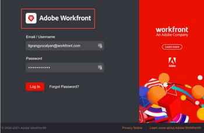
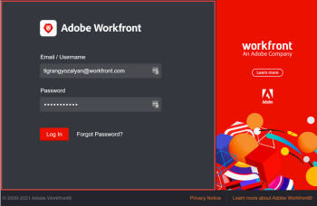
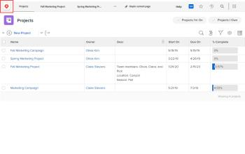
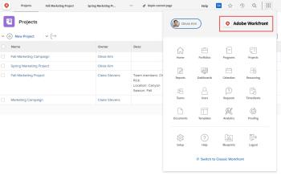

# Brand your Adobe Workfront instance

<!--

**DON'T DELETE, DRAFT OR HIDE THIS ARTICLE. IT IS LINKED TO THE PRODUCT, THROUGH THE CONTEXT SENSITIVE HELP LINKS. **

-->

As a Workfront administrator, you can brand Workfront with logos in the following places:

* Login screen

  

  You can also change the background image and color of the login screen:

  

  >[!NOTE]
  >
  >This is not available if your organization’s Workfront instance uses a custom SSO portal.  >
  >
  ><!--  >
  ><MadCap:conditionalText data-mc-conditions="QuicksilverOrClassic.Draft mode">  >
  >or is enabled with Adobe IMS  >
  ></MadCap:conditionalText>  >
  >-->  >
  >
  >See your network or IT administrator if you need more information.

* Top navigation area

  

* Main Menu

  

>[!NOTE]
>
>A Workfront administrator or group administrator can also brand Workfront for certain groups and users using a layout template. Branding in a layout template overrides the system-level branding explained in this article. For instructions on branding in a layout template, see [Brand Adobe Workfront using a layout template](../../../administration-and-setup/customize-workfront/use-layout-templates/brand-wf-using-a-layout-template.md).

## Access requirements

You must have the following access to perform the steps in this article: 

<table cellspacing="0"> 
 <col> 
 <col> 
 <tbody> 
  <tr> 
   <td role="rowheader">Adobe Workfront plan</td> 
   <td> 
Any
 </td> 
  </tr> 
  <tr> 
   <td role="rowheader">Adobe Workfront license</td> 
   <td> 
Plan 
 </td> 
  </tr> 
  <tr> 
   <td role="rowheader">Access level configurations</td> 
   <td> 
You must be a Workfront administrator. For more information, see <a href="../../../administration-and-setup/add-users/configure-and-grant-access/grant-a-user-full-administrative-access.md" class="MCXref xref">Grant a user full administrative access</a>.
 
Note: If you still don't have access, ask your Workfront administrator if they set additional restrictions in your access level. For information on how a Workfront administrator can modify your access level, see <a href="../../../administration-and-setup/add-users/configure-and-grant-access/create-modify-access-levels.md" class="MCXref xref">Create or modify custom access levels</a>.
 </td> 
  </tr> 
 </tbody> 
</table>

## Brand the login screen

1. Click the **Main Menu** icon  in the upper-right corner of Adobe Workfront, then click **Setup** .

1. Click **System** > **Branding**.

1. Make any of the following changes to customize Workfront with your branding images.

   <table cellspacing="0"> 
    <col> 
    <col> 
    <tbody> 
     <tr> 
      <td role="rowheader"> 
Brand the Home icon (displays at the far left of the top navigation area)
 </td> 
      <td> 
In the <strong>Top navigation area</strong> section, under <strong>Home icon</strong>, click anywhere in the box, then find and select your logo image. Or drag an image to the box.
 
To crop the image, use the scrolling controls and drag the image to the position you want inside the prescribed space.
 
We recommend a 120 x 120 image. It can be in any of the following formats: GIF, JPG, PNG, SVG.
 
This icon also appears in reports, lists, dashboards, and delivered reports that users export as PDF files.
 </td> 
     </tr> 
     <tr> 
      <td role="rowheader"> 
Brand the Main Menu  logo (displays in the upper-right corner of the Main Menu)
 </td> 
      <td> 
In the <strong>Top navigation area</strong> section, under <strong>Main Menu logo</strong>, click anywhere in the box, then find and select your logo image. Or drag an image to the box.
 
To crop the image, use the scrolling controls and drag the image to the position you want inside the prescribed space.
 
We recommend a 300 x 120 pixel image. It can be in any of the following formats: GIF, JPG, PNG, SVG.
 </td> 
     </tr> 
     <tr> 
      <td role="rowheader">Brand the login screen logo (displays in the top-left of the box where users type login credentials)</td> 
      <td> 
Under <strong>Login Screen</strong>, click anywhere in the box, then find and select your logo image. To crop the image, use the scrolling controls and drag the image to the position you want inside the prescribed space.
 
We recommend a 300 x 120 pixel image. It can be in any of the following formats: GIF, JPG, PNG, SVG.
 </td> 
     </tr> 
     <tr> 
      <td role="rowheader">Brand the login screen background color (displays behind the box where users type login credentials)</td> 
      <td> 
Under <strong>Login Screen</strong>, set a <strong>Background Color</strong>. 
 
You can use RGB or HEX color codes.
 
The background color is visible only if the login screen background is larger than the login screen background image (see the next row in this table) or if there is any transparency in the image.
 </td> 
     </tr> 
     <tr> 
      <td role="rowheader">Brand the login screen background image (displays behind the box where users type their login credentials)</td> 
      <td> 
       <ol style="list-style-type: lower-alpha;"> 
        <li value="1"> 
 In the <strong>Login Screen</strong> area, under <strong>Background Image</strong>, click the box, then&nbsp;find and select your JPG or PNG image or images (up to 20 ). 
 
Multiple background images display in random order, changing each time users refresh their login page. We recommend images no larger than 2 MB.
 </li> 
        <li value="2"> 
Hover over each background image you have uploaded, click the Settings (gear) icon, and use any of the following options to specify where and how you want the image to appear in the login screen background:
 
         <ul> 
          <li> 
<strong>Fill Screen</strong>: Fits the image to the login screen background, which may enlarge the image. Use a high-resolution image (up to 2 MB) for the best results.
 
When you use this option, the Workfront banner, which is not customizable, obscures part your image.
 </li> 
          <li> 
<strong>Tile</strong>: Tiles your image across the login screen background area, in its original size. This is useful for creating a pattern. Select&nbsp;a blue alignment option to start the tiling from the top-left corner, top-center, or top-right of the background area.
 </li> 
          <li> 
<strong>Position</strong>: Places your image in its original size in the position you choose using one of the blue alignment options: the top-left, top-center, or top-right of the login screen background area.
 
The background color fills the rest of the login screen background area. For more about the background color, see the preceding row in this table.
 </li> 
         </ul> </li> 
       </ol> </td> 
     </tr> 
     <tr> 
      <td role="rowheader">Reset to the default branding</td> 
      <td> 
Resetting to the default branding deletes all photos and images that you have uploaded.
 
Click <strong>Reset all branding to Workfront defaults</strong> in the lower-right corner of the screen, then click <strong>Yes</strong>.
 </td> 
     </tr> 
    </tbody> 
   </table>

   >[!NOTE]
   >
   >This is not available if your organization’s Workfront instance uses a custom SSO portal.   >
   >
   ><!--   >
   ><MadCap:conditionalText data-mc-conditions="QuicksilverOrClassic.Draft mode">   >
   >or is enabled with Adobe IMS   >
   ></MadCap:conditionalText>   >
   >-->   >
   >
   >See your network or IT administrator if you need more information.

1. Click **Save**.

