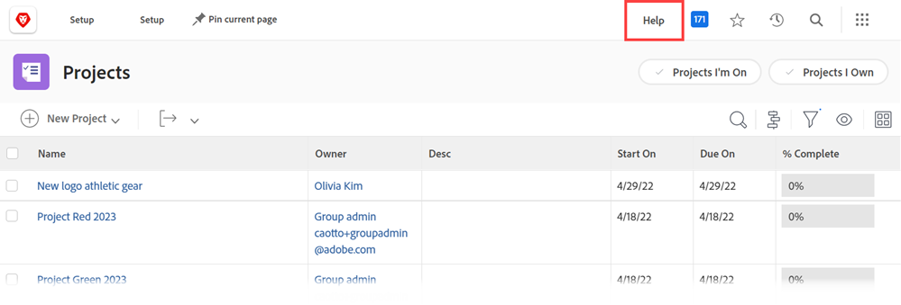

# Configure a custom help URL

If you create a custom  internal help site  containing information about how your organization uses Workfront, you can configure the Main Menu Help icon to go to that site.

 

This does not affect the main Help link in the Main Menu and the context-sensitive help links throughout Workfront, which take users to the Workfront Help site.

 

For information about how users access both a custom help URL that you configure in Workfront and the regular Workfront help site, see [Accessing Workfront Help in the new Adobe Workfront experience](help/quicksilver/workfront-basics/navigate-workfront/workfront-navigation/access-workfront-help.md).

## Access requirements

You must have the following access to perform the steps in this article:

<table style="table-layout:auto"> 
 <col> 
 <col> 
 <tbody> 
  <tr> 
   <td role="rowheader">Adobe Workfront plan</td> 
   <td> 
Any
 </td> 
  </tr> 
  <tr> 
   <td role="rowheader">Adobe Workfront license</td> 
   <td> 
Plan 
 </td> 
  </tr> 
  <tr> 
   <td role="rowheader">Access level configurations</td> 
   <td> 
You must be a Workfront administrator.
 
<b>NOTE</b>: If you still don't have access, ask your Workfront administrator if they set additional restrictions in your access level. For information on how a Workfront administrator can modify your access level, see <a href="../../../administration-and-setup/add-users/configure-and-grant-access/create-modify-access-levels.md" class="MCXref xref">Create or modify custom access levels</a>.
 </td> 
  </tr> 
 </tbody> 
</table>

## Configure a custom Help URL

1. Click the Main Menu icon  in the upper-right corner of Adobe Workfront, then click Setup.
1. Click **System** > **Preferences**.
1. In the **General Preferences** section, in the **Custom Help URL** field, type the URL where your custom help site is located.

   If your custom help location requires login credentials, those credentials are required for users when they access the site from Workfront. The credentials to your custom help site might need to be managed separately from the Workfront credentials if you are not using Single Sign-On (SSO).

1. Click **Save**.
