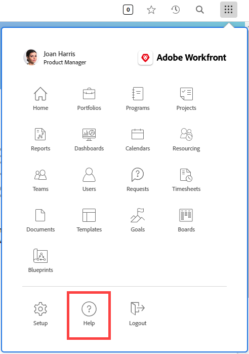

# Configure a custom help URL

If you create a custom internal help site containing information about how your organization uses Workfront, you can configure the Main Menu Help icon to go to that site.

 

This does not affect the context-sensitive help links throughout Workfront, which take users to the Workfront Help site.

For information about how users access both a custom help URL that you configure in Workfront and the regular Workfront help site, see [Access Adobe Workfront help](/help/quicksilver/workfront-basics/navigate-workfront/workfront-navigation/access-workfront-help.md).

## Access requirements

+++ Expand to view access requirements for the functionality in this article.

You must have the following access to perform the steps in this article: 

<table style="table-layout:auto"> 
 <col> 
 <col> 
 <tbody> 
  <tr> 
   <td role="rowheader">Adobe Workfront plan</td> 
   <td>Any</td> 
  </tr> 
  <tr> 
  <tr> 
   <td role="rowheader">Adobe Workfront license</td> 
   <td>
New: Standard

       
Or

       
Current: Plan
</td>
  </tr> 
  </tr> 
  <tr> 
   <td role="rowheader">Access level configurations</td> 
   <td>[!UICONTROL System Administrator]</td>
  </tr> 
 </tbody> 
</table>

For more detail about the information in this table, see [Access requirements in Workfront documentation](/help/quicksilver/administration-and-setup/add-users/access-levels-and-object-permissions/access-level-requirements-in-documentation.md).

+++

## Configure a custom Help URL

{{step-1-to-setup}}

1. Click **System** > **Preferences**.
1. In the **General Preferences** section, in the **Custom Help URL** field, type the URL where your custom help site is located.

   If your custom help location requires login credentials, those credentials are required for users when they access the site from Workfront. The credentials to your custom help site might need to be managed separately from the Workfront credentials if you are not using Single Sign-On (SSO).

1. Click **Save**.

   Once you have saved a custom help URL, you can return to the default Workfront help site by deleting the custom URL and clicking **Save**.
