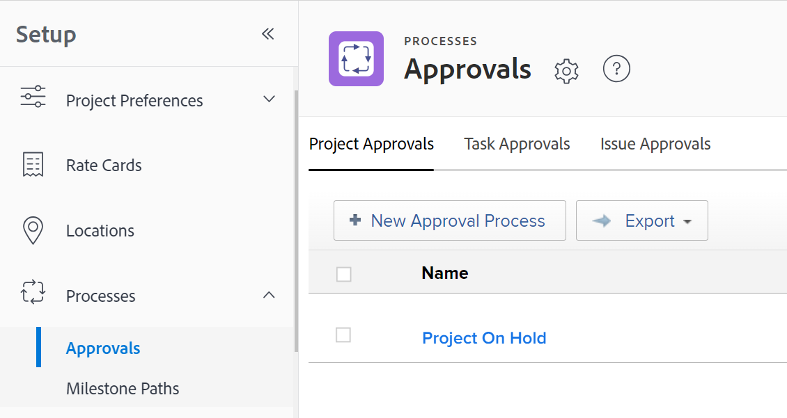
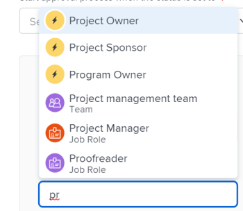

# Create an approval process for work items

<!-- Audited: 12/2023 -->

<!--see below the "hidden" content for the redesigned tabs - August 2023--> 

You can create an approval process that users can attach to a work item (project, task, issue, template, or template task), a document, or a proof. An approval process ensures that designated assignees on the object review certain changes before the object progresses in the system.

This article describes how to create a system-level or group-level global approval processes for work items (project, task, issue, template, or template task).

For information about approvals associated with documents or proofs, see the following articles:

* [Request document approvals](../../../review-and-approve-work/manage-approvals/request-document-approvals.md) 
* [Automated Workflow overview](../../../review-and-approve-work/proofing/proofing-overview/automated-workflow.md)

>[!NOTE]
>
>Users can also create single-use approval process for a project, task, issue, template, or template task where they have Manage permissions. 
>
>This article uses the term "global approval process" to differentiate from single-use approval process. A global approval process can be used repeatedly. 
>
>At the group level, a global approval process is restricted to work items and statuses that belong to the group.
>
>For information about single-use approval processes, see [Approval process overview](../../../review-and-approve-work/manage-approvals/approval-process-in-workfront.md) and [Associate a new or existing approval process with work](../../../review-and-approve-work/manage-approvals/associate-approval-with-work.md).

## Access requirements

+++ Expand to view access requirements for the functionality in this article.

You must have the following:

<table style="table-layout:auto"> 
 <col> 
 <col> 
 <tbody> 
  <tr> 
   <td role="rowheader">Adobe Workfront plan</td> 
   <td>Any</td> 
  </tr> 
  <tr> 
   <td role="rowheader">Adobe Workfront license</td> 
   <td> 
New plan: Standard 

 
or
 

Current plan: Plan 
 
</td> 
  </tr> 
  <tr> 
   <td role="rowheader">Access level configurations*</td> 
   <td> 
If you are a Workfront administrator or you have administrative access to approval processes, you can create a system-level approval process, or a group-level approval process for a particular group.
 
   
If you are a group administrator, you can create group-level approval processes for groups that you manage.
 </td> 
  </tr> 
 </tbody> 
</table>

For more detail about the information in this table, see [Access requirements in Workfront documentation](/help/quicksilver/administration-and-setup/add-users/access-levels-and-object-permissions/access-level-requirements-in-documentation.md).

+++

## Create a system-level or group-level global approval process for work items

{{step-1-to-setup}}

1. (Conditional) If you are creating a system-level approval process, click **Processes** > **Approvals** in the left panel.

   Or

   If you are creating a group-level approval process, click **Groups** , click the name of the group, then click **Approvals**.

   <!--hidden for the new tab redesign - August 2023: 
   
   -->

1. Choose either the **Project Approvals**, **Task Approvals**, or **Issue Approvals** tab.

1. Click **New Approval Process**.
1. Specify the following information in the box that displays:

   <table style="table-layout:auto"> 
    <col> 
    <col> 
    <tbody> 
     <tr> 
      <td role="rowheader">Approval process name</td> 
      <td>
Type a descriptive name for the approval process. Users see this name when applying the approval process to an object, as described in <a href="../../../review-and-approve-work/manage-approvals/associate-approval-with-work.md" class="MCXref xref">Associate a new or existing approval process with work</a>.
</td> 
     </tr> 
     <tr> 
      <td role="rowheader">Description</td> 
      <td>
Type a description of the approval process. This displays in the <b>Approvals</b> section in the <b>Setup</b> area next to the name of the approval process.
</td> 
     </tr> 
     <tr> 
      <td role="rowheader">Is Active</td> 
      <td> 
Keep this option enabled if you want other users to be able to attach the approval process to projects, tasks, and issues that they create. 
 
This option is enabled by default.
 
 Tip: Marking an approval process as inactive is useful when your organization no longer needs to use it, but you want to preserve historical information about its use.
 </td> 
     </tr> 
     <tr data-mc-conditions=""> 
      <td role="rowheader">This approval process can be used by </td> 
      <td> 
If you want the approval process available for projects, tasks, issues, and templates belonging only to a particular group, start typing the name of the group, then select the name when it appears:
 
       <ul> 
       <li>If you are a system administrator or you have administrative access to approval processes, you can see any group in the system when you type its name. <b>All groups</b> is selected by default. </li> 
       <li>If you are a group administrator without administrative access to approval processes, you can assign the approval process to any group you manage when you type its name. The <b>All Groups</b> option is not available.</li> 
       </ul> 
       
This option is not available for single-use approval processes.
 
       
<b>WARNING</b>: When you make changes to the group-specific approval process, the existing approval processes that have already been associated with work items might change. For information about these changes, see <a href="../../../administration-and-setup/customize-workfront/configure-approval-milestone-processes/how-changes-affect-group-approvals.md" class="MCXref xref">How group and approval process changes affect assigned approval processes</a>.
 
       
For information about listing and managing your group's approval processes from your group's page, see <a href="../../../administration-and-setup/manage-groups/work-with-group-objects/create-and-modify-groups-approval-processes.md" class="MCXref xref">Group-level approval processes</a>. 
 
       
For information about administrative access to approval processes, see <a href="../../../administration-and-setup/add-users/configure-and-grant-access/grant-users-admin-access-certain-areas.md" class="MCXref xref">Grant users administrative access to certain areas</a>.
 </td> 
     </tr> 
    </tbody> 
   </table>

1. Configure a path for the approval process using the following options.

   A path is where you specify what needs to happen in the approval process. You create stages in a path to indicate who needs to do the approval work and in what order.

   <table style="table-layout:auto"> 
    <col> 
    <col> 
    <tbody> 
     <tr> 
      <td role="rowheader"> 
Start approval process when the status is set to
 </td> 
      <td> 
Select the status that will trigger the approval process on work items. When someone updates a work item to this status, its approval process begins. 
 
The same status cannot be selected for multiple approval process paths.
 
The statuses available are based on what is selected under the option <b>This approval can be used by</b> (explained in the table above):
 
       <ul> 
       <li> If <b>All groups</b> is selected, only system-wide statuses are available
       <li> 
If a specific group is selected, only the statuses available for that group are available
 </li> 
       </ul> 
For information about how approval process work with statuses, see the section <a href="../../../review-and-approve-work/manage-approvals/approval-process-in-workfront.md#how2" class="MCXref xref">How approval processes rely on statuses</a> in the article <a href="../../../review-and-approve-work/manage-approvals/approval-process-in-workfront.md" class="MCXref xref">Approval process overview</a>.
 </td> 
     </tr> 
     <tr> 
      <td role="rowheader">Stage Name</td> 
      <td>(Optional) Type a name describing the first stage of the path. If you do not specify a stage name, the default name is <b>Stage 1</b>.</td> 
     </tr> 
     <tr> 
      <td role="rowheader">Approvers</td> 
      <td> 
Begin typing the name of the user, team, or job role that you want to designate as an approver for this stage, then click the name when it appears in the drop-down list. You can add only active users, job roles, and teams. 
 

      
<b>TIP</b>:

      
When adding a user as an approver, notice the avatar, the user's Primary Role, or their email address to distinguish between users with identical names. Users must be associated with at least one job role to view it as you add them.

      
You must have the View Contact Info setting enabled in your access level for Users to view users' emails. For information, see <a href="../../add-users/configure-and-grant-access/grant-access-other-users.md">Grant access to users</a>. 

      
      
<b>NOTE</b>:
      
      Adding a user, team, or role as an approver does not automatically give them permissions to the object associated with that approval. They receive permissions to the object when the approval step is triggered. Otherwise, the objects must be shared with them before they can make an approval decision. 
 
You can also designate an individual as an approver by specifying the individual's role. For example, you can assign a Project Owner, Project Sponsor, Portfolio Owner, Program Owner, or Manager as an approver. These options automatically appear when you begin typing.
 
      
      
<b>IMPORTANT</b>:  
       <ul> 
       <li> 
When you assign an approval to the Project Sponsor and no one is designated as the sponsor of a project, the approval is reassigned to the Project Owner. If no one is designated as the owner of the project, the approval is assigned to the Workfront administrator. 
 </li> 
      </ul> 
       <ul> 
       <li> 
When you assign an approval to a role and the <b>Approver not required to be on the project team (for approval processes that include a role)</b> is disabled but there are no roles in the project team that match the role on the approval, the approval is reassigned to the Project Owner. For information about approval settings, see <a href="../../../administration-and-setup/customize-workfront/configure-approval-milestone-processes/establish-approval-settings.md" class="MCXref xref">Configure global approval settings</a>.
 </li> 
       </ul> 
       <ul> 
       <li> 
When you assign an approval to the Project Owner and no one is designated as the owner of a project, the approval is reassigned to the main Workfront administrator as indicated in the Customer Info section in the Setup area. For information, see <a href="../../../administration-and-setup/get-started-wf-administration/configure-basic-info.md" class="MCXref xref">Configure basic information for your system</a>.  
 </li> 
       </ul> 
  
 
 
You can repeat this process to add multiple approvers to the stage. A single stage can include a combination of users, teams, and job roles as approvers. There is no limit to the number of approvers you can add to a stage.
 
<b>IMPORTANT</b>:  
When you assign job roles as approvers, all users associated with that job role that are also on the project team can make a decision on the approval. 
 
When you assign a team as an approver, any user in that team can make a decision on the approval. 
 
For more information about the project team, see <a href="../../../manage-work/projects/planning-a-project/project-team-overview.md" class="MCXref xref">Project Team overview</a>. For more information about approving work, see <a href="../../../review-and-approve-work/manage-approvals/approving-work.md" class="MCXref xref">Approving work </a>.
 
 </td> 
     </tr> 
     <tr> 
      <td role="rowheader">Only one decision is required    (Displays only if you add multiple approvers to the stage) </td> 
      <td> 
Select this option if any one of the approvers on the stage can approve or reject the work item during this stage. This action allows the work item to leave the stage. 
 
When this option is not selected, all of the identified approvers must approve or reject the stage (in any order) before the item leaves the stage. If any one of the approvers rejects the stage, the process interrupts and starts over so that the required changes can be made. Then the approvers can approve or reject the stage once again.
 
When a team is designated as an approver, any member of the team can grant or reject a stage.
 </td> 
     </tr> 
     <tr> 
      <td role="rowheader"> 
Add stage
 </td> 
      <td>
(Optional) Add another a stage to the path, using the options explained in the three rows above. You can add as many stages to the path as you need.
</td> 
     </tr> 
     <tr> 
      <td role="rowheader">Choose what happens when the approval is rejected
 </td> 
      <td> 
Select the action you want to take if the work item is rejected at any stage of the path:
 
       <ul> 
       <li><b>Create an Issue</b>: (Available only for project and task approval processes) An issue is created in the project or task where the approval process is running. The default assigned resource on the task, or the owner of the project is assigned to the issue. By default, the name of the issue created is <b>Approval Rejected (&lt;Project or Task Name&gt;)</b>. This is a Rejection Issue, entered under the task or the project, depending on the approval process where the rejection happened.</li> 
       <li> 
<b>Set Status to</b>: Choose one of the following:
 
       <ul> 
       <li><b>Previous Status</b>: The rejected project, task, or issue reverts to the status prior to the status that activates the approval process.</li> 
       <li>
<b>Any other status in the list</b>: The rejected object moves to the status you choose, such as On Hold. You can choose one of the default statuses or a custom statuses you added to your Workfront system.

       
If you select a status associated with an approval process as the rejection status, the rejected object moves to the selected status and it will be marked as "Pending approval".
 
       
 For example, if you select On Hold for the rejection status and the On Hold status is associated with an approval process, the rejected object is placed in the status of "On Hold - Pending approval" status, requiring the approval.
 
      
     </tr> 
    </tbody> 
   </table>

1. (Optional) Click **Add path** to add another path to the approval process, referring to the list of options in the previous step.

   The new path must be associated with another status. The path triggers when the item is updated to show this status. You cannot have two paths for the same status.

1. Click **Save**.
1. Now that the approval process is created, continue with any of the following:

   * Associate the approval process with specific projects, tasks, or issues throughout your system, as described in [Associate a new or existing approval process with work](../../../review-and-approve-work/manage-approvals/associate-approval-with-work.md).
   * Outside of Workfront, notify users that the approval process is available for them to associate with their projects, tasks, or issues, as described in [Associate a new or existing approval process with work](../../../review-and-approve-work/manage-approvals/associate-approval-with-work.md).
   * Create another approval process that is triggered if this approval process is rejected and the item takes on another status. This gives you a way to link approval processes together.

For information about editing an approval process, see [Edit an approval process](../../../administration-and-setup/customize-workfront/configure-approval-milestone-processes/edit-an-approval-process.md).

## Associating an approval process with a work item

When you want to create an approval process for a work item (project, task, or issue), you 

1. Create the approval process first
1. Create the work item
1. Associate the approval process with the work item

For instructions on associating an approval process with a work item, see [Associate a new or existing approval process with work](../../../review-and-approve-work/manage-approvals/associate-approval-with-work.md).

>[!NOTE]
>
>Any Workfront user with manage permissions to a project, task, or issue can create single-use approval processes for use only on the object where they are created. For more information, see [Associate a new or existing approval process with work](../../../review-and-approve-work/manage-approvals/associate-approval-with-work.md).

## Enabling users to modify global approval processes for a single work item

By default, users who have manage permissions on projects, tasks, and issues can create single-use approval processes on them. For information about adding single-use approval processes to projects, tasks, and issues, see the section [Associate a single-use approval process with a project, task, issue, template, or template task](../../../review-and-approve-work/manage-approvals/associate-approval-with-work.md#creating-a-single-use-approval-process) in the article [Associate a new or existing approval process with work](../../../review-and-approve-work/manage-approvals/associate-approval-with-work.md).

Users can also change settings for a global approval processes associated with a work item. These changes affect only the project, task, or issue associated with the system-level approval process. For more information, see the section [Modify a global approval process for use on a specific object](../../../review-and-approve-work/manage-approvals/associate-approval-with-work.md#modifying-a-global-approval-process) in the article [Associate a new or existing approval process with work](../../../review-and-approve-work/manage-approvals/associate-approval-with-work.md)).
