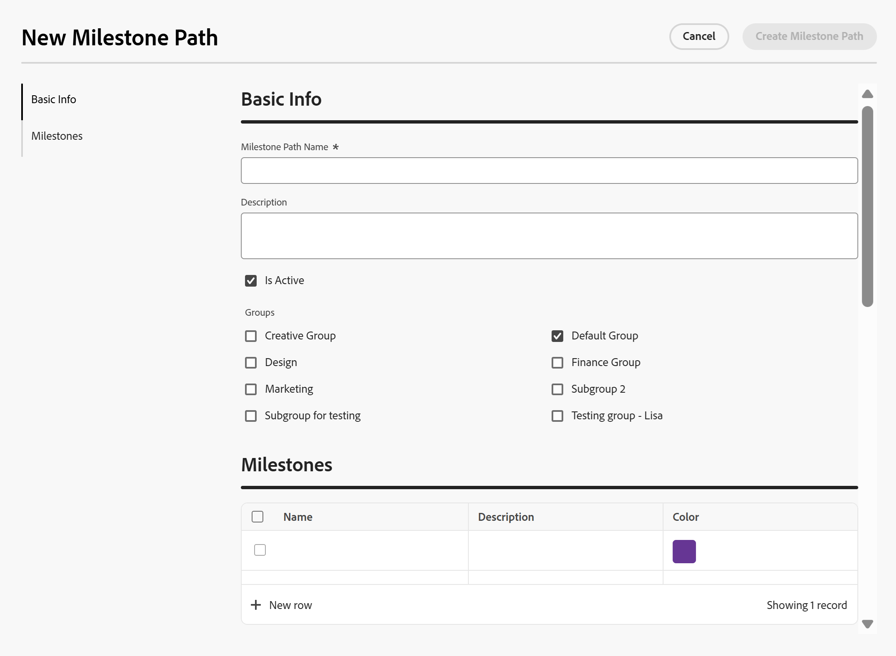
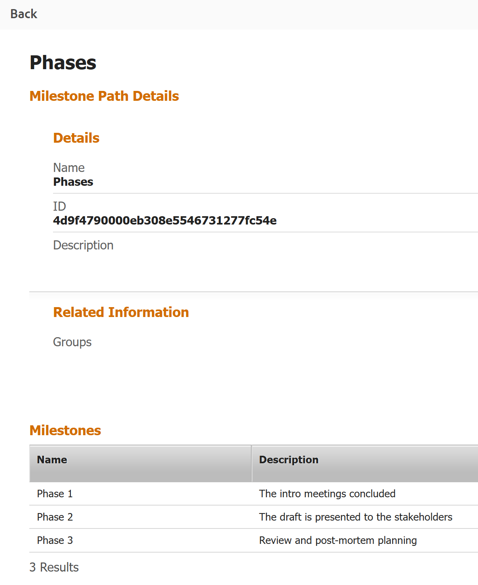

# Create a milestone path

<!--Audited: 07/2024-->

<!--
NOTE: DON'T DELETE, DRAFT OR HIDE THIS ARTICLE. IT IS LINKED TO THE PRODUCT, THROUGH THE CONTEXT SENSITIVE HELP LINKS.
-->

<!--The highlighted information on this page refers to functionality not yet generally available. It is available only in the Preview environment for all customers. After the monthly releases to Production, the same features are also available in the Production environment for customers who enabled fast releases.    

For information about fast releases, see [Enable or disable fast releases for your organization](/help/quicksilver/administration-and-setup/set-up-workfront/configure-system-defaults/enable-fast-release-process.md). -->

 

The highlighted information on this page refers to functionality not yet generally available. It is available only in the Preview environment for all customers. The same features will also be available in the Production environment for all customers starting with  a week from the Preview release.      

For more information, see [Interface modernization](/help/quicksilver/product-announcements/product-releases/interface-modernization/interface-modernization.md).  

 

As an Adobe Workfront administrator, you can create milestone paths which can then be applied to any project in the system. The changes you make to milestone paths in this area affect the entire Workfront system.

## Access requirements

+++ Expand to view access requirements for the functionality in this article.

You must have the following access to perform the steps in this article: 

<table style="table-layout:auto"> 
 <col> 
 <col> 
 <tbody> 
  <tr> 
   <td role="rowheader">Adobe Workfront plan</td> 
   <td>Any</td> 
  </tr> 
  <tr> 
   <td role="rowheader">Adobe Workfront license</td> 
   <td>
Standard

   
Plan

   </td> 
  </tr> 
  <tr> 
   <td role="rowheader">Access level configurations</td> 
   <td> 
You must be a Workfront administrator.
</td> 
  </tr> 
 </tbody> 
</table>

*For information, see [Access requirements in Workfront documentation](/help/quicksilver/administration-and-setup/add-users/access-levels-and-object-permissions/access-level-requirements-in-documentation.md). 

+++

## Milestones and milestone paths

You can associate the key tasks in a project with predefined milestones. This function can provide managers and other stakeholders with a high-level overview as to how a project is progressing.

The sum of all the predefined milestones is called a milestone path. 

The first step in building a milestone path is identifying what the milestone steps are and establishing the milestones. Because you can associate a milestone path to multiple projects, the milestone steps must be general phases or stages of any project.

For more information on how you can associate a milestone path with a project and a milestone with a task, see [Associate milestones with tasks](../../../manage-work/tasks/manage-tasks/associate-milestones-with-tasks.md).

## Create a milestone path

{{step-1-to-setup}}

1. Click **Processes** > **Milestone Paths**.
1. Click **New Milestone Path.**

   

   The New Milestone Path box opens. 
   
   
   
   

1. Click **Basic Info** in the left panel. 

   Update the following information: 

   <table style="table-layout:auto">
    <tr>
      <td>Milestone Path Name</td>
       <td>Enter a name for the milestone path.</td>
    </tr>
    <tr>
      <td>Description</td>
      <td>Enter a description to define the milestone path.</td>
    </tr>
    <tr>
       <td>Is Active</td>
      <td>Select this checkbox if you want the milestone path to be active. Other users can find this path and attach it to projects when creating or editing projects. Inactive milestone paths cannot be attached to projects. This is enabled by default.</td>
    </tr>
    <tr>
      <td>Groups</td>
      <td>Select the groups listed to allow users in these groups to see and apply this milestone path to their projects. The home group of the user entering the milestone path is selected by default.</td>
    </tr>
   </table>

1. Click **Milestones** in the left panel. 
1.In the Production environment, click **Add Milestone** to add milestones to the path. 
   In the Preview environment, click **New row** to add milestones to the path.
1. Update the following information: 

   <table style="table-layout:auto"> 
    <col> 
    <col> 
    <tbody> 
     <tr> 
      <td role="rowheader">Name</td> 
      <td>Type descriptive names for each milestone.</td> 
     </tr> 
     <tr> 
      <td role="rowheader">Description</td> 
      <td>Type a description for the milestone.</td> 
     </tr> 
     <tr> 
      <td role="rowheader">Color</td> 
      <td> 
Choose a color to associate with your milestone. 
 
If you do not choose a color, the system chooses the last color used in a milestone path. We recommend that you choose a unique color for each milestone. The color is used for visual and reporting purposes.
 </td> 
     </tr> 
    </tbody> 
   </table>

1. (Optional) Drag and drop each milestone to reorder them. 
1. Click **Create Milestone Path** to save your changes.

   Your milestone path is ready to be associated with a project.

   For more information on how to associate milestone paths to projects and milestones to tasks, see [Associate milestones with tasks](../../../manage-work/tasks/manage-tasks/associate-milestones-with-tasks.md).

1. (Optional) From the Milestone Paths list, select one milestone, then click the **Edit** icon  to open the milestone path and edit its information. 
1. (Optional) Click the **Export** icon , then select from the following formats to export the milestone path list to a file:

   * PDF
   * Excel
   * Excel (xlsx)
   * Tab Delimited

1. (Optional) Select one or several milestones in the milestone list, then click the **Delete** icon  to delete it. 
1. Click **Yes, Delete it**. 

   The milestone is deleted and cannot be recovered. The milestone path is removed from any project previously associated with it and all milestones are removed from the tasks associated with them. 
   
   Deleted milestones cannot be recovered.

## View milestone path details in a project report

You can view the details of a milestone path in a project report. 

You must associate a milestone path with a project before you can see its details in a project report. 

For information about associating milestone paths to projects, see [Edit projects](/help/quicksilver/manage-work/projects/manage-projects/edit-projects.md).

{{step1-to-reports}}

1. Click **New Report**, then click **Project**. 
1. Click **Add Column**. 
1. In the **Show in this column** area, start typing **Milestone Path**, then click **Milestone Path Name** when it displays. 
1. (Optional) Click **Filters** and add the following filter to the report: **Project Milestone Path ID Is Not Blank**. 

   The filter ensures that you only display projects that are associated with a milestone path in the report. 

1. Click **Save + Close**.
1. Add a name for your report, then click **Apply**. 

   The project report displays. The milestone paths associated with each project display in the last column of the report. 
1. Click the name of a milestone path in the report's last column. 

   The milestone path's details display.  

   

   The milestone path details page displays the following information:

   * Milestone path name, ID, and Description
   * Milestone path groups
   * Milestone names, descriptions, colors, and color icons

1. (Optional) Click **Back** to go back to the project report. 

