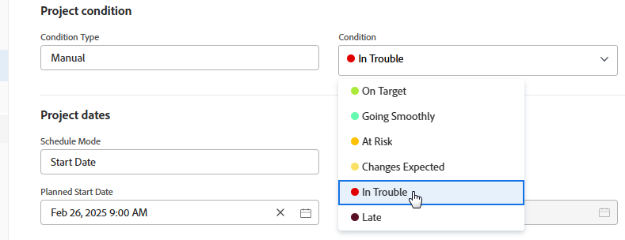

# Change the display order of conditions

You can change the order in which conditions display in projects, tasks and issues:

* When a user is editing a project

  

* When a user is changing the condition for a task or issue

  

  >[!NOTE]
  >
  >In the default Condition view, the **Condition** field is a type of field that can't be edited inline. When you add the **Condition** field separately to a view, it is editable. For information about inline editing, see [Inline edit items in a list in Adobe Workfront](/help/quicksilver/workfront-basics/navigate-workfront/use-lists/inline-edit-objects.md).

## Access requirements

+++ Expand to view access requirements for the functionality in this article.

You must have the following access to perform the steps in this article: 

<table style="table-layout:auto"> 
 <col> 
 <col> 
 <tbody> 
  <tr> 
   <td role="rowheader">Adobe Workfront plan</td> 
   <td>Any</td> 
  </tr> 
  <tr> 
  <tr> 
   <td role="rowheader">Adobe Workfront license</td> 
   <td>
New: Standard

       
Or

       
Current: Plan
</td>
  </tr> 
  </tr> 
  <tr> 
   <td role="rowheader">Access level configurations</td> 
   <td>[!UICONTROL System Administrator]</td>
  </tr> 
 </tbody> 
</table>

For more detail about the information in this table, see [Access requirements in Workfront documentation](/help/quicksilver/administration-and-setup/add-users/access-levels-and-object-permissions/access-level-requirements-in-documentation.md).

+++

## Change the display order of conditions

{{step-1-to-setup}}

1. Click **Project Preferences** > **Conditions**.  

1. Select the **Projects**, **Tasks**, or **Issues** tab.

1. Drag  the conditions to change their order.

   The new order saves automatically.

For more information about customizing conditions, see [Custom conditions](../../../administration-and-setup/customize-workfront/create-manage-custom-conditions/custom-conditions.md).
