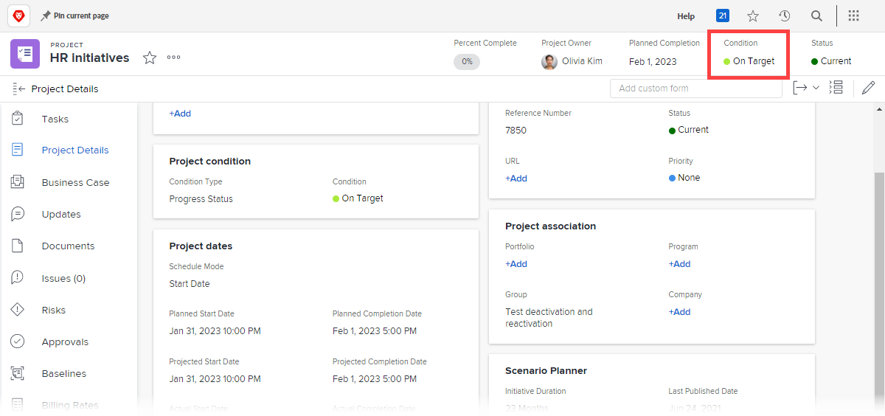

# Set a custom condition as the default for projects

If the Condition Type of a project is set to Progress Status instead of Manual, Adobe Workfront automatically displays one of three built-in default conditions on the project (On Target, At Risk, or In Trouble) as it progresses, as explained in [Overview of Project Condition and Condition Type](../../../manage-work/projects/manage-projects/project-condition-and-condition-type.md).

You can set your custom conditions as default conditions instead of using these three built-in default conditions. For example, you could change the On Target default condition to display as Tracking Well in all projects.

## Access requirements

+++ Expand to view access requirements for the functionality in this article.

You must have the following access to perform the steps in this article: 

<table style="table-layout:auto"> 
 <col> 
 <col> 
 <tbody> 
  <tr> 
   <td role="rowheader">Adobe Workfront plan</td> 
   <td>Any</td> 
  </tr> 
  <tr> 
  <tr> 
   <td role="rowheader">Adobe Workfront license</td> 
   <td>
New: Standard

       
Or

       
Current: Plan
</td>
  </tr> 
  </tr> 
  <tr> 
   <td role="rowheader">Access level configurations</td> 
   <td>[!UICONTROL System Administrator]</td>
  </tr> 
 </tbody> 
</table>

For more detail about the information in this table, see [Access requirements in Workfront documentation](/help/quicksilver/administration-and-setup/add-users/access-levels-and-object-permissions/access-level-requirements-in-documentation.md).

+++

## Set a custom condition as a default condition for all projects:

{{step-1-to-setup}}

1. Click **Project Preferences** > **Conditions**.  

1. Click the **Project** tab. 
1. Click **Set Default Conditions**.
1. In the drop-down menu next to the default condition you want to change, click the custom condition you want to use instead. 
1. Repeat the previous step for any other default condition you want to change.
1. Click **Save**.

For information about setting a custom condition as a default condition for tasks and issues, see [Set a custom condition as the default for tasks and issues](../../../administration-and-setup/customize-workfront/create-manage-custom-conditions/set-custom-condition-default-tasks-issues.md).

For information about setting up a project so that users can update it's condition manually, see [Update Condition for tasks and issues](../../../manage-work/projects/updating-work-in-a-project/update-condition-for-tasks-and-issues.md).

For information about custom conditions, see [Custom conditions](../../../administration-and-setup/customize-workfront/create-manage-custom-conditions/custom-conditions.md).
