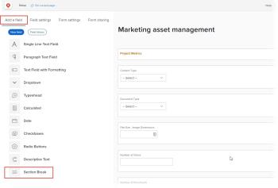

# Add a section break to a custom form

In a custom form, if you need to limit access to custom fields

<!--
 or image widgets
-->

for certain users, you can place them under a section break, and then grant only certain users access to the section.

For example, if you needed to retire some fields on a custom form that are no longer used, you could create a section for them called "Retired fields" at the bottom of the form, then allow only system administrators to access it. This is better than deleting the fields and losing all of the historical data that was entered into it; some of that data might still be needed for reports.

The access settings you select for a section break are directly tied to the permissions users have on the Workfront object where the custom form is attached. You can hide or show the fields in a section based on whether the user has access to view, contribute to, or manage that object. Or you can set a section to Admin Only so that only users with a system administrator access level can access it. For information about permissions on objects, see [Overview of sharing permissions on objects in Adobe Workfront](../../../workfront-basics/grant-and-request-access-to-objects/sharing-permissions-on-objects-overview.md).

Section breaks that you add to custom forms are saved in your system for re-use. For information about listing them, see [List and edit custom forms, fields, and section breaks](../../../administration-and-setup/customize-workfront/create-manage-custom-forms/list-edit-share-custom-forms-and-custom-fields.md).

## Access requirements

You must have the following to perform the steps in this article:

<table cellspacing="0"> 
 <col> 
 <col> 
 <tbody> 
  <tr data-mc-conditions=""> 
   <td role="rowheader"> 
Adobe Workfront plan*
 </td> 
   <td>Any</td> 
  </tr> 
  <tr> 
   <td role="rowheader">Adobe Workfront license*</td> 
   <td> 
Plan 
 </td> 
  </tr> 
  <tr data-mc-conditions=""> 
   <td role="rowheader">Access level configurations*</td> 
   <td> 
Administrative access to custom forms
 
For information about how Workfront administrators grants this access, see <a href="../../../administration-and-setup/add-users/configure-and-grant-access/grant-users-admin-access-certain-areas.md" class="MCXref xref">Grant users administrative access to certain areas</a>.
 </td> 
  </tr>  
 </tbody> 
</table>

&#42;To find out what plan, license type, or access level configurations you have, contact your Workfront administrator.

## Add a section break to a custom form

1. Begin creating or editing a custom form, as described in [Create or edit a custom form](../../../administration-and-setup/customize-workfront/create-manage-custom-forms/create-or-edit-a-custom-form.md).
1. Add custom fields

   <!--
   and widgets
   -->

   to the form, as described in [Add a custom field to a custom form](../../../administration-and-setup/customize-workfront/create-manage-custom-forms/add-a-custom-field-to-a-custom-form.md).

1. While still creating or editing the custom form, on the **Add a field** tab, click **Section Break**.

   <!--
   
RESHOOT THIS WHEN THEY ADD IMAGE WIDGET TO LIST OF FIELDS

   -->

   

1. On the **Field Settings** tab, configure the options that are available for the type of field you are adding:

   <table cellspacing="0"> 
    <col> 
    </col> 
    <col> 
    </col> 
    <tbody> 
     <tr> 
      <td role="rowheader">Label</td> 
      <td> 
(Required) Type a descriptive label for the section. It displays above the section when users view the field on a custom form added to an object.
 
You can change the label at any time.
 
Important: Avoid using special characters in this label. They don't display correctly in reports.
 </td> 
     </tr> 
     <tr> 
      <td role="rowheader">Description</td> 
      <td>Type text if you want to explain to users what the section is for. This displays below the section's label on the custom form.</td> 
     </tr> 
     <tr> 
      <td role="rowheader">Add Logic</td> 
      <td>Specify which fields should appear on the form, based on selections users make in existing fields. For more information, see <a href="../../../administration-and-setup/customize-workfront/create-manage-custom-forms/display-or-skip-logic-custom-form.md" class="MCXref xref">Display logic and skip logic on a custom form</a>.</td> 
     </tr> 
     <tr> 
      <td role="rowheader"> 
Additional settings<!--
          Grant access 
        -->
 </td> 
      <td> 
 Select the permissions that users need on an object where the custom form is attached in order to view this section and edit its field values. For information about permissions on objects, see <a href="../../../workfront-basics/grant-and-request-access-to-objects/sharing-permissions-on-objects-overview.md" class="MCXref xref">Overview of sharing permissions on objects in Adobe Workfront</a>.
 
       <ul> 
        <li> 

          <!--
           Use if production/ifpreview structure when stories release
          --><b>In order to VIEW this section, people must have permission to</b><!--
           Users with the following access to the object can view the section
          --> 
 
         <ul> 
          <li><strong>View</strong>: The user needs View permissions to the object in order to view the section.</li> 
          <li><b>Contribute
            <!--
             Limited Edit
            --></b>: (Available only if the object is a project, task, issue, or user) The user needs Contribute permissions to the object in order to view the section.</li> 
          <li><strong>Manage</strong><!--
            <b class="preview" data-mc-conditions="QuicksilverOrClassic.Quicksilver,QuicksilverOrClassic.Draft mode">Edit</b>
           -->: The user needs Manage permissions to the object to be able to view this section.</li> 
          <li> 
<strong>Admin only</strong>: Only Workfront administrators can see this section.
 
Note: Users without the permissions you specify here can't see the values of the fields<!--
              and image widgets 
            --> in the section. This is also true if you display the values in reports or use them in calculated fields in text mode reporting.
 </li> 
         </ul> </li> 
        <li> 

          <!--
           Use if production/ifpreview structure when stories release
          --><b>In order to EDIT this section, people must have permission to</b><!--
           Users with the following access to the object can edit field values in the section
          --> 
 
         <ul> 
          <li><b>Contribute
            <!--
             Limited Edit
            --></b>: (Available only if the object is a project, task, issue, or user) The user needs Contribute permissions to the object in order to edit field values in the section.</li> 
          <li><![CDATA[
       ]]><b><strong>Manage</strong>
            <!--
             <b class="preview" data-mc-conditions="QuicksilverOrClassic.Quicksilver,QuicksilverOrClassic.Draft mode">Edit</b>
            --></b>: The user needs Manage permissions to the object to be able to edit field values in this section. </li> 
          <li><b>Admin only</b>: Only Workfront administrators can edit field values in this section. </li> 
         </ul> </li> <!--
         
Associating multiple object types with your form can impact the viewing and editing permissions you configure for a section in the form. For more information, see <a href="#section" class="MCXref xref">How multiple object types can affect a form's section breaks</a> in this article.

        --> 
       </ul> </td> 
     </tr> 
    </tbody> 
   </table>

1. Drag at least one field

   <!--
   or image widget
   -->

   to the new section.

   This is required before you save the section.

1. Click **Done**.

   >[!TIP]
   >
   >You can click **Apply** at any point while you are creating a custom form to save your changes and keep the form open.

1. If you want to continue building your custom form in other ways, continue on to one of the following articles:

   * [Add a custom field to a custom form](../../../administration-and-setup/customize-workfront/create-manage-custom-forms/add-a-custom-field-to-a-custom-form.md#add2) 
   * [Reuse an existing custom field](../../../administration-and-setup/customize-workfront/create-manage-custom-forms/reuse-an-existing-field.md)

     <!--   
     <li data-mc-conditions="QuicksilverOrClassic.Draft mode,QuicksilverOrClassic.Quicksilver"><a href="../../../administration-and-setup/customize-workfront/create-manage-custom-forms/add-image-or-edit-its-properties-in-a-custom-form.md" class="MCXref xref">Add or edit an image widget in a custom form</a> </li>   
     -->   
   
   * [Add calculated data to a custom form](../../../administration-and-setup/customize-workfront/create-manage-custom-forms/add-calculated-data-to-custom-form.md) 
   * [Position fields and widgets in a custom form](../../../administration-and-setup/customize-workfront/create-manage-custom-forms/position-fields-in-a-custom-form.md) 
   * [Using an existing calculated custom field on a new custom form](../../../administration-and-setup/customize-workfront/create-manage-custom-forms/use-existing-calc-field-new-custom-form.md) 
   * [Display logic and skip logic on a custom form](../../../administration-and-setup/customize-workfront/create-manage-custom-forms/display-or-skip-logic-custom-form.md)

<!--

<h2>Limit access to custom fields<!--
 and image widgets
--> that are not placed under a section break</h2>

If you want to limit access for certain users on all fields<!--
 and image widgets
--> that are not placed under a section break, you can do so on the Form Settings tab. 

<ol>
<li value="1">Begin creating or editing a custom form, as described in <a href="../../../administration-and-setup/customize-workfront/create-manage-custom-forms/create-or-edit-a-custom-form.md" class="MCXref xref">Create or edit a custom form</a>.</li>
<li value="2">Add custom fields<!--
and widgets
--> to the form, as described in <a href="../../../administration-and-setup/customize-workfront/create-manage-custom-forms/add-a-custom-field-to-a-custom-form.md" class="MCXref xref">Add a custom field to a custom form</a>.</li>
<li value="3">While still creating or editing the custom form, open the <b>Form settings</b> tab.<!--
SHOW THIS WHEN THEY ADD SETTINGS
--></li>
<li value="4"> 
Under <b>Grant access</b>, select the permissions that users need on an object where the custom form is attached in order to view this section and edit its field values. 
 
If you need information about permissions on objects, see <a href="../../../workfront-basics/grant-and-request-access-to-objects/sharing-permissions-on-objects-overview.md" class="MCXref xref">Overview of sharing permissions on objects in Adobe Workfront</a>.

<table cellspacing="0">
<col>
<col>
<tbody>
<tr>
<td role="rowheader">Users with the following access to the object can view the section</td>
<td>
<ul>
<li><strong>View</strong>: Users need View permissions to the object in order to view the section.</li>
<li><b>Limited Edit</b>: (Available only if the object is a project, task, issue, or user) Users need needs Contribute permissions to the object in order to view the section.</li>
<li><b>Edit</b>: Users need Manage permissions to the object to be able to view this section.</li>
<li> 
<strong>Admin only</strong>: Only Workfront administrators can see this section.
 <note type="note">
Users without the permissions you specify here can't see the values of the fields
<!--
and image widgets
--> in the section. This is also true if you display the values in reports or use them in calculated fields in text mode reporting.
</note> </li>
</ul> </td>
</tr>
<tr>
<td role="rowheader">Users with the following access to the object can edit field values in the section</td>
<td>
<ul>
<li><b>Limited Edit</b>: (Available only if the object is a project, task, issue, or user) The user needs Contribute permissions to the object in order to edit field values in the section.</li>
<li><![CDATA[
]]><b>Edit</b>: The user needs Manage permissions to the object to be able to edit field values in this section. </li>
<li><b>Admin only</b>: Only Workfront administrators can edit field values in this section. </li>
</ul> </td>
</tr>
</tbody>
</table> <note type="note">
Associating multiple object types with your form can impact the viewing and editing permissions you configure for a section in the form. For more information, see
<a href="#section" class="MCXref xref">How multiple object types can affect a form's section breaks</a> in this article.
</note> </li>
<li value="5"> 
Click <strong>Done</strong>.
 <note type="tip">
You can click
<strong>Apply</strong> at any point while you are creating a custom form to save your changes and keep the form open.
</note> </li>
<li value="6"> 
If you want to continue building your custom form in other ways, continue on to one of the following articles:

<ul>
<li><a href="../../../administration-and-setup/customize-workfront/create-manage-custom-forms/add-a-custom-field-to-a-custom-form.md#add2" class="MCXref xref">Add a custom field to a custom form</a> </li>
<li><a href="../../../administration-and-setup/customize-workfront/create-manage-custom-forms/reuse-an-existing-field.md" class="MCXref xref">Reuse an existing custom field</a> </li> <!--
<li data-mc-conditions="QuicksilverOrClassic.Draft mode,QuicksilverOrClassic.Quicksilver"><a href="../../../administration-and-setup/customize-workfront/create-manage-custom-forms/add-image-or-edit-its-properties-in-a-custom-form.md" class="MCXref xref">Add or edit an image widget in a custom form</a> </li>
-->
<li><a href="../../../administration-and-setup/customize-workfront/create-manage-custom-forms/position-fields-in-a-custom-form.md" class="MCXref xref">Position fields and widgets in a custom form</a> </li>
<li><a href="../../../administration-and-setup/customize-workfront/create-manage-custom-forms/add-calculated-data-to-custom-form.md" class="MCXref xref">Add calculated data to a custom form</a> </li>
<li><a href="../../../administration-and-setup/customize-workfront/create-manage-custom-forms/use-existing-calc-field-new-custom-form.md" class="MCXref xref">Using an existing calculated custom field on a new custom form</a> </li>
<li><a href="../../../administration-and-setup/customize-workfront/create-manage-custom-forms/display-or-skip-logic-custom-form.md" class="MCXref xref">Display logic and skip logic on a custom form</a> </li>
</ul> </li>
</ol>

-->

<!--

<h2>How multiple object types can affect a form's section breaks</h2>

Some section break access settings are available only for certain object types. If you add an object type to a custom form that contains a section break, you might be prompted to switch to an access setting for the section break that is compatible with the new object type you are adding as well as the existing object types on the form. 

Example: </b>"> <b>Example: </b>

The Limited Edit permission option is available for the Project, Task, Issue, and User object types; but not for the Portfolio, Program, Document, Company, Billing Record, Iteration, Expense, and Group object types. 

Imagine a custom form associated with the Project object type, with Limited Edit selected for a section break in the form. 

If you were to add the Portfolio object type to the form, the Limited Edit permission option would no longer be available for the section break in the form. 

An on-screen message would prompt you to choose the Edit option instead, because it is the most similar option to Limited Edit and it is compatible with both the Project object type and the Portfolio object type. 

-->

