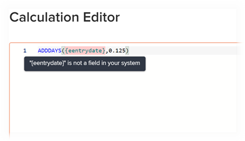

# Add calculated data to a custom form with the legacy form builder

<!--Audited: 01/2024-->

{{form-designer-default}}

In a custom form, you can add a calculated custom field that uses existing data to generate new data when the custom form is attached to an object. 

To do this, you create a statement that uses data expressions and the names of existing fields, which can be custom fields, calculated custom data fields, and built-in Adobe Workfront fields. 

This statement calculates the data you enter and displays the result in the new calculated custom field.

A calculated custom field can contain:

* A simple reference to a single built-in field.

  >[!INFO]
  >
  > **Example:** To calculate the revenue generated by projects and tasks, you could create a calculated custom field  that contains the built-in  field Actual Revenue. When someone attaches the custom form to a project or task, the revenue for the project or task displays in the field.

* An expression that references one or more fields. These can be custom fields, other calculated custom fields, and built-in  fields.

  >[!INFO]
  >
  >**Example:** To calculate the profit generated by projects and tasks, you could create a calculated custom field called Profit containing a mathematical expression that subtracts cost from revenue.
  >
  >To do this, you could use the mathematical expression SUB (subtract) with the built-in Workfront fields Actual Cost and Actual Revenue.
  >
  >In the steps below, you can see how this example can be carried out.

For information about creating custom forms for your organization and understanding the type of fields you can associate with them, see [Create or edit a custom form](../../../administration-and-setup/customize-workfront/create-manage-custom-forms/create-or-edit-a-custom-form.md).

## Access requirements

+++ Expand to view access requirements for the functionality in this article.

You must have the following to perform the steps in this article:

<table style="table-layout:auto"> 
 <col> 
 <col> 
 <tbody> 
  <tr data-mc-conditions=""> 
   <td role="rowheader"> 
Adobe Workfront plan
 </td> 
   <td>Any</td> 
  </tr> 
  <tr> 
   <td role="rowheader">Adobe Workfront license*</td> 
   <td>
Current: Plan

   Or
   
New: Standard

   </td> 
  </tr> 
  <tr> 
   <td role="rowheader">
Access level configuration
</td> 
   <td> 
Administrative access to custom forms
 
 </td> 
  </tr>  
 </tbody> 
</table>

*To find out what plan, license type, or access level configurations you have, contact your Workfront administrator. For more information about access requirements, see [Access requirements in Workfront documentation](/help/quicksilver/administration-and-setup/add-users/access-levels-and-object-permissions/access-level-requirements-in-documentation.md). 

+++

## Add a calculated field to a custom form {#add-a-calculated-field-to-a-custom-form}

You can use both built-in Workfront fields and custom fields that you already created in the expression of a calculated custom field.

>[!IMPORTANT]
>
>Before you create a calculated custom field, identify the existing fields that you want to include so that you are sure that the data necessary for the calculation is present in Workfront.

1. Begin creating or editing a custom form, as described in [Create or edit a custom form](../../../administration-and-setup/customize-workfront/create-manage-custom-forms/create-or-edit-a-custom-form.md).  

1. On the **Add a Field** tab, click **Calculated**.

   In the display area on the right, the field displays a fill-in value of 12345. This is an indicator to remind you that the field is a calculated custom field while you are creating or editing the custom form. When the form is attached to an object and users are filling it out, they see the result of the calculation in the field, and not the 12345 value.

1. Specify the following information for the calculated field:

   <table style="table-layout:auto"> 
    <col> 
    </col> 
    <col> 
    </col> 
    <tbody> 
     <tr> 
      <td role="rowheader">Label</td> 
      <td>Type a label for the field. This is what users see when they use the custom form. The field <b>Name</b>, which fills in automatically and matches the Label, is referenced by Workfront in reports. This is a required field.</td> 
     </tr> 

   <tr> 
   <td role="rowheader">Name</td> 
   <td>By default, the Name of a field is the same as the Label. However, you can modify the Name of a field to be different than the Label of a field. The field <b>Name</b> is referenced by Workfront in reports. This is a required field.</td> 
   </tr> 

   <tr> 
     <td role="rowheader" id="instructions">Instructions</td> 
      <td> 
Add text to provide additional information about the field and the formula in it.

      
You can also paste here the formula used in the calculation of the custom field. In this case, we recommend that you first update the Calculation of the custom field, and then copy the final expression from the Calculation field and paste it in the Instructions field. 

       
      
   This can be useful in the following ways: 
      <ul> 
      <li> 
As a reminder of what the formula is and how it works. This is especially helpful if you plan to use this calculated custom field on multiple forms.
 </li> 
       <li> 
As a tooltip users can see when they hover over the field. You can add any text here that you want them to see in the tooltip.
 </li> 
       </ul>
       
If you don't want users to see the formula in the tooltip, which might be confusing for them, do not add it to the Instructions field. Instead, use the "Display formula in instructions" setting to display or hide the formula, as it is further described in this article <a href="#build-the-calculation-for-your-calculated-custom-field">Build the calculation for your calculated custom field</a> in this article.
 
       
      
For information about using the same calculated custom field on a new form, see <a href="../../../administration-and-setup/customize-workfront/create-manage-custom-forms/use-existing-calc-field-new-custom-form.md#using-an-existing-calculated-custom-field-on-a-new-form" class="MCXref xref">Reuse an existing calculated custom field in a custom form</a>.
 
       
      </td> 
     </tr> 
     <tr> 
      <td role="rowheader">Format</td> 
      <td> 
The format in which you want the results of the field to be stored and displayed.
 
If you plan to use the field in mathematical calculations, always use a <strong>Number</strong> or a <strong>Currency</strong> format. When you select Number or Currency, the system automatically truncates numbers that start with 0.
 
      
<b>IMPORTANT</b>: 
Before you choose a format, consider the correct format for the new field. The format field cannot be edited after the custom form is saved. And selecting the wrong format could impact future calculations and aggregate values in report and list groupings.

      
<strong>NOTE:</strong> Calculated fields with a Currency format should not include quotation marks. (For example, use 800.00 and not "800.00.") Using quotation marks can cause unexpected consequences due to nuances with language formatting for currency types.
</td> 
     </tr> 
    </tbody> 
   </table>

1. Continue to update the custom field information, as described in the section [Build the calculation for your calculated custom field](#build-the-calculation-for-your-calculated-custom-field) in this article.

## Build the calculation for your calculated custom field {#build-the-calculation-for-your-calculated-custom-field}

1. Start creating the calculated custom field, as described in the section [Add a calculated field to a custom form](#add-a-calculated-field-to-a-custom-form) in this article.

1. Click **Maximize** to open the **Calculation Editor** and build your calculation.

   >[!INFO]
   >
   >**Example:** Using the example in the introduction to this article, you could create a calculated custom field called Profit in a custom form for projects and tasks. This field could contain a calculation that displays the difference between Actual Revenue and Actual Cost:
   >
   >`SUB({actualRevenue},{actualCost})`
   >
   >In this example, `SUB` is the expression, and the referenced fields are `actualRevenue` and `actualCost`.

   A calculation usually starts with an expression, followed by parentheses containing the fields you want to reference when the custom form is attached to an object. For information about the expressions that are available, see [Overview of calculated data expressions](../../../reports-and-dashboards/reports/calc-cstm-data-reports/calculated-data-expressions.md).

   Each field must be surrounded by curly brackets, as explained in the section [Syntax required in calculated custom fields](#syntax-required-in-calculated-custom-fields) in this article. When you start typing the name of a field, the system makes suggestions and you can select one to insert it into your calculation.

   >[!NOTE]
   >
   >   You cannot reference fields of the following types in a calculation: 
   >   
   >   * Text Field with Formatting
   >   * Descriptive Text. 
   >   
   >   For information about the custom field types, see [Add a custom field to a custom form](../../../administration-and-setup/customize-workfront/create-manage-custom-forms/add-a-custom-field-to-a-custom-form.md).

1. Click in the large text box in the Calculation Editor box, then click either search or expand and click an option from the **Expressions** and **Fields** sections to the right of the text box. This adds them to the calculation. 

   You can also start typing an expression or field in the large text box, then select it when it displays. Each item displays with an "F" for field or an "E" for expression.

   If you type an opening parenthesis, the closing parenthesis is added automatically.

   >[!TIP]
   >
   >You can do any of the following to get help with your calculation:
   > 
   >* Hover over an expression in your calculation to see a description, an example showing how it can be used, and a "Learn More" link to more information in the article [Overview of calculated data expressions](../../../reports-and-dashboards/reports/calc-cstm-data-reports/calculated-data-expressions.md).
   >  
   >* Use the color coding to identify the components you have added. Expressions display in blue and fields display in green.
   >  
   >* Find calculation errors, highlighted in pink, as you go. You can hover over a highlighted error to display a brief description of its cause.
   >   
   >* In the **Preview on an existing object** area below your calculation, start typing the name of a Workfront object, select it when it displays in the list. This gives you a preview of what the field will look like when the form is attached to the object.
   ><!--or by providing test values (NOT READY YET; CHANGE THIS SCREENSHOT WHEN IT IS)-->
   >  
   >* Reference expressions in a long calculation using the line numbers that display on the left.

1. Click **Minimize** when you are finished creating the calculation for the calculated custom field.

    >[!NOTE] 
    >
    >In the display area on the right, the field displays a fill-in value of 12345. This is an indicator to remind you that the field is a calculated custom field while you are creating or editing the custom form. When the form is attached to an object and users are filling it out, they see the result of the calculation in the field, and not the 12345 value.

1. (Optional) Use any of the following options to further configure your calculated custom field:

   <table style="table-layout:auto"> 
    <col> 
    <col> 
    <tbody> 
     <tr> 
      <td role="rowheader">Add Logic</td> 
      <td>You can add Display Logic to determine whether the calculated field displays, based on at least one choice that a user makes in a preceding multiple choice field (Dropdown, Checkboxes, or Radio Buttons) when filling out the form. For more information, see <a href="../../../administration-and-setup/customize-workfront/create-manage-custom-forms/display-or-skip-logic-custom-form.md" class="MCXref xref">Add display logic and skip logic to a custom form</a>. 
This is available only when at least one checkbox, radio button, or a drop-down field precedes the calculated custom field on the form. 
 
Skip Logic is unavailable for calculated custom fields.
 </td> 
     </tr> 
     <tr> 
      <td role="rowheader">Update previous calculations</td> 
      <td>When you are editing an existing calculated custom field, you can select this option to trigger an update in the calculation when you save the custom form. This happens only once when you save the custom form. The option returns to its disabled state after you do so.</td> 
     </tr> 
     <tr> 
      <td role="rowheader">Display formula in instructions</td> 
      <td>Leave this option enabled if you want the users who fill out the custom form to see the field's formula when they hover over the field. For more information, see the information about <a href="#instructions" class="MCXref xref">Instructions</a> earlier in this table.</td> 
     </tr> 
    </tbody> 
   </table>

1. Click **Done** when all changes are complete on the calculated custom field.
   
   Or, click **Apply** to apply your changes to the form so far if you want to continue adding custom fields to the form.
   
   Or, click **Save + Close** when all changes are complete on the custom form.
1. To verify that your calculated custom field works correctly, attach the custom form to an object, then review the result in the calculated custom field.

   For instructions on attaching a custom form, see [Add a custom form to an object](../../../workfront-basics/work-with-custom-forms/add-a-custom-form-to-an-object.md).
   
   If you want to continue building your custom form in other ways, you can continue on to one of the following articles:

   * [Add a custom field to a custom form](../../../administration-and-setup/customize-workfront/create-manage-custom-forms/add-a-custom-field-to-a-custom-form.md) 
   * [Position custom fields and widgets in a custom form](../../../administration-and-setup/customize-workfront/create-manage-custom-forms/position-fields-in-a-custom-form.md) 
   * [Add or edit an asset widget in a custom form](../../../administration-and-setup/customize-workfront/create-manage-custom-forms/add-widget-or-edit-its-properties-in-a-custom-form.md) 
   * [Reuse an existing calculated custom field in a custom form](../../../administration-and-setup/customize-workfront/create-manage-custom-forms/use-existing-calc-field-new-custom-form.md) 
   * [Add display logic and skip logic to a custom form](../../../administration-and-setup/customize-workfront/create-manage-custom-forms/display-or-skip-logic-custom-form.md) 
   * [Preview and complete a custom form](../../../administration-and-setup/customize-workfront/create-manage-custom-forms/preview-and-complete-a-custom-form.md)

## Syntax required in calculated custom fields
  
Each field used in a custom calculated field must use the syntax explained below, with curly brackets around each field name. When you start typing the name of a field, the system makes suggestions and you can select one  to insert it into your calculation. If you enter data in a calculation incorrectly, a warning messages alerts you. You cannot save the form unless you edit your calculation to contain valid fields and a valid calculated expression.

>[!NOTE]
>
>Currently, the system makes suggestions only when you start typing the name of a field you want to reference on an object that the custom form will be attached to, not on the object's parent.

### Surround field names with curly brackets

* If you want the calculation to reference a built-in field, the name of the field must be surrounded by curly brackets and it must be formatted as it appears in the Workfront database. You cannot use the name of the fields as they display in the Workfront interface. 

For example: `{actualRevenue}`

Field names are case-sensitive and must appear in camel case format, as they appear in the Workfront system.

* If you want the calculation to reference a custom field, the name of the field must be surrounded by curly brackets, and preceded by `DE:` within the brackets. Custom fields are case sensitive and must be formatted as they appear in the Workfront interface. 

For example: `{DE:Profit}`

The system lists all of the custom fields you can choose from when you type `DE:`.  

* If you want the calculation to reference a field that will pull data from  the parent object when the custom form is attached to an object, you must precede the field name with the object type of the parent object, also in curly brackets.

  For example, if the custom form is configured to work with tasks, and you want the field to calculate the actual revenue of the parent object when the form is attached to a task, you need to indicate `project` as the object type of the field: 
  
  `{project}.{actualRevenue}`
  
  Or, if it's a custom field: 
  
  `{project}.{DE:profit}`

  If you're not sure what the object type of the parent object will be because the custom form is configured for multiple object types, you can use the wildcard filter variable `$$OBJCODE` to allow the calculation to work for each of the possible types. For more information, see [Calculated custom fields in multi-object custom forms](#calculated-custom-fields-in-multi-object-custom-forms) in this article.

### Separate items with periods

When you reference a related object in a calculated custom field, you must separate object names and attributes with periods.

For example, in a task-type custom form, to display the name of the Portfolio Owner in a calculated custom field, you would type the following: 

`{project}.{porfolio}.{owner}`

This system retrieves the information in the following steps (in this order):

1. From the object of the custom form (a task), then
1. Access the parent of the task, or another related object (project), then
1. Access the parent, or another related object of the project (a portfolio), and then
1. Access the next related object to the portfolio (the portfolio's owner).

### Name syntax for referencing a custom field

When you reference another custom field in a calculated custom field, you need to enter the name of the field as it displays in the Workfront interface.

For example, to reference the selected option in a custom field labeled Executive sponsor, you would type the following:

`{DE:Executive sponsor}`

>[!NOTE]
>
>The syntax for a Typeahead field is different than it is for other types of fields because you need to add `:name` at the end.
>
>For example, to reference the selected option in a custom typeahead field named "Executive sponsor," you would type:
>
>`{DE:Executive sponsor:name}`

## Calculated custom fields in multi-object custom forms {#calculated-custom-fields-in-multi-object-custom-forms}

In a multi-object custom form, the selected object types must be compatible with all fields referenced in the form's calculated custom fields.

>[!INFO]
>
>**Example:**
>
>In a custom form configured to work with the Task object type, you create a calculated custom field named In Charge. You configure it to reference the built-in field so that it can show the name of the primary assignee in charge whenever the form is attached to a task:
>
>`{assignedTo}.{name}`
>
>Later, you add the Project object type to the custom form, but the Project object type is incompatible with the calculated custom field.

When this occurs, you can do one of the following:

* Remove one of the two incompatible items from the custom form — either the object type or the referenced calculated custom field.
* Keep both items and use the wildcard filter variable `$$OBJCODE` as a condition in an IF expression to create two different versions of the In Charge field. This allows the field to function successfully, no matter which type of object the form is attached to. 

>[!INFO]
>
>**Example:** Though there is no Assigned To: Name field in projects, there is a built-in Owner field (which fills in automatically with the name of the person who created the project, unless someone manually changes this).
>
>So, in your custom In Charge field, you could use `$$OBJCODE` as shown below to reference the Owner field when the custom form is attached to a project, and the Assigned To: Name field when the form is attached to a task:
>
>`IF($$OBJCODE="PROJ",{owner}.{name},{assignedTo}.{name})`

For more information about variables like `$$OBJCODE,` see [Wildcard filter variables overview](../../../reports-and-dashboards/reports/reporting-elements/understand-wildcard-filter-variables.md).

## Automatic updates of calculated custom fields

Calculated custom fields on an object recalculate automatically when the following things happen:

* Something on the object changes, such as a daily timeline calculation.
* Someone edits another field that is referenced by a calculated custom field on the object.
* The calculated expression is empty and the field contains a value—this sets the value to null.

   >[!NOTE]
   >
   >In a custom form attached to an object, date and time statements in calculated custom fields are calculated and saved according to the Coordinated Universal Time (UTC), not according to the time zone configurations set for your organization's instance and your user profile. However, calculations in a custom form are displayed based on each user's individual time zone.
