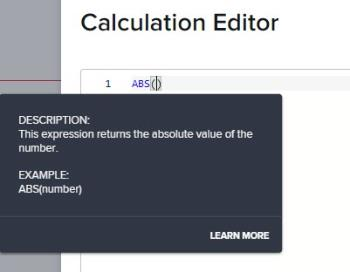
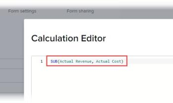
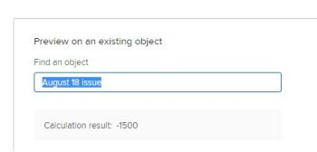

# Add calculated data to a custom form

In a custom form, you can build a calculated custom field that generates calculations. To do this, you create a statement that uses data expressions and the names of existing fields, which can be custom fields, calculated custom data fields, and built-in Workfront fields. This statement calculates the data you enter and displays the result in the new calculated custom field. 

``` ```**Example: **`````` To calculate the profit generated by projects and tasks, you could create a calculated custom field called Profit containing a mathematical expression that subtracts cost from revenue.

To do this, you could use the mathematical expression “SUB” (subtract) with the built-in Workfront fields Actual Cost and Actual Revenue.

In the steps below, you can see how this example can be carried out.
For information about creating custom forms for your organization and understanding the type of fields you can associate with them, see [Create or edit a custom form](../../../administration-and-setup/customize-workfront/create-manage-custom-forms/create-or-edit-a-custom-form.md).

## Access requirements

You must have the following to perform the steps in this article:

<table cellspacing="0"> 
 <col> 
 <col> 
 <tbody> 
  <tr data-mc-conditions=""> 
   <td role="rowheader"> <p>Adobe Workfront plan*</p> </td> 
   <td>Any</td> 
  </tr> 
  <tr> 
   <td role="rowheader">Adobe Workfront license*</td> 
   <td> <p>Plan </p> </td> 
  </tr> 
  <tr data-mc-conditions=""> 
   <td role="rowheader">Access level configurations*</td> 
   <td> <p>Administrative access to custom forms</p> <p>For information about how Workfront administrators grants this access, see <a href="../../../administration-and-setup/add-users/configure-and-grant-access/grant-users-admin-access-certain-areas.md" class="MCXref xref">Grant users administrative access to certain areas</a>.</p> </td> 
  </tr>  
 </tbody> 
</table>

&#42;To find out what plan, license type, or access level configurations you have, contact your Workfront administrator.

## Add a calculated field to a custom form {#add-a-calculated-field-to-a-custom-form}

>[!IMPORTANT]
>
>Before you create a new calculated custom field, identify the existing fields that you want to include in the statement so that you are sure that the data necessary for the calculation is present in Workfront.

1. Begin creating or editing a custom form, as described in [Create or edit a custom form](../../../administration-and-setup/customize-workfront/create-manage-custom-forms/create-or-edit-a-custom-form.md).  

1. On the **Add a Field** tab, click **Calculated**.

1. Specify the following information for the calculated field:

   <table cellspacing="0"> 
    <col> 
    </col> 
    <col> 
    </col> 
    <tbody> 
     <tr> 
      <td role="rowheader">Label</td> 
      <td>Type a label for the field. This is what users will see when they use the custom form. The field <b>Name</b>, which fills in automatically, is referenced by Workfront in reports.</td> 
     </tr> 
     <tr> 
      <td role="rowheader" id="instructions"><a name="Instructions"></a>Instructions</td> 
      <td> <p>By default, the formula you create for the field is stored here. You can add text to provide additional information about the field and the formula in it. This can be useful in 2 ways:</p> 
       <ul> 
        <li> <p>You can use it as a reminder of what the formula is and how it works. This can be especially helpful if you plan to use this calculated custom field on multiple forms.</p> </li> 
        <li> <p>When users fill out the custom form, they can hover over the field to display the text stored here in a tooltip. You add any text here that you want them to see in the tooltip.</p> <p>Tip: If you don't want them to see the formula in the tooltip, which might be confusing for them, you can hide it. For instructions, see the table row "Display formula in instructions" in the section <a href="#build-the-calculation-for-your-calculated-custom-field" class="MCXref xref">Build the calculation for your calculated custom field</a> in this article."</p> </li> 
       </ul> <p>For information about using the same calculated custom field on a new form, see <a href="../../../administration-and-setup/customize-workfront/create-manage-custom-forms/use-existing-calc-field-new-custom-form.md#using-an-existing-calculated-custom-field-on-a-new-form" class="MCXref xref">Reuse an existing calculated custom field in a custom form</a>.</p> </td> 
     </tr> 
     <tr> 
      <td role="rowheader">Format</td> 
      <td> <p>The format in which you want the results of the field are stored and displayed.</p> <p>If the field will be used in mathematical calculations, always use a <strong>Number</strong> or a <strong>Currency</strong> format. When you select Number or Currency, the system automatically truncates numbers that start with 0.</p> <p>Important: Before you choose a format, consider the correct format for the new field. The format field cannot be edited after the custom form is saved. And selecting the wrong format could impact future calculations and aggregate values in report and list groupings.</p> </td> 
     </tr> 
    </tbody> 
   </table>

1. Continue on to [Build the calculation for your calculated custom field](#build-the-calculation-for-your-calculated-custom-field) in this article.

## Build the calculation for your calculated custom field {#build-the-calculation-for-your-calculated-custom-field}

1. Start creating the calculated custom field, as explained in the section [Add a calculated field to a custom form](#add-a-calculated-field-to-a-custom-form) in this article.
1. Click **Maximize** to open the **Calculation Editor** and build your calculation.

   ``` ```**Example: **`````` Using the example in the introduction to this article, you could create a calculated custom field called Profit in a custom form for projects and tasks. This field could contain a calculation that displays the difference between Actual Revenue and Actual Cost:

   ```
   SUB({actualRevenue},{actualCost})
   ```

   In this example, 

   ```
   SUB
   ```

   is the expression, and the referenced fields are 

   ```
   Actual Revenue
   ```

   and 

   ```
   Actual Cost
   ```

   .
   A calculation starts with an expression, followed by parentheses containing the fields you want to reference. For information about the expressions that are available, see [Calculated data expressions](../../../reports-and-dashboards/reports/calc-cstm-data-reports/calculated-data-expressions.md).

   Each field must be surrounded by curly brackets and use the following syntax. As you type, the system makes suggestions and prompts you to enter the information with the correct syntax.

   * 
   
     ```   
     {fieldName}
     ```   
   
     for a built-in field available on the object.

     For example:    
   
     ```   
     {actualRevenue}
     ```

   * 
   
     ```   
     {DE:custom field name}
     ```   
   
     for a custom field available on the object.

     For example:    
   
     ```   
     {DE:profit}
     ```

   * 
   
     ```   
     {parent object}.{fieldName}
     ```   
   
     for a built-in field available on the parent object.

     For example:    
   
     ```   
     {project}.{actualRevenue}
     ```

   * 
   
     ```   
     {parent object}.{DE:custom field name}
     ```   
   
     for a custom field on the parent object.

     For example:    
   
     ```   
     {project}.{DE:profit}
     ```

   >[!IMPORTANT]
   >
   >In a multi-object custom form, the fields referenced in calculated custom fields need to be compatible with all of the form's object types. For more information, see [Calculated custom fields in multi-object custom forms](#calculated-custom-fields-in-multi-object-custom-forms) in this article.

   To create your calculation, click in the large text box, then do the following:

   * Under **Formula**, click **Expressions** and **Fields** that are available to add them to your calculation.

     You can also start typing an expression or field in the large text box, then select it when it displays. Each item displays with an "F" for field or an "E" for expression.

     If you type an opening parenthesis, the closing parenthesis is added automatically.
   
   * Hover over an expression ```in your calculation to see a description, an example showing how it can be used, and a "Learn More" link to more information in the article [Calculated data expressions](../../../reports-and-dashboards/reports/calc-cstm-data-reports/calculated-data-expressions.md).```

     

   * Use the color coding to identify the components you have added.

     Expressions display in blue and fields display in green:

     

     <!--   
     <li data-mc-conditions="QuicksilverOrClassic.Draft mode"> <p>Find out immediately what is causing errors in your calculations. Errors are highlighted in red. Hovering over an error displays a brief description of its cause.</p> <!--   
     <p style="color: #ff1493;" data-mc-conditions="QuicksilverOrClassic.Draft mode">This feature isn't finished yet. Add screen shot when this is ready, probably 22.3</p>   
     --> </li>   
     -->   
   
   * Reference expressions in a long calculation using the line numbers that display on the left.
   * In the area below your calculation, preview the results on an existing Workfront object   
   
     <!--   
     <MadCap:conditionalText data-mc-conditions="QuicksilverOrClassic.Draft mode">   
     or by providing test values:   
     </MadCap:conditionalText>   
     -->

     <!--   
     <p style="color: #ff1493;" data-mc-conditions="QuicksilverOrClassic.Draft mode">The test values feature isn't finished yet. Change screen shot when it's ready</p>   
     -->   
   
     

1. Click **Minimize** when you are finished creating the calculation for the calculated custom field.
1. (Optional) Use any of the following options to further configure your calculated custom field:

   <table cellspacing="0"> 
    <col> 
    <col> 
    <tbody> 
     <tr> 
      <td role="rowheader">Add Logic</td> 
      <td> <p>You can add Display Logic to determine whether the calculated field displays, based on at least one choice that a user makes in a preceding multiple choice field (Dropdown, Checkboxes, or Radio Buttons) when filling out the form. For more information, see <a href="../../../administration-and-setup/customize-workfront/create-manage-custom-forms/display-or-skip-logic-custom-form.md" class="MCXref xref">Add display logic and skip logic to a custom form</a>.</p> <p>This is available only when at least one checkbox, radio button, or a drop-down field precedes the calculated custom field on the form. </p> <p>Skip Logic is unavailable for calculated custom fields.</p> </td> 
     </tr> 
     <tr> 
      <td role="rowheader">Update previous calculations</td> 
      <td>When you are editing an existing calculated custom field, you can select this option to trigger an update in the calculation when you save the custom form. This happens only once when you save the custom form. The option returns to its disabled state after you do so.</td> 
     </tr> 
     <tr data-mc-conditions="QuicksilverOrClassic.Quicksilver"> 
      <td role="rowheader"><a name="Display_formula_in_instructions"></a>Display formula in instructions</td> 
      <td>Leave this option enabled if you want the users who fill out the custom form to see the field's formula when they hover over the field. For more information, see the information about <a href="#instructions" class="MCXref xref">Instructions</a> earlier in this table.</td> 
     </tr> 
    </tbody> 
   </table>

1. Click **Done** when all changes are complete on the calculated custom field.
1. (Optional) Click **Apply** to apply your changes to the form so far if you want to continue adding custom fields to the form.
1. Click **Save + Close** when all changes are complete on the custom form.
1. To verify that your calculated custom field works correctly, attach the custom form to an object, then review the result in the calculated custom field.

   For instructions on attaching a custom form, see [Add a custom form to an object](../../../workfront-basics/work-with-custom-forms/add-a-custom-form-to-an-object.md).

1. If you want to continue building your custom form in other ways, continue on to one of the following articles:

   * [Add a custom field to a custom form](../../../administration-and-setup/customize-workfront/create-manage-custom-forms/add-a-custom-field-to-a-custom-form.md) 
   * [Position custom fields and widgets in a custom form](../../../administration-and-setup/customize-workfront/create-manage-custom-forms/position-fields-in-a-custom-form.md) 
   * [Add or edit an asset widget in a custom form](../../../administration-and-setup/customize-workfront/create-manage-custom-forms/add-widget-or-edit-its-properties-in-a-custom-form.md) 
   * [Reuse an existing calculated custom field in a custom form](../../../administration-and-setup/customize-workfront/create-manage-custom-forms/use-existing-calc-field-new-custom-form.md) 
   * [Add display logic and skip logic to a custom form](../../../administration-and-setup/customize-workfront/create-manage-custom-forms/display-or-skip-logic-custom-form.md) 
   * [Preview and complete a custom form](../../../administration-and-setup/customize-workfront/create-manage-custom-forms/preview-and-complete-a-custom-form.md)

## Considerations for building calculated custom fields

Consider the following when building a calculated custom field in a custom form, particularly if you are typing information instead of selecting it:

* Field names are case-sensitive and must appear in the calculation exactly how they appear in the Workfront system.
* You can use both built-in Workfront fields and custom fields that you already created.
* You can refer to objects that are related to other objects in a calculation. For information about how objects connect to one another, see the section [Interdependency and hierarchy of objects](../../../workfront-basics/navigate-workfront/workfront-navigation/understand-objects.md#understanding-interdependency-and-hierarchy-of-objects) in the article [Understand objects in Adobe Workfront](../../../workfront-basics/navigate-workfront/workfront-navigation/understand-objects.md).
* When you reference a related object in a calculated custom field, you must separate the object names and attributes with periodsyou must type each object name and attribute in curly brackets and separate them with periods.

  For example, in a task-type custom form, to display the name of the Portfolio Owner in a calculated custom field, you would type 

  ```
  Project.Portfolio.Owner
  ```

  ```
  {project}.{porfolio}.{owner}
  ```

  This would determine the following: From the object of the custom form (a task), you can access the next object related to the task (a project). From there, you can access the next related object to the project (a portfolio), then the next related object to the portfolio (the owner). 

* When you reference another custom field in a calculated custom field, you need to enter the name of the field appears as it displays in the Workfront user interface.

  For example, to reference the selected option in a custom field labeled Executive sponsor, you would enter the following

  ```
  {DE:Executive sponsor}
  ```

  <!--
  <span class="preview" style="color: #ff1493;" data-mc-conditions="QuicksilverOrClassic.Draft mode">Is this right? Is there a more helpful/obvious example I could use?</span>
  -->

  >[!NOTE]
  >
  >If you manually enter the name of a custom field by the same name as a Workfront native field, you must precede it in the calculation by "DE:" and surround it by curly brackets to indicate that you are referencing another custom field. ``````  >
  >
  ><!--  >
  ><MadCap:conditionalText style="color: #ff1493;" data-mc-conditions="QuicksilverOrClassic.Draft mode">  >
  >I don't understand "by the same name as a WF&nbsp;native field" in this sentence  >
  ></MadCap:conditionalText>  >
  >-->  >
  >

  >
  >
  >For example, a calculated field containing the calculation below would display the data in a custom field named "Additional description" in all caps: 
  >
  >
  >
  >
  >```  >
  >UPPER({DE:Additional description)}
  >```  >
  >

* If you enter data in a calculation incorrectly, a warning messages alerts you. You cannot save the form unless you edit your calculation to contain valid fields and a valid calculated expression.

## Calculated custom fields in multi-object custom forms {#calculated-custom-fields-in-multi-object-custom-forms}

In a multi-object custom form, the selected object types must be compatible with all fields referenced in the form's calculated custom fields. If there is an incompatibility, a message alerts you to make adjustments.

``` ```**Example: **`````` In a custom form configured to work with the Task object type, you create a calculated custom field named In Charge. You configure it to reference the built-in field 

```
Assigned To: Name{assignedTo}.{name}
```

so that it can show the name of the primary assignee in charge whenever the form is attached to a task .

Later, you add the Project object type to the custom form. A warning message tells you that the Project object type is incompatible with the 

```
Assigned To: Name{assignedTo}.{name}
```

field. 
When this occurs, you can do one of the following:

* Remove one of the two incompatible items from the custom form—either the object type or the referenced field.
* Keep both items and use the wildcard filter variable 

  ```
  $$OBJCODE
  ```

  as a condition in an IF expression to create two different versions of the In Charge field. This allows the field to function successfully, no matter which type of object the form is attached to. 

  ``` ```**Example: **`````` Though there is no Assigned To: Name field in projects, there is a built-in Owner field (which fills in automatically with the name of the person who created the project, unless someone manually changes this).

  So, in your custom In Charge field, you could use 

  ```
  $$OBJCODE
  ```

  as shown below to reference the Owner field when the custom form is attached to a project, and the Assigned To: Name field when the form is attached to a task:
  <pre>IF($$OBJCODE="PROJ",{owner}.{name},{assignedTo}.{name})</pre>For more information about variables like $$OBJCODE, see [Wildcard filter variables](../../../reports-and-dashboards/reports/reporting-elements/understand-wildcard-filter-variables.md).

## Automatic updates of calculated custom fields

Calculated custom fields on an object recalculate automatically when the following things happen:

* Something on the object changes, such as a daily timeline calculation.
* Someone edits another field that is referenced by a calculated custom field on the object.
* The calculated expression is empty and the field contains a value—this sets the value to null.

