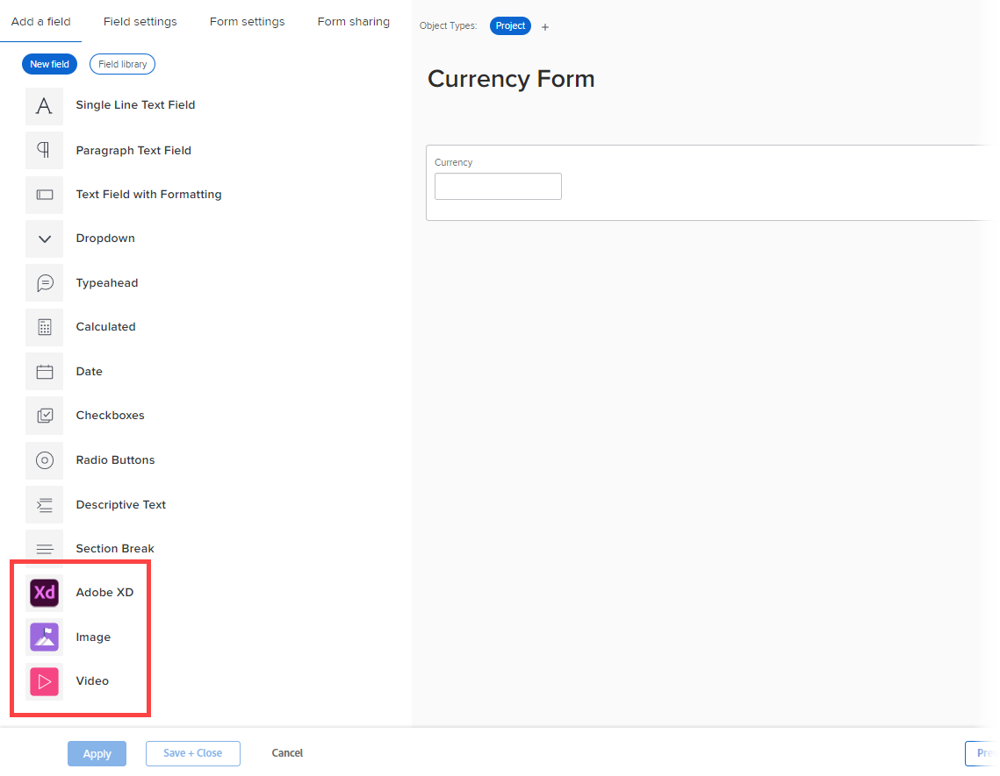

# Add or edit an image or other asset widget in a custom form with the legacy form builder

You can add or edit the properties of any of the following asset widgets in a custom form:

* Image
* Video
* PDF file
* Adobe XD file

This is useful when you need to include visual content such as branding images, an instructional video, or an interactive prototype for an app you are designing.  

When a custom form containing a widget is attached to an object, users who work with the object can see it in the following areas:

* The object's Details area (for example, for a project, the Project Details area) 
* The Edit box for the object, if it has the new Adobe Workfront experience look and feel (for example, the Edit Project and Edit Task boxes)

Currently, users cannot see the widget in the following areas:​ 

* Lists and reports
* Home and Summary
* The Edit box for the object, if it doesn't have the new Adobe Workfront experience look and feel (for example, the Edit Expense box)
* The Workfront Mobile app
 

## Access requirements

You must have the following to perform the steps in this article:

<table style="table-layout:auto"> 
 <col> 
 <col> 
 <tbody> 
  <tr data-mc-conditions=""> 
   <td role="rowheader"> 
Adobe Workfront plan*
 </td> 
   <td>Any</td> 
  </tr> 
  <tr> 
   <td role="rowheader">Adobe Workfront license*</td> 
   <td>Plan</td> 
  </tr> 
  <tr data-mc-conditions=""> 
   <td role="rowheader">Access level configurations*</td> 
   <td> 
Administrative access to custom forms
 
For information about how Workfront administrators grants this access, see <a href="../../../administration-and-setup/add-users/configure-and-grant-access/grant-users-admin-access-certain-areas.md" class="MCXref xref">Grant users administrative access to certain areas</a>.
 </td> 
  </tr>  
 </tbody> 
</table>

&#42;To find out what plan, license type, or access level configurations you have, contact your Workfront administrator.

## Add or edit an asset widget in a custom form

1. Begin working on a custom form, as described in [Create or edit a custom form](../../../administration-and-setup/customize-workfront/create-manage-custom-forms/create-or-edit-a-custom-form.md).
1. With the **Add a field** tab open, do one of the following:

   * If you are adding a new widget, select **Image**, **PDF**, or **Video** to add it at the bottom of the form, or drag it where you want it on the form.

     

   * If you want to add a widget that has already been added to another custom form, click **Field library**, then click the name of the widget in the list that displays. For more information, see [Reuse a custom field or widget in a custom form](../../../administration-and-setup/customize-workfront/create-manage-custom-forms/reuse-an-existing-field.md).
   
   * If you are editing a widget already added to the custom form, select it.

1. Type or edit any of the following properties for the widget:

   <table style="table-layout:auto"> 
    <col> 
    <col> 
    <tbody> 
     <tr> 
      <td role="rowheader">Label</td> 
      <td> 
(Required) Type a descriptive label to display above the widget. You can change the label at any time.
 
<b>IMPORTANT</b>: Avoid using special characters in this label. They don't display correctly in reports.
 </td> 
     </tr> 
     <tr> 
      <td role="rowheader">Name</td> 
      <td> 
(Required) This name is how the system identifies the widget.
 
When you are configuring the widget for the first time and you type the label, the Name field populates automatically to match it. But the Label and Name fields are not synchronized—this gives you the freedom to change the label that your users see without having to change the name that the system sees.
 
<b>IMPORTANT</b>: Though it's possible to do so, we recommend that you do not change this name after you or other users start using the custom form in widget. If you do, the system will no longer recognize the widget where it might now be referenced in other areas of Workfront. 
 
Each widget name must be unique in your organization's Workfront instance. This way, you can reuse one that was already created for another custom form. 
 </td> 
     </tr> 
     <tr> 
      <td role="rowheader">URL</td> 
      <td> 
(Required) Type or paste the URL of the widget where it is stored on the internet.
 
       
<strong>Important</strong>: The URL for must be a public URL. 

      
If you are adding a video widget, currently you can do so by adding the following in the URL box:
 
      <ul> 
      <li> 
YouTube or Vimeo link
 </li> 
      <li> 
Google Drive video link
 </li> 
      <li> 
Link to video with MP4 and MOV extension
 </li> 
      <li> 
Link to video already uploaded to the Documents area in your Workfront instance. For instructions, see <a href="#add-a-video-widget-to-a-custom-form-from-the-documents-area" class="MCXref xref">Add a video widget to a custom form from the Documents area</a> in this article.
 
      </li> 
      </ul> 
       </td> 
     </tr> 
     <tr> 
      <td role="rowheader">Instructions</td> 
      <td> 
Type any additional information about the widget. When users fill out the custom form, they can hover over the question mark icon to view a tool tip containing the information you type here.
 </td> 
     </tr> 
     <tr> 
      <td role="rowheader">Size</td> 
      <td>Change the display size of the widget as needed.</td> 
     </tr> 
    </tbody> 
   </table>

1. Click **Apply**.
1. If you want to continue building your custom form in other ways, continue on to one of the following articles:

   * [Position custom fields and widgets in a custom form](../../../administration-and-setup/customize-workfront/create-manage-custom-forms/position-fields-in-a-custom-form.md) 
   * [Add a custom field to a custom form](../../../administration-and-setup/customize-workfront/create-manage-custom-forms/add-a-custom-field-to-a-custom-form.md) 
   * [Reuse a custom field or widget in a custom form](../../../administration-and-setup/customize-workfront/create-manage-custom-forms/reuse-an-existing-field.md) 
   * [Add calculated data to a custom form](../../../administration-and-setup/customize-workfront/create-manage-custom-forms/add-calculated-data-to-custom-form.md) 
   * [Reuse an existing calculated custom field in a custom form](../../../administration-and-setup/customize-workfront/create-manage-custom-forms/use-existing-calc-field-new-custom-form.md) 
   * [Add display logic and skip logic to a custom form](../../../administration-and-setup/customize-workfront/create-manage-custom-forms/display-or-skip-logic-custom-form.md) 
   * [Preview and complete a custom form](../../../administration-and-setup/customize-workfront/create-manage-custom-forms/preview-and-complete-a-custom-form.md)

## Add an XD file to a custom form

1. Begin working on a custom form, as described in [Create or edit a custom form](../../../administration-and-setup/customize-workfront/create-manage-custom-forms/create-or-edit-a-custom-form.md).
1. With the **Add a field** tab open, select **Adobe XD**.
1. Type or edit any of the following properties for the widget:

   <table style="table-layout:auto"> 
    <col> 
    <col> 
    <tbody> 
     <tr> 
      <td role="rowheader">Label</td> 
      <td> 
(Required) Type a descriptive label to display above the widget. You can change the label at any time.
 
<b>IMPORTANT</b>: Avoid using special characters in this label. They don't display correctly in reports.
 </td> 
     </tr> 
     <tr> 
      <td role="rowheader">Name</td> 
      <td> 
(Required) This name is how the system identifies the widget.
 
When you are configuring the widget for the first time and you type the label, the Name field populates automatically to match it. But the Label and Name fields are not synchronized—this gives you the freedom to change the label that your users see without having to change the name that the system sees.
 
<b>IMPORTANT</b>: Though it's possible to do so, we recommend that you do not change this name after you or other users start using the custom form in widget. If you do, the system will no longer recognize the widget where it might now be referenced in other areas of Workfront. 
 
Each widget name must be unique in your organization's Workfront instance. This way, you can reuse one that was already created for another custom form. 
 </td> 
     </tr> 
     <tr> 
      <td role="rowheader">URL</td> 
      <td> 
(Required) Type or paste a valid XD prototype link.
 
      
Note: The Link Access setting on the Share tab in Adobe XD must be set to Anyone with the link. Otherwise, users will not be able to view the prototype. 
   </td> 
     </tr> 
     <tr> 
      <td role="rowheader">Instructions</td> 
      <td> 
(Optional) Type any additional information about the widget. When users fill out the custom form, they can hover over the question mark icon to view a tool tip containing the information you type here.
 </td> 
     </tr> 
     <tr> 
      <td role="rowheader">Size</td> 
      <td>(Optional) Change the display size of the widget as needed.</td> 
     </tr> 
    </tbody> 
   </table>

1. If you want to continue building your custom form in other ways, continue on to one of the following articles:

   * [Position custom fields and widgets in a custom form](../../../administration-and-setup/customize-workfront/create-manage-custom-forms/position-fields-in-a-custom-form.md) 
   * [Add a custom field to a custom form](../../../administration-and-setup/customize-workfront/create-manage-custom-forms/add-a-custom-field-to-a-custom-form.md) 
   * [Reuse a custom field or widget in a custom form](../../../administration-and-setup/customize-workfront/create-manage-custom-forms/reuse-an-existing-field.md) 
   * [Add calculated data to a custom form](../../../administration-and-setup/customize-workfront/create-manage-custom-forms/add-calculated-data-to-custom-form.md) 
   * [Reuse an existing calculated custom field in a custom form](../../../administration-and-setup/customize-workfront/create-manage-custom-forms/use-existing-calc-field-new-custom-form.md) 
   * [Add display logic and skip logic to a custom form](../../../administration-and-setup/customize-workfront/create-manage-custom-forms/display-or-skip-logic-custom-form.md) 
   * [Preview and complete a custom form](../../../administration-and-setup/customize-workfront/create-manage-custom-forms/preview-and-complete-a-custom-form.md)

## Add a video widget to a custom form from the Documents area {#add-a-video-widget-to-a-custom-form-from-the-documents-area}

>[!IMPORTANT]
>
>When you add a video to a custom form this way, only the permissions set for the custom form apply to the video when users access the form on an object, not the permissions that were set for the video in the Documents area.

1. Go to the video in the Documents area and generate a proof for it, as described in [Create an interactive proof for a website or other web content](../../../review-and-approve-work/proofing/creating-proofs-within-workfront/generate-interactive-proof-for-website-or-other-web-content.md).
1. Open the proof.
1. Right-click anywhere on the video, then select **Copy Video Address**.
1. In the custom form where you are adding the video widget, paste the copied address in the **URL** box.
