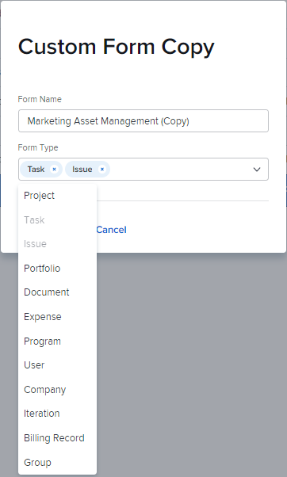

# Copy a custom form to create a new one with the legacy builder

You can create a new custom form that is based on an existing one.

## Access requirements

You must have the following to perform the steps in this article:

<table style="table-layout:auto"> 
 <col> 
 <col> 
 <tbody> 
  <tr data-mc-conditions=""> 
   <td role="rowheader"> 
Adobe Workfront plan*
 </td> 
   <td>Any</td> 
  </tr> 
  <tr> 
   <td role="rowheader">Adobe Workfront license*</td> 
   <td>Plan</td> 
  </tr> 
  <tr data-mc-conditions=""> 
   <td role="rowheader">Access level configurations*</td> 
   <td> 
Administrative access to custom forms
 
For information about how Workfront administrators grants this access, see <a href="../../../administration-and-setup/add-users/configure-and-grant-access/grant-users-admin-access-certain-areas.md" class="MCXref xref">Grant users administrative access to certain areas</a>.
 </td> 
  </tr> 
 </tbody> 
</table>

&#42;To find out what plan, license type, or access level configurations you have, contact your Workfront administrator.

## Copy a custom form to create a new one

1. Click the **Main Menu** icon  in the upper-right corner of Adobe Workfront, then click **Setup** .

1. Click **Custom Forms.**
1. Select the custom form that you want to use as the basis for a new custom form, then click **Copy**.
1. In the **Custom Form Copy** box that appears, type the following information:

   <table style="table-layout:auto"> 
    <col> 
    <col> 
    <tbody> 
     <tr> 
      <td role="rowheader">Form Name</td> 
      <td>Type a name for the copied form.</td> 
     </tr> 
     <tr> 
      <td role="rowheader"> 
Form Types 
 </td> 
      <td> 
In the <b>Form Type</b> box, select the object types that you want the custom form to work with, and click the X next to any types that you want to remove. Types that are already associated with the form are disabled in the list.
 
      

 
      
The form must be associated with at least one object type.
 
      </td> 
     </tr> 
    </tbody> 
   </table>

1. Click **Copy Form**.

   In the original form, if calculated fields reference fields that are incompatible with an object type you add to the new form, a message prompts you to change the calculations in those fields.

   Similarly, if an access option for a section break on the original form isn't compatible with an object type you add to the new one, a message prompts you to adjust the option.

1. Select the form that you just copied, then click **Edit**.
1. Make any changes to the form, as explained in the following articles:

   * [Copy a custom form to create a new one with the legacy form builder](#Add2) 
   * [Add calculated data to a custom form with the legacy form builder](../../../administration-and-setup/customize-workfront/create-manage-custom-forms/add-calculated-data-to-custom-form.md) 
   * [Position custom fields and widgets in a custom form with the legacy form builder](../../../administration-and-setup/customize-workfront/create-manage-custom-forms/position-fields-in-a-custom-form.md) 
   * [Add or edit an asset widget in a custom form with the legacy form builder](../../../administration-and-setup/customize-workfront/create-manage-custom-forms/add-widget-or-edit-its-properties-in-a-custom-form.md) 
   * [Reuse an existing calculated custom field in a custom form with the legacy form builder](../../../administration-and-setup/customize-workfront/create-manage-custom-forms/use-existing-calc-field-new-custom-form.md) 
   * [Add display logic and skip logic to a custom form with the legacy form builder](../../../administration-and-setup/customize-workfront/create-manage-custom-forms/display-or-skip-logic-custom-form.md) 
   * [Preview and complete a custom form with the legacy form builder](../../../administration-and-setup/customize-workfront/create-manage-custom-forms/preview-and-complete-a-custom-form.md)

1. (Optional) After you click **Save+Close**, attach the form to the object where you want to use it, as described in [Add a custom form to an object](../../../workfront-basics/work-with-custom-forms/add-a-custom-form-to-an-object.md).
